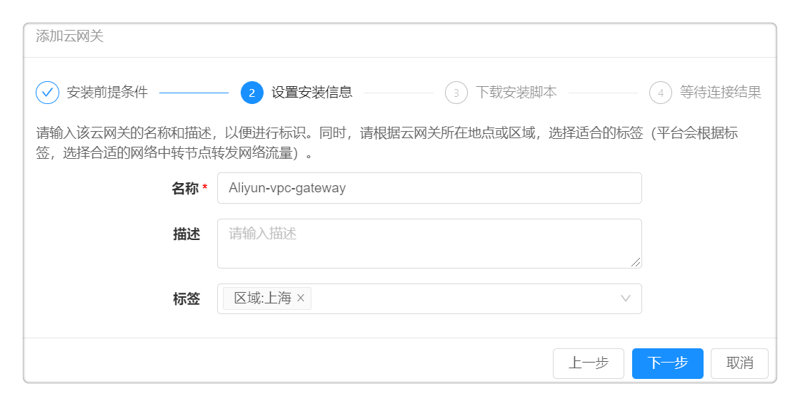
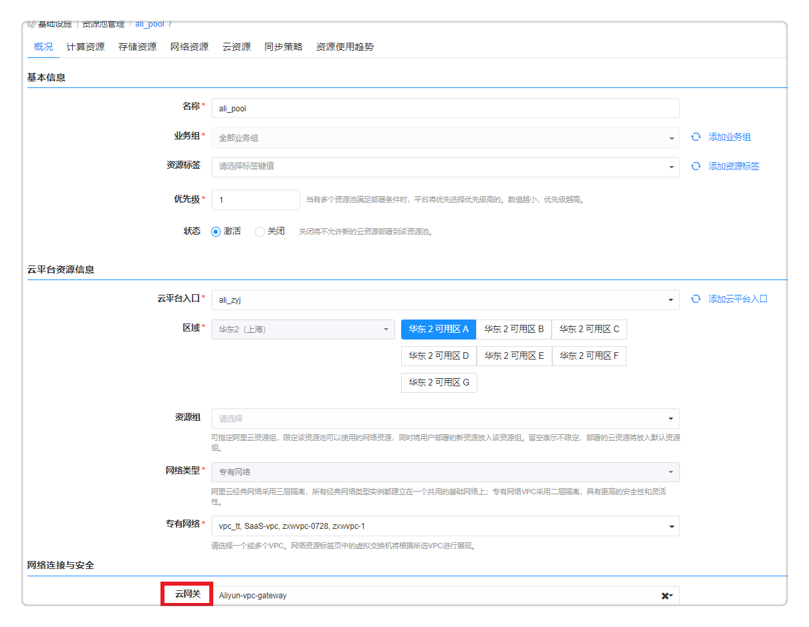

**备份与安全**

# 堡垒机{#堡垒机}

堡垒机是集用户管理、授权管理、认证管理和综合审计于一体的集中运维管理系统。 

SmartCMP不仅整合了内置的堡垒机，还支持对接第三方堡垒机，支持您通过堡垒机访问虚拟机，并可选择SSH/RDP/VNC等多种远程协议，为您提供统一的运维入口、构建安全、高效的运维通道。
 
## 核心使用场景：

堡垒机拥有以下主要特点：
 + 权限管理：整合堡垒机和平台的访问控制，支持对不同角色实行不同的授权配置，管控运维操作范围；
 + 管理协议：支持SSH、RDP、VNC等多种远程访问协议；
 + 运维操作：支持对主机进行批量改密和下发密钥，提高安全防护；
 + 会话管理和录像回放：拥有会话管理功能，并支持对所有的运维操作进行录像，全程审计。
  
## 堡垒机功能

### 堡垒机的配置

SmartCMP提供的云网关组件就集成了堡垒机功能，当您需要配置堡垒机时，可参考以下步骤：

+ 在左侧菜单选择 基础设施 – 云网关管理，点击添加按钮，进入编辑页面：
  + 名称和描述：自定义云网关的名称和描述，以便进行标识。

  + 标签：请根据云网关所在地点或区域选择合适的标签，平台会根据标签，选择合适的网络中转节点转发网络流量。
  
+ 点击下一步，进入安装脚本页面，复制脚本信息。
      
  + 选择一台符合安装条件的云主机，执行脚本信息，安装云网关的代理。
  

+ 绑定资源池：点击左侧导航栏 基础设施 - 资源池管理 ，点击资源池名称，进入概况标签页，指定已经安装的云网关。例如：在添加vSphere资源池时，绑定云网关，使用vSphere资源池部署的虚拟机将自动注册到堡垒机，使用vSphere资源池部署的虚拟机卸除时自动从堡垒机中取消注册。

### 堡垒机的使用

当堡垒机与资源池进行绑定之后，可使用堡垒机进行运维操作(以vSphere资源池为例）：
  + 点击左侧导航栏 我的资源 - 云主机 ,选择通过vSphere资源池部署成功的云主机，进入 云主机 概况 标签页
  
  + 设置关联凭证：您可以点击 组织架构 - 用户 ，在我的凭证标签页添加凭证，并将我的凭证与云主机相关联，下次访问云主机时，云管平台将自动选用关联的凭证。当您修改凭证的密码或密钥时，可同步更新云主机操作系统中的密码或密钥。
  
  + 选择完成后，点击 Web SSH 按钮，按照云主机的配置来打开云平台上的远程终端，可以通过远程终端修改协议信息的相关参数，例如，修改虚拟机的用户名和密码。 

### 对接第三方堡垒机

平台也支持对接第三方堡垒机，并提供Web SSH与远程终端服务，便于您进行远程操作。

以对接安恒堡垒机为例，具体配置步骤如下：
+ 点击左侧导航栏 备份与安全 - 堡垒机入口 ，点击添加按钮，填入以下信息：
  - 堡垒机名称和描述：自定义堡垒机名称和描述
  - 安恒堡垒机地址：请输入堡垒机的URL链接
  - Admin令牌：请输入安恒堡垒机的管理令牌
点击保存按钮，成功验证对接安恒堡垒机。

# 备份系统{#备份系统}

SmartCMP支持基于Veeam实现快速、可靠地备份云平台的所有云主机。当您配置备份系统，并将资源池和备份管理平台进行绑定后，则在这个资源池部署的云主机都可以通过Veeam来进行管理，并支持恢复单个文件、整个虚拟机、应用程序等等，确保服务的安全性和高可用性。

## 核心使用场景

+ 备份：是一个即时发生的备份（即手工备份），当您将资源池和备份系统进行绑定，您可以快速地备份这个资源池内的云资源，您可以在云主机的操作历史中查看备份操作的执行过程和结果（备份成功或是失败）。
例如：将当前整个云主机进行备份，类似于打快照

+ 恢复：即支持选择备份点，在当前的云主机中进行恢复（备份点是一个列表， 允许用户进行选择备份文件的名称， 时间信息，更多额外的参数需要配置表单，点击备份点之后， 触发一次恢复的过程把备份点的数据恢复到当前云主机），您可以在云主机的操作历史中查看恢复操作的执行过程和结果（恢复成功或是失败）。
例如：实施备份的云主机副本恢复到当前云端虚拟机

## 配置方法

备份系统的具体配置步骤请参考下文：

+ 备份管理入口配置：点击左侧导航栏 备份与安全 - 备份系统 ，点击添加按钮，进入编辑页面
 - 名称和描述：自定义Veeam系统平台的名称和描述
 - 地址：即Veeam平台的URL链接
 - 用户名和密码：Veeam平台的登录用户名和密码

点击保存按钮，验证添加完成备份系统。

## 备份系统的使用

当您配置完成一个备份系统，您可以通过以下方式来管理云主机：

 + 与资源池进行绑定：点击左侧导航栏 基础设施 - 资源池管理 ，选择需要绑定的资源池，进入概况标签页，选择已经接入的备份管理平台。
  
绑定资源池之后，您能够使用备份管理平台来管理云主机，例如，当您将vSphere资源池和备份系统绑定之后，您可以进行如下运维操作：

 + 点击左侧导航栏 我的资源 - 云主机 ，可进行基本的 备份 / 恢复 操作。

