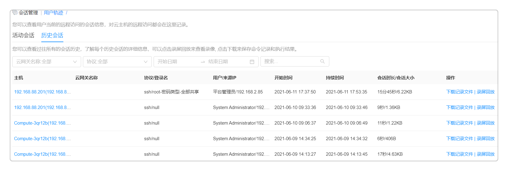
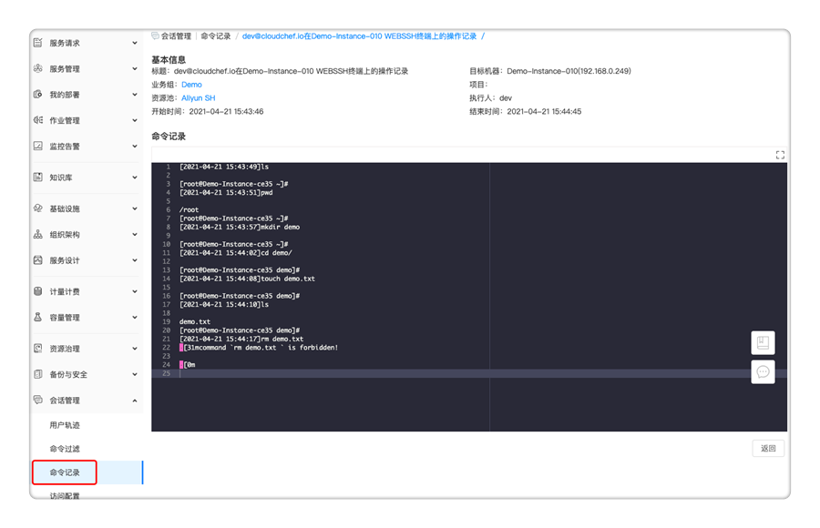
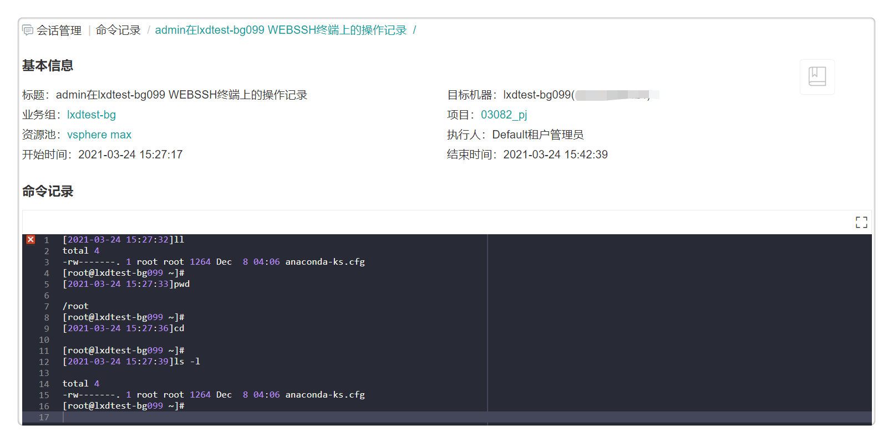

**会话管理**

# 堡垒机的用户轨迹
您可以查看通过堡垒机对云主机的远程访问记录，具体步骤请参考下文：

 + 点击左侧导航栏 会话管理 - 用户轨迹 ，进入活动会话标签页，您可以查看当前正在进行的会话，也可以终止一个或多个会话，点击终止按钮就能断开对应用户的会话。
  
 + 点击历史会话标签页，您可以查看过往所有的会话历史，并了解每个历史会话的详细信息，点击回放按钮就可以查看历史操作录像，点击下载按钮可以查看当次会话中用户所执行的webssh命令，以及执行的结果。

# 堡垒机命令的过滤
堡垒机提供命令过滤功能。通过使用该功能，您可以设置命令控制策略来管理用户对主机的访问，以保障运维操作的合规、安全、可控。

+ 点击 会话管理 - 命令过滤 ，您可以看到过滤命令的相关信息，包括名称、描述、状态、作用方式、匹配方式、命令规则、过滤目标、作用角色、创建者、更新时间等。

+ 您也可以对已添加的命令进行各种操作，包括编辑、删除、启用和禁用等。

下文为您介绍如何新建命令过滤策略。

选择 会话管理 - 命令过滤 ，点击添加按钮，填入以下信息：

  + 基本信息：请填写过滤命令的基本信息
  
   + 过滤命令的名称和描述：请自定义命令的名称和描述
  
   + 状态：请选择是否开启该条命令的“启用状态”

   + 作用方式：请设置该命令是否被允许或者拒绝执行，当一条命令既被设定为允许又被设置为拒绝时，此条命令优先被设定为拒绝。
  
   + 匹配方式：请选择该命令的匹配方式，可选“完整匹配”和“正则表达式匹配”
     + 完整匹配：整条命令信息完全匹配成功 
     + 正则表达式匹配：命令信息部分匹配成功
  
   + 命令规则：请自定义填写命令规则信息
  
  + 过滤目标：请定义命令生效的云资源，当用户在某个云资源上进行脚本执行或者通过Web SSH远程访问云主机时，只要该云资源满足下列任意一个条件，平台将对脚本内容做审计，不满足条件的脚本将被拒绝执行。
    + 业务组：请选择云资源所属业务组
    + 项目：请选择云资源所属项目
    + 所有者：请选择该命令作用的角色或者用户。
      + 角色：可选的角色类型包括平台内置的角色（软件架构师、普通成员、基础设施架构师、平台管理员等),您也可以自定义添加角色，具体步骤可参考[角色](https://cloudchef.github.io/doc/AdminDoc/04组织架构管理/角色.html)
      + 用户：可选具体用户，使命令生效。
    + 键值标签：由一个键值对组成，例如键为“环境”且值为“UAT”的标签。
    + 云资源：请选择命令作用的具体云资源，使该命令在相应云资源上生效。
      + 资源类型：云资源类型包括IaaS、PaaS、CaaS、软件和代理。
      + 云资源：指定命令作用的具体云资源。

# 堡垒机命令记录
当用户通过WebSSH远程访问云主机或者在目标主机上执行脚本命令后，基础设施管理员，平台管理员和堡垒机管理员有权限查看用户访问记录或目标主机上执行的脚本记录。点击 会话管理 - 命令记录 ，您可以看到命令记录的基本信息，包括命令标题，执行命令的机器，机器所属业务组，项目和资源池，命令执行人，执行人的来源IP，命令开始时间和命令结束时间。同时，平台也支持您通过搜索框进行全文搜索查找指定内容，搜索条件包括执行人，起止时间等。

点击命令标题，就可以进入命令记录详情页面，您可以在此查看该条命令的基本信息和详细的命令记录。

# 堡垒机访问配置
基础设施管理员、平台管理员和堡垒机管理员默认有权限开启会话访问并对其进行配置，开启后您可以在用户轨迹查看录像回放和保存命令记录。具体配置步骤请参考下文：
 + 基本信息：
   + 启用状态：点击启用后将开始录屏保存和命令记录
   + 保留时长：您可以设置录像和命令的保留时长，到期后将自动清除录像和命令记录，留空表示无限制。
 + 存储配置：
   + 存储类型：
     + 本地存储：录像和命令数据会被保存至本地存储设备中。
     + 阿里云对象存储：录像和命令数据会被存储到阿里云OSS。
       + 访问域名：请输入访问域名，OSS会为每一个存储空间分配默认的访问域名。例如，访问域名结构为BucketName.Endpoint，BucketName为您的存储空间名称，Endpoint为存储空间对应的地域域名。
       + 访问密钥ID: 请输入阿里云的访问密钥ID（AccessKey ID)。
       + 访问密钥： 请输入阿里云的访问密钥（AccessKey)。
       + Bucket名称：请输入存储空间（Bucket)的名称。
       + 访问路径：请输入OSS资源的访问路径。通过访问路径，您可以快速进入对应的存储空间（Bucket）或目录。
 + 认证配置：仅针对基于RDP远程协议访问的云资源生效。
    + 安全模式：当您使用远程终端连接Windows云主机时，您需要忽略安全证书，并选择一种安全模式。目前平台提供的安全模式包括RDP加密、TLS加密、NLA(网络级别认证)和Hyper-V/VMConnect,您也可以选择任意选项，则平台会自动轮询选择一种安全模式。
     >「Note」 若您访问公有云的Windows云主机，需要开启Winrm以及5985端口，才能使用RDP协议并忽略安全证书。
 + 文件管理配置：请填写可访问目录的具体地址，禁用时将无法访问文件管理功能。

