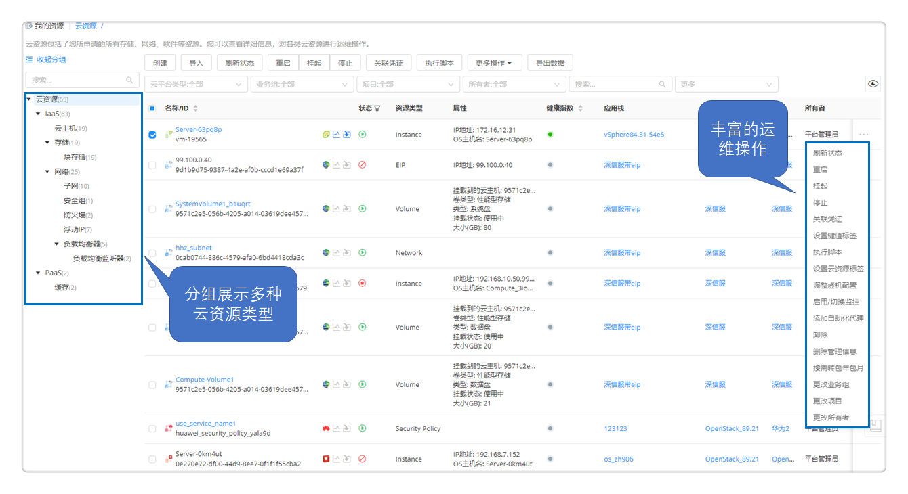
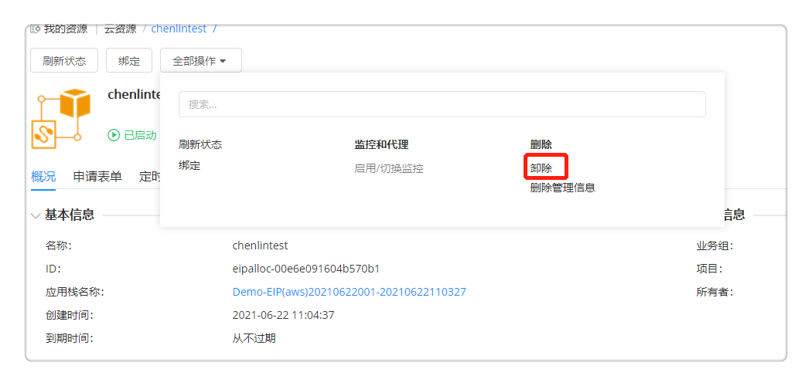
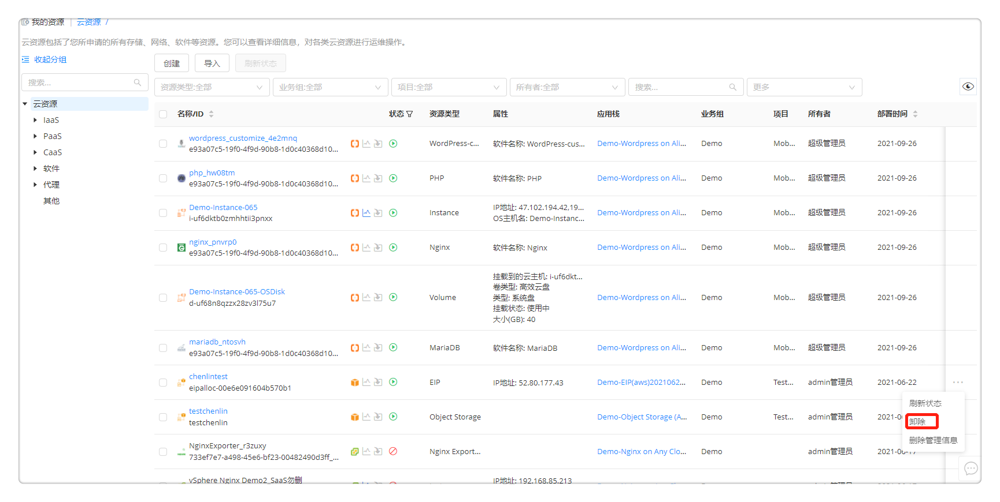
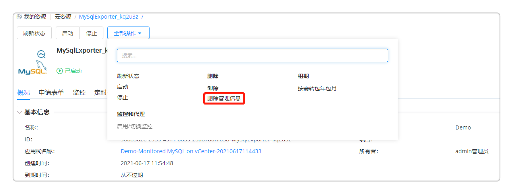
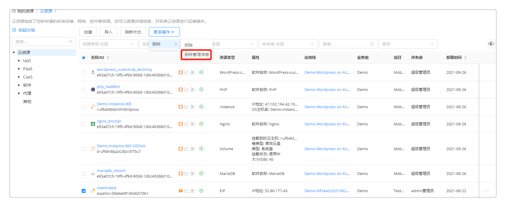
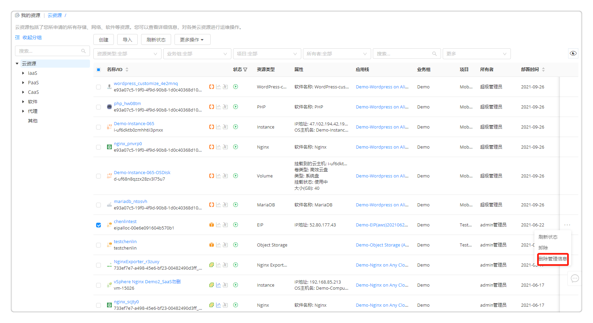
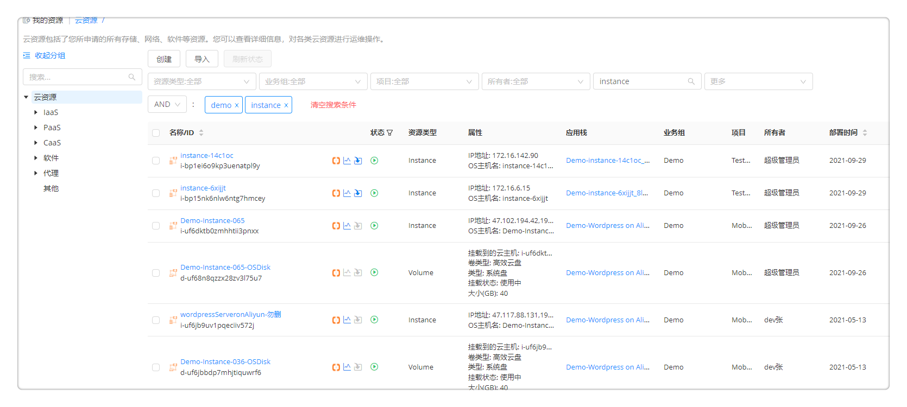
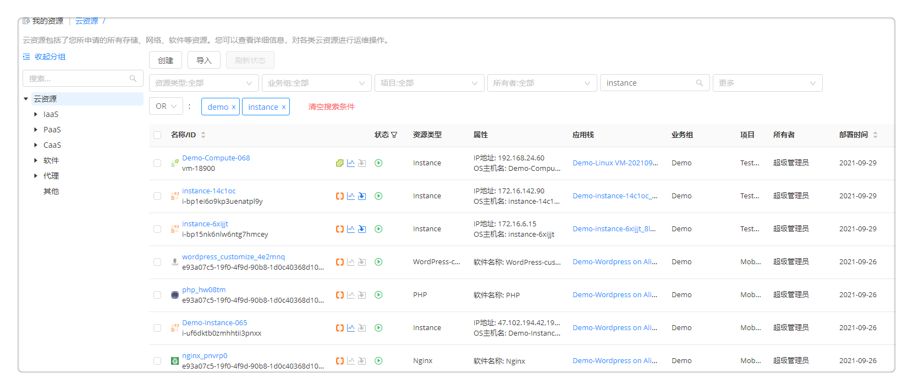
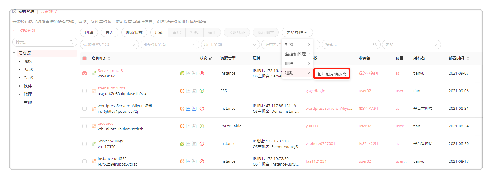
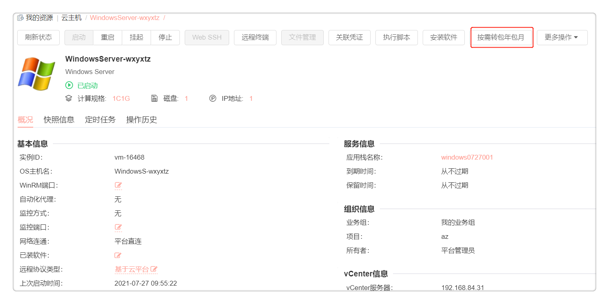

**云资源**

云资源菜单下统一纳管所有的云资源，展示其相关信息以及提供各云资源对应的运维操作。

用户可通过统一页面，看到申请的所有云资源，包括，云主机、存储、网络、软件等，查看运行状态，并进行允许的各种变更运维操作。云资源页面展示了云资源基本信息：名称/ID、状态、资源类型、监控指数、业务组、项目等，支持勾选编辑列表的基本信息展示列（如部署时间、租期类型、云资源标签等，支持勾选组件自定义属性作为展示列），支持根据业务组、项目、所有者、云资源标签、云平台类型等筛选查看云资源列表。点击 导出数据 按钮可以导出筛选后的云资源列表，导出格式支持CSV和Excel。

如下图，用户能快速查看云资源分组，并针对任意云资源统一地进行运维变更操作。
  + 当您需要为云资源设置云资源标签时，在云资源列表和详情页均可操作。当需要设置键值标签时，请选择云资源名称进入详情页，点击 全部操作 - 设置键值标签，可为该云资源增加或删除键值标签，设置的键值标签将同步更新至对应云平台，从而为云资源分类和过滤，目前支持同步键值标签功能的包括阿里云，华为云（部分云资源）和微软云（部分云资源）。设置后，云资源列表可展示云资源标签，详情页将展示当前云资源的所有标签。管理员需在系统设置 - [界面配置](https://cloudchef.github.io/doc/AdminDoc/09系统管理/#界面配置) 中启用键值标签或云资源标签的申请字段配置，并在[资源标签](https://cloudchef.github.io/doc/AdminDoc/03基础设施管理/资源标签.html)中预设云资源标签。
  + 在对部分云资源运维操作（启动、停止、重启、卸除、删除管理信息、vSphere调整配置）进行批量提交时，平台会生成一个工单类型为请求单的批量申请，用户可以在 服务请求 - 我的申请 查看该申请的详情。
  

# 云资源快速导入{#云资源快速导入} 
在云资源列表界面，您可以点击导入按钮快速导入已有云资源至SmartCMP进行纳管。

## 云主机导入

您可以点击导入按钮快速导入已有云资源至SmartCMP进行纳管。详情请参考[云主机快速导入](https://cloudchef.github.io/doc/AdminDoc/14我的资源/云主机.html#云主机快速导入)

## 存量机器导入

您可以导入存量机器至SmartCMP进行纳管。当您有物理机需要管理，或者在SmartCMP暂未支持的云平台上已部署云资源，并需要导入至SmartCMP进行纳管，普通用户（有云主机列表查看和创建权限）可以进行以下操作：
   1. 在 我的资源 - 云资源 界面，点击导入按钮，选择导入存量机器 ，根据需求选择导入Linux云主机或者Windows Machine。
   2. 在请求服务页面填写申请信息：
     + 组织信息
       + 业务组: 您可以选择资源所属的业务组，如无法选择，可选择添加业务组
       + 项目: 您可以选择资源所属的项目，如无法选择，可选择添加业务组
       + 所有者：您可以指定资源所属的人员
     + 部署信息
       + 名称：自定义资源名称，或者您可以点击 组织架构 － 命名规范 创建命名规则，则在此可以根据业务组上的规则自动生成
       + 数量：您可以一次创建多个应用栈
       + 执行时间：您可以指定在未来的某个时间，进行应用栈的创建
       + 付费方式：可选包年包月或者按需
       + 租用到期时间：您可以指定应用栈的使用期限。到期之后，所有的服务将被停机
       + 保留时间（日）：您可以指定使用期限到期之后，应用栈的保留时间。到期之后，所有的服务将被卸除。您可以输入大于等于2，留空为无限期
     + 标签设置：您可以为申请部署的云资源设置管理员配置的云资源标签。每个标签由一个键值对组成，例如一个键为“环境”且值为“UAT”的标签。
     + 资源环境
       + 资源池：指定导入资源的Hostpool资源池
       + IP地址：请输入云主机的IP地址，以供访问
       + 主机名：输入主机名
       + IPMI配置信息：勾选则您需要配置接入智能平台管理的接口，您可以通过IPMI实现对物理设备的开关机操作。
       + IPMI访问配置：请输入IPMI本地地址，用户，密码，主机IP以及端口信息等。
     + 系统配置
       + 协议：您可以选择安全协议，例如SSH(安全外壳协议)
       + 端口：填写端口号 
       + 验证方式：您可以选择“凭证”或者“密码”
       + 凭证：当验证方式选择“凭证”，请选择可以SSH登录云主机的用户凭证。若下拉为空，请首先创建。
       + 用户名，密码：当验证方式选择“密码”，请输入可以通过SSH登录云主机的用户名和用户密码。   
   3. 点击申请按钮，完成导入云资源的申请。

## 云资源导入

您可以根据以下步骤导入云上资源(如RDS等）或非云资源（如数据库、网络设备等）至SmartCMP进行纳管：
   1. 在 我的资源 - 云资源 界面（或 资源池管理 - 云资源标签页），点击导入按钮，选择需要导入的资源。您可根据页面左侧组件类型树对云资源导入类型进行过滤，其中软件组件仅支持在 我的资源 - 云资源 界面导入。
   2. 在请求服务页面填写申请信息：
     + 组织信息
       + 业务组: 您可以选择资源所属的业务组，如无法选择，可选择添加业务组
       + 项目: 您可以选择资源所属的项目，如无法选择，可选择添加业务组
       + 所有者：您可以指定资源所属的人员
     + 部署信息
       + 名称：自定义资源名称，或者您可以点击 组织架构 － 命名规范 创建命名规则，则在此可以根据业务组上的规则自动生成
       + 数量：您可以一次创建多个应用栈。点击申请参数的“+”可以同时导入多个资源，部署信息内的数量值会对应调整。
     + 标签设置：您可以为申请部署的云资源设置管理员配置的云资源标签。每个标签由一个键值对组成，例如一个键为“环境”且值为“UAT”的标签。
     + 资源环境：指定导入资源的资源池及可用区（如有）等。
        >「Note」 非云资源不需要填写资源环境信息。
     + 资源参数：选择表单定义的资源参数
     + 系统配置
       + 名称：输入导入资源的名称，留空将使用业务组命名规则自动生成。
   3. 点击申请按钮，完成导入云资源的申请。 

# 云资源删除

在云资源列表界面，您可通过以下步骤进行快速删除操作：

 - 卸除

   您可以通过以下三种方式卸除云资源
   - 点击 我的资源 - 云资源 ，点击云资源的名称，选择卸除，进行卸除操作。
   
   - 点击 我的资源 - 云资源 ，勾选云资源，选择卸除，进行卸除操作。
   
   - 点击 我的资源 - 云资源 ，在云资源列表右侧，点击 操作 - 卸除，进行卸除操作。
   
 
 - 删除管理信息 

   您可以通过多种方式删除管理信息
    - 点击 我的资源 - 云资源 ，点击云资源的名称，选择删除管理信息，进行删除操作。
   
    - 点击 我的资源 - 云资源 ，勾选云资源，选择删除管理信息，进行删除操作。
   
    - 点击 我的资源 - 云资源 ，在云资源列表右侧，点击 操作 - 删除管理信息，进行删除操作。
    

# 云资源搜索
您可以通过设置搜索条件快速查找云资源（支持用户自定义属性作为搜索条件），如果需要设置多条搜索条件，您可以在搜索栏中以英文逗号隔开多个搜索字段。平台目前提供两种搜索条件关联方式：

 - 设置搜索条件为AND: 筛选能够满足所有搜索条件的云资源。例如，设置搜索条件为172，instance,则实例名称，实例ID, 云资源名称，IP地址和应用栈名称中同时包括以上搜索条件的云资源才会显示。
   
 
 - 设置搜索条件为OR: 筛选能够满足任一搜索条件的云资源。例如，设置搜索条件为172，instance,则实例名称，实例ID, 云资源名称，IP地址和应用栈名称中包括以上任一搜索条件的云资源就会显示。
   
  
# 云资源付费方式转换
平台支持私有云云资源付费方式的互转，当多个云资源拥有相同的付费方式，您也可以进行批量转换。平台目前提供两种转换方式：

 - 点击 我的资源 - 云资源 ，勾选某个私有云云资源，点击按需转包年包月按钮或者包年包月转按需按钮，进行付费方式转换的操作。
   

 - 点击 我的资源 - 云资源 ，点击私有云云资源的名称，选择按需转包年包月按钮或者包年包月转按需按钮，进行付费方式转换的操作。
   

下面对云资源菜单下包含的存储、网络、软件等资源及相关运维操作进行介绍：

# CaaS资源 

支持在云资源中展示kubernetes的各个组件信息，包括部署（Deployment）、Helm Chart、容器（Container）、服务（Service）、路由（Ingress）、存储卷（PVC）、配置字典（ConfigMap）、保密字典（Secrets）等。

## 部署
Kubernetes的部署（Deployment）为Pod和ReplicaSet提供声明式更新。通过在Deployment中描述所期望的集群状态，DeploymentController会将现在的集群状态在一个可控的速度下逐步更新成所期望的集群状态。Deployment的主要职责同样是为了保证Pod的数量和健康，90%的功能与ReplicationController完全一样，可以看作下一代的Replication Controller。

1.  在部署（Deployment） 的列表界面，可查看该容器的名称/ID、云平台类型、状态、类型、业务组、应用栈、项目、所有者、标签、部署时间和到期时间等。您可通过类型、业务组、云资源标签、状态、项目和所有者对列表信息进行快速筛选定位。

2.  点击名称，进入部署的详情页面。包括概况、详细配置、定时任务和操作历史等标签页。在当前资源详情页面可对资源执行运维操作：刷新状态、更新配置和其他更多操作（如更新副本数量、卸除等）；部分运维操作支持启用定时，可以设置该操作的执行时间和重复周期。点击更新副本数量，可以更新POD的副本数量（Replicas），点击后在弹框中选择需要更新的副本数量。

  - 概况标签页：

      -   基本信息：名称、ID、部署名称、云平台类型、创建时间和到期时间

      -   组织信息：业务组、项目和所有者

      -   属性：类型、命名空间、标签、注释、策略、镜像、云资源名称、云资源ID和云资源在云平台中的名称等，以及用户自定义的组件属性
    
      -   费用信息：展示该云资源最近一个月的费用。点击费用详情按钮可以跳转至该云资源的费用分析概览页，包括“费用趋势”和“预测今天（本月）费用”。支持根据时间粒度和时间跨度筛选展示，以及图表形式切换。

  -  关联对象标签页：展示该资源关联的全部对象，如需关联新的资源，请点击添加图标，选择需要的资源进行关联。 
  
  -  详细配置标签页：查看部署该资源的详细配置文件。

  -  定时任务标签页：查看已启用的定时任务信息，支持删除已配置的定时任务。

  -  操作历史标签页：包括了该Deployment进行过的操作历史记录。如果一个操作正在执行中，您可以点击“取消”按钮取消该操作，也可以批量进行取消操作。

## Helm Chart
Kubernetes的Helm Chart可以用于快速部署容器应用。Helm是一个命令行下的客户端工具，主要用于Kubernetes应用程序Chart的创建、打包、发布以及创建和管理本地和远程的Chart仓库。Chart是Helm的软件包，其包含了一组定义Kubernetes资源相关的YAML文件。对于使用者而言，使用Helm后不用需要了解Kubernetes的YAML语法并编写应用部署文件，可以通过Helm下载并在kubernetes上安装需要的应用。部署成功后用户可在左侧导航栏选择 云资源 - CaaS - Chart 中查看详细信息。

1.  在 CaaS - Chart 中可查看Chart的基本信息，如：名称/ID、状态、类型、业务组、应用栈、项目、所有者、标签、部署时间和到期时间等。您可通过类型、业务组、云资源标签、状态、项目和所有者对列表信息进行快速筛选定位。在当前资源详情页面可对资源执行运维操作：刷新状态、启动、停止和其他更多操作（如更新、卸除等）；部分运维操作支持启用定时，可以设置该操作的执行时间和重复周期。点击更新按钮，可更新Chart包地址和修改参数信息，系统会在升级Chart包时使用这些参数。

2.  点击名称，进入Helm Chart的详情页面。包括概况、容器列表、申请表单、定时任务和操作历史等标签页。

  - 概况标签页：

      -   基本信息：名称、ID、部署名称、云平台类型、创建时间和到期时间

      -   组织信息：业务组、项目和所有者

      -   属性：类型、Release Name、名称、云资源ID、云资源在云平台中的名称和Chart URL，以及用户自定义的组件属性

      -   费用信息：展示该云资源最近一个月的费用。点击费用详情按钮可以跳转至该云资源的费用分析概览页，包括“费用趋势”和“预测今天（本月）费用”。支持根据时间粒度和时间跨度筛选展示，以及图表形式切换。

      -   参数信息

  -  关联对象标签页：展示该资源关联的全部对象，如需关联新的资源，请点击添加图标，选择需要的资源进行关联。 
  
  -  容器列表标签页：展示了当前部署下包含的容器列表，点击名称可跳转至详情页。

  -  申请表单标签页：展示了Chart包配置地址和参数配置。如果指定的Helm Chart包有申请属性, 可以配置属性的键-值参数, 系统会在部署Chart时候使用这些参数。

  -  定时任务标签页：查看已启用的定时任务信息，支持删除已配置的定时任务。

  -  操作历史标签页：包括了对Helm Chart进行过的操作历史记录。如果一个操作正在执行中，您可以点击“取消”按钮取消该操作，也可以批量进行取消操作。

## 容器

Kubernetes Container部署成功后可在左侧导航栏选择 云资源 - CaaS - Kubernetes - 容器 中查看详细信息。

1.  在容器（Container）的列表界面，可查看该容器的名称/ID、云平台类型、状态、类型、业务组、应用栈、项目、所有者、标签、部署时间和到期时间等。您可通过类型、业务组、云资源标签、状态、项目和所有者对列表信息进行快速筛选定位。

2.  点击名称，进入容器的详情页面。包括概况、详细配置、定时任务和操作历史等标签页。在当前资源详情页面可对资源执行运维操作：刷新状态、启动、停止和其他更多操作（如更新镜像、卸除等）；部分运维操作支持启用定时，可以设置该操作的执行时间和重复周期。点击 更多操作 - 其他 - 更新镜像 按钮，可更新容器的入口、名称与版本信息。

  - 概况标签页：

      -   基本信息：名称、ID、部署名称、云平台类型、创建时间和到期时间

      -   组织信息：业务组、项目和所有者

      -   属性：类型、镜像、端口、存活探针、环境变量、就绪探针、云资源ID和云资源在云平台中的名称等，以及用户自定义的组件属性

      -   费用信息：展示该云资源最近一个月的费用。点击费用详情按钮可以跳转至该云资源的费用分析概览页，包括“费用趋势”和“预测今天（本月）费用”。支持根据时间粒度和时间跨度筛选展示，以及图表形式切换。

  -  关联对象标签页：展示该资源关联的全部对象，如需关联新的资源，请点击添加图标，选择需要的资源进行关联。 
  
  -  详细配置标签页：查看部署该资源的详细配置文件。

  -  定时任务标签页：查看已启用的定时任务信息，支持删除已配置的定时任务。

  -  操作历史标签页：包括了对容器进行过的操作历史记录。如果一个操作正在执行中，您可以点击“取消”按钮取消该操作，也可以批量进行取消操作。

## 服务

在Kubernetes中，客户端需要访问的服务就是Service对象。每个Service会对应一个集群内部有效的虚拟IP，集群内部通过虚拟IP访问一个服务。部署成功后可在左侧导航栏选择 云资源 - CaaS - Kubernetes 中查看详细信息。

1.  在服务（Service）的列表界面，可查看该路由的名称/ID、云平台类型、状态、类型、业务组、应用栈、项目、所有者、标签、部署时间和到期时间等。您可通过类型、业务组、云资源标签、状态、项目和所有者对列表信息进行快速筛选定位。

2.  点击名称，进入服务的详情页面。包括概况、详细配置、定时任务和操作历史等标签页。在当前资源详情页面可对资源执行运维操作：刷新状态、更新配置和其他更多操作（如卸除等）；部分运维操作支持启用定时，可以设置该操作的执行时间和重复周期。

  - 概况标签页：

      -   基本信息：名称、ID、部署名称、云平台类型、创建时间和到期时间

      -   组织信息：业务组、项目和所有者

      -   属性：类型、命名空间、标签、集群IP、内部端点、服务类型、云资源名称、云资源ID和云资源在云平台中的名称，以及用户自定义的组件属性

      -   费用信息：展示该云资源最近一个月的费用。点击费用详情按钮可以跳转至该云资源的费用分析概览页，包括“费用趋势”和“预测今天（本月）费用”。支持根据时间粒度和时间跨度筛选展示，以及图表形式切换。

  -  关联对象标签页：展示该资源关联的全部对象，如需关联新的资源，请点击添加图标，选择需要的资源进行关联。 
  
  -  详细配置标签页：查看部署该资源的详细配置文件。

  -  定时任务标签页：查看已启用的定时任务信息，支持删除已配置的定时任务。

  -  操作历史标签页：包括了对服务进行过的操作历史记录。如果一个操作正在执行中，您可以点击“取消”按钮取消该操作，也可以批量进行取消操作。

## 路由

在Kubernetes中，通常情况下，服务（service）和pod的IP仅可在集群内部访问。集群外部的请求需要通过负载均衡转发到service在Node上暴露的NodePort上，然后再由kube-proxy将其转发给相关的Pod，而路由（Ingress）就是为进入集群的请求提供路由规则的集合。部署成功后可在左侧导航栏选择 云资源 - CaaS - Kubernetes 中查看详细信息。

1.  在路由（Ingress）的列表界面，可查看该路由的名称/ID、云平台类型、状态、类型、业务组、应用栈、项目、所有者、标签、部署时间和到期时间等。您可通过类型、业务组、云资源标签、状态、项目和所有者对列表信息进行快速筛选定位。

2.  点击名称，进入路由的详情页面。包括概况、详细配置、定时任务和操作历史等标签页。在当前资源详情页面可对资源执行运维操作：刷新状态、更新配置和其他更多操作（如卸除等）；部分运维操作支持启用定时，可以设置该操作的执行时间和重复周期。

  - 概况标签页：

      -   基本信息：名称、ID、部署名称、云平台类型、创建时间和到期时间

      -   组织信息：业务组、项目和所有者

      -   属性：类型、命名空间、标签、云资源名称、云资源ID和云资源在云平台中的名称，以及用户自定义的组件属性

      -   费用信息：展示该云资源最近一个月的费用。点击费用详情按钮可以跳转至该云资源的费用分析概览页，包括“费用趋势”和“预测今天（本月）费用”。支持根据时间粒度和时间跨度筛选展示，以及图表形式切换。

  -  关联对象标签页：展示该资源关联的全部对象，如需关联新的资源，请点击添加图标，选择需要的资源进行关联。 
  
  -  详细配置标签页：查看部署该资源的详细配置文件。

  -  定时任务标签页：查看已启用的定时任务信息，支持删除已配置的定时任务。

  -  操作历史标签页：包括了对路由进行过的操作历史记录。如果一个操作正在执行中，您可以点击“取消”按钮取消该操作，也可以批量进行取消操作。

## 存储卷

Kubernetes中的存储卷（PVC：PersistentVolumeClaim）是用户存储的请求。它类似于pod。Pod消耗节点资源，PVC消耗光伏资源。部署成功后可在左侧导航栏选择 云资源 - CaaS - Kubernetes 中查看详细信息。

1.  在存储卷（PVC）的列表界面，可查看该存储卷的名称/ID、云平台类型、状态、类型、业务组、应用栈、项目、所有者、标签、部署时间和到期时间等。您可通过类型、业务组、云资源标签、状态、项目和所有者对列表信息进行快速筛选定位。

2.  点击名称，进入存储卷的详情页面。包括概况、详细配置、定时任务和操作历史等标签页。在当前资源详情页面可对资源执行运维操作：刷新状态、更新配置和其他更多操作（如卸除等）；部分运维操作支持启用定时，可以设置该操作的执行时间和重复周期。

  - 概况标签页：

      -   基本信息：名称、ID、部署名称、云平台类型、创建时间和到期时间

      -   组织信息：业务组、项目和所有者

      -   属性：类型、命名空间、标签、卷状态、总量、访问模式、存储类、存储卷名、云资源名称、云资源ID和云资源在云平台中的名称，以及用户自定义的组件属性

      -   费用信息：展示该云资源最近一个月的费用。点击费用详情按钮可以跳转至该云资源的费用分析概览页，包括“费用趋势”和“预测今天（本月）费用”。支持根据时间粒度和时间跨度筛选展示，以及图表形式切换。

  -  关联对象标签页：展示该资源关联的全部对象，如需关联新的资源，请点击添加图标，选择需要的资源进行关联。 
  
  -  详细配置标签页：查看部署该资源的详细配置文件。

  -  定时任务标签页：查看已启用的定时任务信息，支持删除已配置的定时任务。

  -  操作历史标签页：包括了对存储卷进行过的操作历史记录。如果一个操作正在执行中，您可以点击“取消”按钮取消该操作，也可以批量进行取消操作。

## 配置字典

在Kubernetes中，配置字典（ConfigMap）用于保存配置数据的键值对，可以用来保存单个属性，也可以用来保存配置文件。ConfigMap跟保密字典（Secret）很类似，但它可以更方便地处理不包含敏感信息的字符串。部署成功后可在左侧导航栏选择 云资源 - CaaS - Kubernetes 中查看详细信息。

1.  在配置字典（ConfigMap）的列表界面，可查看该配置字典的名称/ID、云平台类型、状态、类型、业务组、应用栈、项目、所有者、标签、部署时间和到期时间等。您可通过类型、业务组、云资源标签、状态、项目和所有者对列表信息进行快速筛选定位。

2.  点击名称，进入配置字典的详情页面。包括概况、详细配置、定时任务和操作历史等标签页。在当前资源详情页面可对资源执行运维操作：刷新状态、更新配置和其他更多操作（如卸除等）；部分运维操作支持启用定时，可以设置该操作的执行时间和重复周期。

  - 概况标签页：

      -   基本信息：名称、ID、部署名称、云平台类型、创建时间和到期时间

      -   组织信息：业务组、项目和所有者

      -   属性：类型、命名空间、标签、云资源名称、云资源ID和云资源在云平台中的名称，以及用户自定义的组件属性

      -   费用信息：展示该云资源最近一个月的费用。点击费用详情按钮可以跳转至该云资源的费用分析概览页，包括“费用趋势”和“预测今天（本月）费用”。支持根据时间粒度和时间跨度筛选展示，以及图表形式切换。

  -  关联对象标签页：展示该资源关联的全部对象，如需关联新的资源，请点击添加图标，选择需要的资源进行关联。 
  
  -  详细配置标签页：查看部署该资源的详细配置文件。

  -  定时任务标签页：查看已启用的定时任务信息，支持删除已配置的定时任务。

  -  操作历史标签页：包括了对配置字典进行过的操作历史记录。如果一个操作正在执行中，您可以点击“取消”按钮取消该操作，也可以批量进行取消操作。

## 保密字典

在Kubernetes中，保密字典（Secret）解决了密码、token、密钥等敏感数据的配置问题，而不需要把这些敏感数据暴露到镜像或者Pod Spec中。Secret可以以Volume或者环境变量的方式使用。部署成功后可在左侧导航栏选择 云资源 - CaaS - Kubernetes 中查看详细信息。

1.  在保密字典（Secret）的列表界面，可查看该保密字典的名称/ID、云平台类型、状态、类型、业务组、应用栈、项目、所有者、标签、部署时间和到期时间等。您可通过类型、业务组、云资源标签、状态、项目和所有者对列表信息进行快速筛选定位。

2.  点击名称，进入保密字典的详情页面。包括概况、详细配置、定时任务和操作历史等标签页。在当前资源详情页面可对资源执行运维操作：刷新状态、更新配置和其他更多操作（如卸除等）；部分运维操作支持启用定时，可以设置该操作的执行时间和重复周期。

  - 概况标签页：

      -   基本信息：名称、ID、部署名称、云平台类型、创建时间和到期时间

      -   组织信息：业务组、项目和所有者

      -   属性：类型、标签、云资源名称、云资源ID和云资源在云平台中的名称，以及用户自定义的组件属性

      -   费用信息：展示该云资源最近一个月的费用。点击费用详情按钮可以跳转至该云资源的费用分析概览页，包括“费用趋势”和“预测今天（本月）费用”。支持根据时间粒度和时间跨度筛选展示，以及图表形式切换。

      -   数据

  -  关联对象标签页：展示该资源关联的全部对象，如需关联新的资源，请点击添加图标，选择需要的资源进行关联。 
  
  -  详细配置标签页：查看部署该资源的详细配置文件。

  -  定时任务标签页：查看已启用的定时任务信息，支持删除已配置的定时任务。

  -  操作历史标签页：包括了对保密字典进行过的操作历史记录。如果一个操作正在执行中，您可以点击“取消”按钮取消该操作，也可以批量进行取消操作。

## 守护进程集

Kubernetes的守护进程集（DaemonSet）保证在每个Node上都运行一个容器副本，常用来部署一些集群的日志、监控或者其他系统管理应用。部署成功后可在左侧导航栏选择 云资源 - CaaS - Kubernetes 中查看详细信息。

1.  在 CaaS - 守护进程集 中可查看守护进程集的基本信息，如：名称/ID、状态、类型、业务组、应用栈、项目、所有者、标签、部署时间和到期时间等。您可通过类型、业务组、云资源标签、状态、项目和所有者对列表信息进行快速筛选定位。

2.  点击名称，进入DaemonSet的详情页面。包括概况、详细配置、定时任务和操作历史等标签页。在当前资源详情页面可对资源执行运维操作：刷新状态、更新配置和其他更多操作（如卸除等）；部分运维操作支持启用定时，可以设置该操作的执行时间和重复周期。

  - 概况标签页包括了：

      -   基本信息：名称、ID、部署名称、创建时间和到期时间

      -   组织信息：业务组、项目和所有者

      -   属性：类型、标签、云资源名称、云资源ID和云资源在云平台中的名称等，以及用户自定义的组件属性

      -   费用信息：展示该云资源最近一个月的费用。点击费用详情按钮可以跳转至该云资源的费用分析概览页，包括“费用趋势”和“预测今天（本月）费用”。支持根据时间粒度和时间跨度筛选展示，以及图表形式切换。

  -  关联对象标签页：展示该资源关联的全部对象，如需关联新的资源，请点击添加图标，选择需要的资源进行关联。 
  
  -  详细配置标签页：查看部署该资源的详细配置文件。

  -  定时任务标签页：查看已启用的定时任务信息，支持删除已配置的定时任务。

  -  操作历史标签页：包括了对守护进程组进行过的操作历史记录。如果一个操作正在执行中，您可以点击“取消”按钮取消该操作，也可以批量进行取消操作。

## 有状态副本集

Kubernetes的有状态副本集（StatefulSet）是为了解决状态服务的问题。由以下几个部分组成：用于定义网络标志（DNS domain）的Headless Service、用于创建PersistentVolumes的volumeClaimTemplates、定义具体应用的StatefulSet。部署成功后可在左侧导航栏选择 云资源 - CaaS - Kubernetes 中查看详细信息。

1.  在 有状态副本集 列表界面可查看有状态副本集的基本信息，如：名称/ID、状态、类型、业务组、应用栈、项目、所有者、标签、部署时间和到期时间等。您可通过类型、业务组、云资源标签、状态、项目和所有者对列表信息进行快速筛选定位。

2.  点击名称，进入StatefulSet的详情页面。包括概况、详细配置、定时任务和操作历史等标签页。在当前资源详情页面可对资源执行运维操作：刷新状态、更新配置和其他更多操作（如更新副本数量、卸除等）；部分运维操作支持启用定时，可以设置该操作的执行时间和重复周期。点击更新副本数量，可以更新POD的副本数量（Replicas），点击后在弹框中选择需要更新的副本数量。

  - 概况标签页：

      -   基本信息：名称、ID、部署名称、云平台类型、创建时间和到期时间

      -   组织信息：业务组、项目和所有者

      -   属性：类型、命名空间、标签、注释、策略、镜像、云资源名称、云资源ID和云资源在云平台中的名称等，以及用户自定义的组件属性

      -   费用信息：展示该云资源最近一个月的费用。点击费用详情按钮可以跳转至该云资源的费用分析概览页，包括“费用趋势”和“预测今天（本月）费用”。支持根据时间粒度和时间跨度筛选展示，以及图表形式切换。

  -  关联对象标签页：展示该资源关联的全部对象，如需关联新的资源，请点击添加图标，选择需要的资源进行关联。 
  
  -  详细配置标签页：查看部署该资源的详细配置文件。

  -  定时任务标签页：查看已启用的定时任务信息，支持删除已配置的定时任务。

  -  操作历史标签页：包括了该StatefulSet进行过的操作历史记录。如果一个操作正在执行中，您可以点击“取消”按钮取消该操作，也可以批量进行取消操作。

# IaaS资源

## 云主机

用户可以查看已部署云主机列表，快速部署云主机并进行运维管理操作。

可执行的云主机运维操作包括：刷新状态、启动、停止、执行脚本、关联凭证、设置键值标签和云资源标签、启用/切换监控等，各项运维操作详情请参考：[云主机运维操作](https://cloudchef.github.io/doc/AdminDoc/14我的资源/云主机.html#云主机运维操作)。

当前页面支持批量执行云主机运维操作，不能批量进行的操作请进入云主机详情页面。

## 存储资源 

### 云硬盘

支持对OpenStack/Azure/阿里云/青云的云硬盘进行统一管理。

1.  点击 存储资源 下的 云硬盘 ，将看到云硬盘列表

2.  在云硬盘的列表界面，可查看云硬盘的相关信息：名称、云平台类型、状态、业务组、应用栈、项目、所有者、大小（GB）、挂载状态、挂载到的云主机以及创建时间

3.  点击名称，进入云硬盘详情页面。云硬盘详情页面包括概况、操作历史

4.  云硬盘详情的概况标签页包括：

  -   基本信息：名称、云平台类型、状态、业务组、应用栈、项目、所有者、大小挂载到的云主机、创建时间等

  -   组织信息：应用栈名称、服务名称、业务组、项目等

  -   属性：组件的系统内置属性及用户自定义属性

  -   费用信息：展示该云资源最近一个月的费用。点击费用详情按钮可以跳转至该云资源的费用分析概览页，包括“费用趋势”和“预测今天（本月）费用”。支持根据时间粒度和时间跨度筛选展示，以及图表形式切换。

  -   运维操作：

        -   卷分离：去除云硬盘和云主机的挂载关系

        -   卷挂载：建立云硬盘和云主机的挂载关系

        -   调整大小：支持对硬盘调整大小（Azure/AWS）

5.  关联对象标签页：展示该资源关联的全部对象，如需关联新的资源，请点击添加图标，选择需要的资源进行关联。 

6.  云硬盘详情的操作历史标签页：包括了该云硬盘进行过的操作历史记录。如果一个操作正在执行中，您可以点击“取消”按钮取消该操作，也可以批量进行取消操作。

### 对象存储

支持对AWS、Azure、阿里云的对象存储进行统一管理，分别是S3、Blob、OSS。

1.  在云资源标签页中，点击所有分组中的"Iass"下的“存储”，点击对象存储，将看到对象存储列表

2.  在对象存储的列表界面，可查看对象存储的相关信息：名称、云平台类型、状态、业务组、应用栈、项目、所有者、创建时间

3.  点击名称，进入对象存储详情页面。对象存储详情页面包括概况、操作历史

4.  对象存储详情的基本信息页面包括：

    -   基本信息：名称、云平台类型、状态、所有者、公共访问级别、存储账户、资源组、创建时间等

    -   组织信息：应用栈名称、服务名称、业务组、项目等

    -   属性：组件的系统内置属性及用户自定义属性

    -   费用信息：展示该云资源最近一个月的费用。点击费用详情按钮可以跳转至该云资源的费用分析概览页，包括“费用趋势”和“预测今天（本月）费用”。支持根据时间粒度和时间跨度筛选展示，以及图表形式切换。

5.  关联对象标签页：展示该资源关联的全部对象，如需关联新的资源，请点击添加图标，选择需要的资源进行关联。 

6.  对象存储详情的操作历史页面：包括了该云硬盘进行过的操作历史记录。如果一个操作正在执行中，您可以点击“取消”按钮取消该操作，也可以批量进行取消操作。

### 文件存储
支持对腾讯云/Azure/阿里云/华为云的文件存储（NAS）进行统一管理。

1.  点击 存储资源 下的 NAS ，将看到文件存储列表

2.  在文件存储的列表界面，可查看文件存储的相关信息：名称、云平台类型、状态、资源类型、属性、应用栈、业务组、项目、所有者、部署时间、到期时间、保留时间等。

3.  点击名称，进入文件存储详情页面。文件存储详情页面包括概况、关联对象、定时任务、操作历史

4.  文件存储详情的概况标签页包括：

  -   基本信息：名称、应用栈名称、部署时间、租期类型、到期时间、保留时间等
  
  -   组织信息：业务组、项目、所有者等

  -   属性：组件的系统内置属性及用户自定义属性

  -   资源环境：包括资源所属云平台类型，云平台入口，资源池，可点击链接跳转至对应云平台和资源池  

5.  关联对象标签页：展示该资源关联的全部对象，如需关联新的资源，请点击添加图标，选择需要的资源进行关联。 

6.  文件存储详情的操作历史标签页：包括了该文件存储进行过的操作历史记录。如果一个操作正在执行中，您可以点击“取消”按钮取消该操作，也可以批量进行取消操作。

## 网络资源 

支持OpenStack的防火墙（FireWall）、浮动IP（Floating IP）的独立部署和全生命周期管理。

部署完成后，可在云资源标签页， 云资源 - 网络资源 处查看基本信息和运行状况。并支持OpenStack的负载均衡器（LoadBalance）和负载均衡监听器（Listener），以及VMware　NSX的虚拟服务器（VirtualServer）。

同时也支持阿里Apsara云VPN网关，用户网关和IPsec连接的独立部署和全生命周期管理，部署完成后，可在云资源标签页， 云资源 - 网络资源 处查看基本信息和运行状况。

### 负载均衡器

负载均衡是高可用网络基础架构的关键组件，通常用于将工作负载分布到多个服务器来提高网站、应用、数据库或其他服务的性能和可靠性。

若部署中包含负载均衡器（LoadBalancer），则部署成功后可在 云资源 - 网络资源 - 负载均衡器 中查看详细信息。

1.  在负载均衡器（LoadBalancer）列表界面，显示负载均衡器的名称、云平台类型、状态、资源类型、业务组、应用栈、项目、所有者、部署时间、到期时间、保留时间等。

2.  以阿里云负载均衡为例，点击名称进入详情页面，页面包括概况、服务器组、监听、监控、定时任务、操作历史。

    - 概况标签页：显示该负载均衡器的基本信息、组织信息、属性（系统内置属性及用户自定义属性）和资源环境。

    - 服务器组标签页：每个服务器组均用于将客户的请求路由到一个或多个注册的后端服务器。支持添加或删除虚拟服务器组，点击添加，配置服务器组。
      - 名称：请自定义虚拟服务器组的名称；
      - 云资源：请选择虚拟服务器组中的云资源，可多选；
      - 端口：添加服务器组的端口；
      - 权重：配置服务器组的权重，权重越高的服务器组将被分配到更多的访问请求；
    
    - 监听标签页：负载均衡实例监听负责检查连接请求，然后根据调度算法定义的转发策略将请求流量分发至后端服务器。支持添加或删除监听，点击添加，配置监听。
      -  协议：可根据应用场景选择监听协议；
         -  TCP:面向连接的协议，在正式收发数据前，必须和对方建立可靠的连接；适用于注重可靠性，对数据准确性要求高，速度可以相对较慢的场景，如文件传输、发送或接收邮件、远程登录；
         -  UDP:面向非连接的协议，在数据发送前不与对方进行三次握手，直接进行数据包发送，不提供差错恢复和数据重传；适用于关注实时性而相对不注重可靠性的场景，如视频聊天、金融实时行情推送；
         -  HTTP:应用层协议，主要解决如何包装数据；适用于需要对数据内容进行识别的应用，如Web应用、小的手机游戏等；
      - 前端端口：输入接收请求并向后端服务器进行请求转发的监听端口；
      - 带宽峰值限制：对于按带宽计费的负载均衡实例，您可以针对不同监听设定不同的带宽峰值来限定监听的流量；
      - 调度算法：选择调度算法；
        - 加权轮询(WRR)：权重值越高的后端服务器，被轮询到的概率越高；
        - 加权最小连接数（WLC):除了根据每台后端服务器设定的权重值来进行轮询，同时还考虑后端服务器的实际负载（即连接数）。当权重值相同时，当前连接数越小的后端服务器被轮询到的次数（概率）也越高;
        - 轮询调度（RR)：按照访问顺序依次将外部请求分发到后端服务器；
      - 连接超时时间：指定协议连接的超时时间；
      - 开启会话保持：选择是否开启会话保持；开启会话保持后，负载均衡监听会把来自同一客户端的访问请求分发到同一台后端服务器上；
      - 服务器组：添加处理前端请求的虚拟服务器组；
      - 健康检查：负载均衡通过健康检查来判断后端服务器（ECS实例）的业务可用性
        - 检查方式：监听为TCP协议时，健康检查方式可选TCP或HTTP模式；
         - TCP模式：基于网络层探测，通过发送SYN握手报文来检测服务器端口是否存活；
         - HTTP模式：通过发送HEAD或GET请求模拟浏览器的访问行为来检查服务器应用是否健康；
        - 域名：如果您的应用服务器需要校验请求的host字段，则需要配置相关域名，确保健康检查正常工作；
        - 检查路径：请指定具体的健康检查路径。
        - 正常状态码：选择健康检查正常的HTTP状态码；
        - 检查端口：健康检查服务访问后端时的探测端口；
        - 相应超过时间：接收来自运行状况检查的响应需要等待的时间。如果后端ECS在指定的时间内没有正确响应，则判定为健康检查失败；
        - 健康检查时间间隔：进行健康检查的时间间隔；
        - 健康阈值：从失败到成功的连续健康检查成功次数；
        - 不健康阈值：从成功到失败的连续健康检查失败次数；
    
    - 监控标签页：图表展示负载均衡的监控数据。

    - 关联对象标签页：展示该资源关联的全部对象，如需关联新的资源，请点击添加图标，选择需要的资源进行关联。 
    
    - 定时任务标签页：查看已启用的定时任务信息，支持删除已配置的定时任务。
    
    - 操作历史标签页：显示操作历史详情。如果一个操作正在执行中，您可以点击“取消”按钮取消该操作，也可以批量进行取消操作。

### 负载均衡监听器

支持VMWare NSX / OpenStack / Azure的负载均衡监听器，VMWare NSX负载均衡监听器为VirtualServer，OpenStack 负载均衡监听器为Listener，Azure负载均衡监听器为LoadBalancerRule。负载均衡器可以监听多个端口上请求，每个端口通过负载均衡监听器指定。部署成功后可在 云资源 - 网络资源 - 负载均衡监听器 中查看详细信息。

1.  在负载均衡器监听器（Listener）列表界面，显示负载均衡监听器的名称、状态、描述、业务组、项目、所有者、协议、云平台类型、创建时间等

2.  点击名称进入详情页面，包括概况、属性（系统内置属性及用户自定义属性）、费用信息、操作历史界面，以及添加成员、删除成员等运维

    -   费用信息：展示该云资源最近一个月的费用。点击费用详情按钮可以跳转至该云资源的费用分析概览页，包括“费用趋势”和“预测今天（本月）费用”。支持根据时间粒度和时间跨度筛选展示，以及图表形式切换。

3.  关联对象标签页：展示该资源关联的全部对象，如需关联新的资源，请点击添加图标，选择需要的资源进行关联。 

4.  运维操作 -- OpenStack

  -   添加成员：添加成员（member），可添加内部成员和外部成员。选择要添加成员的云主机、指定IP地址、端口和权重。可启动定时在特定时间执行操作

  -   删除成员：点击后选择需要删除的成员，可启动定时在特定时间执行操作

### 浮动IP

支持OpenStack的的浮动IP（FloatingIP），FloatingIP可单独部署，部署成功后可在左侧导航栏选择 云资源 - 网络资源 - 浮动IP 中查看详细信息。

1.  在选择 云资源 - 网络资源 - 浮动IP ，可查看已部署成功的浮动IP的列表界面，该界面显示浮动IP的名称、云平台类型、状态、业务组、应用栈、项目、所有者、IP地址、网络、映射地址、创建时间等

2.  点击名称，进入详情页面，包括概况、操作历史

3.  概况标签页，显示该浮动IP的的基本信息、组织信息、费用信息、、属性（系统内置属性及用户自定义属性）

    -   费用信息：展示该云资源最近一个月的费用。点击费用详情按钮可以跳转至该云资源的费用分析概览页，包括“费用趋势”和“预测今天（本月）费用”。支持根据时间粒度和时间跨度筛选展示，以及图表形式切换。

4.  关联对象标签页：展示该资源关联的全部对象，如需关联新的资源，请点击添加图标，选择需要的资源进行关联。 

5.  操作历史标签页，显示操作历史记录，点击后将在操作历史列表下方显示操作详情。如果一个操作正在执行中，您可以点击“取消”按钮取消该操作，也可以批量进行取消操作。

6.  运维操作：

  -   关联端口：若当前FloatingIP未关联任何一个端口，则在详情页上方会显示「关联端口」操作，点击后在弹框中选择需要绑定的端口，下拉框中会列出当前业务组下，OpenStack云平台中所有未被关联的端口（Port）。选择后点击提交

  -   解除绑定：若当前FloatingIP已关联端口，则在详情页上方会显示「解除绑定」操作，点击后提交，也可启用定时在特定时间执行操作

### 防火墙

支持OpenStack防火墙即服务（Firewall as a service），Fwaas应用于OpenStack对象，如项目，路由器和路由器端口。OpenStack防火墙的核心概念是防火墙策略和防火墙规则。策略是有序的规则集合。可在左侧导航栏选择 云资源 - 网络资源 - 防火墙 查看已部署成功的防火墙。

1.  选择 云资源 - 网络资源 - 防火墙 ，可查看已部署成功的防火墙列表界面，该界面显示防火墙的名称、云平台类型、状态、业务组、应用栈、项目、所有者、策略、路由、激活状态、管理员状态、创建时间等

2.  点击名称，进入详情页面，包括概况、操作历史

3.  概况标签页：显示该防火墙的的基本信息、组织信息、费用信息、属性（系统内置属性及用户自定义属性）

    -   费用信息：展示该云资源最近一个月的费用。点击费用详情按钮可以跳转至该云资源的费用分析概览页，包括“费用趋势”和“预测今天（本月）费用”。支持根据时间粒度和时间跨度筛选展示，以及图表形式切换。

4.  关联对象标签页：展示该资源关联的全部对象，如需关联新的资源，请点击添加图标，选择需要的资源进行关联。

5.  操作历史标签页：显示操作历史记录，点击后将在操作历史列表下方显示操作详情。如果一个操作正在执行中，您可以点击“取消”按钮取消该操作，也可以批量进行取消操作。

6.  运维操作：

  +  更新防火墙：点击后可在页面中选择已有的防火墙策略或新建防火墙策略。勾选 使用已有策略 ，将列出当前业务组下，OpenStack云平台中所有可用的防火墙策略。若未勾选，则新建防火墙策略，需填写策略名称（必填），策略描述（选填），可选择是否属于已共享、已审计，还可定时，操作完成后点击提交

  +  更新防火墙策略：该页面将列出当前所有可用的规则列表。支持使用已有规则和新建规则。若使用已有规则，在列表中勾选将使用的规则即可。若新建规则，将展现新建规则界面：

      -   填写基本信息：名称、描述、协议（必填，TCP、UDP、ICMP和任何）、动作（必填，允许、拒绝）、源IP、源端口、目的IP、目的端口、选择是否是共享的、激活

      -   可选择新增的规则的位置，指定当前规则在某条规则之前插入（规则前于），或指定规则在某条规则后插入（规则后于）。如果两者均被指定，前者优先级更高。

    >「Note」：一个防火墙策略可关联多个规则，但规则只能被一个策略所关联

  +  删除防火墙规则：删除防火墙中已关联的规则，删除后将不可恢复。可同时选择多个规则删除，也可启动定时在特定时间执行操作

### 安全组

安全组是一种虚拟防火墙，具备状态检测和数据包过滤功能，用于在云端划分安全域。您可以通过配置安全组规则，允许或禁止安全组内的虚拟机实例对公网或私网的访问。

平台支持展示OpenStack、AWS、Azure、阿里云、华为云的安全组，并且在申请阿里云，腾讯云，华为云或者AWS云主机时，支持多选安全组。若安全组组件部署后，可在 云资源 - 网络资源 - 安全组 中查看部署的安全组组件。

1.  在安全组列表界面，显示安全组名称、云平台类型、状态、所属业务组、应用栈、所属项目、所有者、创建时间等

2.  点击名称进入详情页面，包括概况、操作历史界面

3.  概况标签页，显示该安全组的的基本信息、组织信息、费用信息、属性（系统内置属性及用户自定义属性）和入站/出站安全组规则。

    -   费用信息：展示该云资源最近一个月的费用。点击费用详情按钮可以跳转至该云资源的费用分析概览页，包括“费用趋势”和“预测今天（本月）费用”。支持根据时间粒度和时间跨度筛选展示，以及图表形式切换。

4.  关联对象标签页：展示该资源关联的全部对象，如需关联新的资源，请点击添加图标，选择需要的资源进行关联。 

5.  操作历史标签页，显示操作历史记录，点击后将在操作历史列表下方显示操作详情。如果一个操作正在执行中，您可以点击“取消”按钮取消该操作，也可以批量进行取消操作。

### VPN

目前平台支持部署展示VPN网关，用户网关，IPsec连接,在部署这些组件后，您可以实现IPsec-VPN连接，IPsec-VPN是一种基于路由的网络连接技术，可通过该技术建立本地数据中心与VPC之间或不同VPC之间的连接，让您更方便地配置和维护VPN策略，而且还为您提供了灵活的流量路由方式。在VPN组件部署后，可在 云资源 - 网络资源 - VPN 中查看部署的相关组件。

- 在VPN列表界面，显示VPN名称、状态、属性、 应用栈、所属业务组、所属项目、所有者、部署时间、到期时间、保留时间等。

  - VPN网关是一款基于Internet，通过加密通道将企业数据中心、企业办公网络、或Internet终端和阿里云专有网络安全可靠地连接起来的服务，点击VPN网关名称进入详情页面，包括概况、申请表单、定时任务和操作历史界面。

     - 概况标签页：显示该VPN网关的的基本信息、组织信息、属性（系统内置属性及用户自定义属性）和资源环境。

     - 申请表单标签页：展示VPN网关的专有网络，虚拟交换机和带宽，系统会在部署VPN网关时使用这些参数。 
    
     - 目的路由器标签页：目的路由仅基于目的IP进行路由转发。本页面展示路由条目的相关参数，包括目标网段，下一跳，下一跳类型，权重等。

     - 策略路由器标签页：策略路由基于源IP和目的IP进行更精确的路由转发。本页面展示策略条目的相关参数，包括源网段，目标网段，下一跳，下一跳类型，权重等。

     - 关联对象标签页：展示该资源关联的全部对象，如需关联新的资源，请点击添加图标，选择需要的资源进行关联。
     
     - 定时任务标签页：查看已启用的定时任务信息，支持删除已配置的定时任务。
    
     - 操作历史标签页：显示操作历史详情。如果一个操作正在执行中，您可以点击“取消”按钮取消该操作，也可以批量进行取消操作。

  - 通过创建用户网关，您可以将本地数据中心网关设备的信息注册到阿里云上。点击用户网关名称进入详情页面，包括概况、申请表单、定时任务和操作历史界面。

     - 概况标签页：显示该用户网关的的基本信息、组织信息、属性（系统内置属性及用户自定义属性）和资源环境。

     - 申请表单标签页：展示用户网关的IP地址和相关描述，系统会在部署用户网关时使用这些参数。 
    
     - 关联对象标签页：展示该资源关联的全部对象，如需关联新的资源，请点击添加图标，选择需要的资源进行关联。
     
     - 定时任务标签页：查看已启用的定时任务信息，支持删除已配置的定时任务。
    
     - 操作历史标签页：显示操作历史详情。如果一个操作正在执行中，您可以点击“取消”按钮取消该操作，也可以批量进行取消操作。

  - IPsec连接是指VPN网关和本地数据中心网关设备建立连接后的VPN通道。只有建立IPsec连接后，本地数据中心才能使用VPN网关进行加密通信。点击IPSec名称进入详情页面，包括概况、申请表单、定时任务和操作历史界面。

     - 概况标签页：显示该IPsec的的基本信息、组织信息、属性（系统内置属性及用户自定义属性）和资源环境。

     - 申请表单标签页：该页面展示IPsec连接的VPN网关和用户网关，本端网段，对端网段以及高级配置，系统会在部署IPsec时使用这些参数。 
    
     - 关联对象标签页：展示该资源关联的全部对象，如需关联新的资源，请点击添加图标，选择需要的资源进行关联。
     
     - 定时任务标签页：查看已启用的定时任务信息，支持删除已配置的定时任务。
    
     - 操作历史标签页：显示操作历史详情。如果一个操作正在执行中，您可以点击“取消”按钮取消该操作，也可以批量进行取消操作。
 
平台也支持部署展示NAT网关，即支持用户申请Apsara的NAT网关并关联VPC,在组件部署后，可在 云资源 - 网络资源 - VPN 中查看部署的NAT网关。

 - NAT网关可使VPC内的ECS实例通过私网地址转换服务，实现VPC与VPC之间、及VPC与线下IDC互访能力,点击NAT网关名称进入详情页面，包括概况、定时任务和操作历史界面。
   
   - 概况标签页：显示该NAT网关的的基本信息、组织信息、属性（系统内置属性及用户自定义属性）和资源环境。

   - 关联对象标签页：展示该资源关联的全部对象，如需关联新的资源，请点击添加图标，选择需要的资源进行关联。
   
   - 定时任务标签页：查看已启用的定时任务信息，支持删除已配置的定时任务。

   - 操作历史标签页：显示操作历史详情。如果一个操作正在执行中，您可以点击“取消”按钮取消该操作，也可以批量进行取消操作。

### 域名系统DNS

支持OpenStack域名系统DNS，若DNS组件部署后，将在 云资源 - 网络资源 - 域名系统DNS中查看部署的DNS组件。

1.  在域名系统DNS列表界面，显示DNS名称、状态、业务组、项目、所有者、DNS类型、DNS域、DNS服务器、DNS参数等

2.  点击名称进入详情页面，包括概况、操作历史界面

    -   费用信息：展示该云资源最近一个月的费用。点击费用详情按钮可以跳转至该云资源的费用分析概览页，包括“费用趋势”和“预测今天（本月）费用”。支持根据时间粒度和时间跨度筛选展示，以及图表形式切换。

3.  关联对象标签页：展示该资源关联的全部对象，如需关联新的资源，请点击添加图标，选择需要的资源进行关联。

4.  运维操作

  -   更新DNS：更新DNS参数，DNS类型不可更改

# PaaS资源 

支持AWS、Azure、阿里云的关系型数据库（RDS）的独立部署和全生命周期管理，支持关系型数据库即服务（RDS as a Service）和Web应用。部署完成后，可在 云资源 - PaaS资源 处查看基本信息和运行状况。

## 关系型数据库

在左侧导航栏选择 云资源 - PaaS资源 - 关系型数据库 查看已部署成功的关系型数据库（RDS）。

1.  在关系型数据库的列表界面，可查看关系型数据库的相关信息，如名称、所属业务组、所属项目、所有者、云平台类型、创建时间等

2.  点击名称可进入该关系型数据库详情页面，有概况、操作历史两个页面

3.  概况标签页，显示该关系型数据库的基本信息、组织信息、属性（系统内置属性及用户自定义属性）和费用信息。

    -   费用信息：展示该云资源最近一个月的费用。点击费用详情按钮可以跳转至该云资源的费用分析概览页，包括“费用趋势”和“预测今天（本月）费用”。支持根据时间粒度和时间跨度筛选展示，以及图表形式切换。

4.  关联对象标签页：展示该资源关联的全部对象，如需关联新的资源，请点击添加图标，选择需要的资源进行关联。

5.  操作历史标签页，显示对该关系型数据库的操作历史记录，点击后将在操作历史列表下方显示操作详情。如果一个操作正在执行中，您可以点击“取消”按钮取消该操作，也可以批量进行取消操作。

6.  运维操作：

  -   更新防火墙：点击关系型数据库名称进入详情页，或在关系型数据库的列表页勾选一个关系型数据库，点击更新防火墙按钮，打开 更新防火墙 - RDS名称 弹窗。勾选"定时"，设置执行时间，点击提交按钮，定时更新防火墙；或者直接点击提交按钮，立即更新防火墙

## Web应用

在左侧导航栏选择 云资源 - PaaS资源 - Web应用 查看已部署成功的Web应用

1.  在Web应用的列表界面，可查看Web应用的相关信息，如名称、所属业务组、所属项目、所有者、云平台类型、创建时间等

2.  点击名称可进入该Web应用详情页面，有概况、操作历史两个页面

3.  概况标签页，显示该Web应用的基本信息、组织信息、属性（系统内置属性及用户自定义属性）和费用信息。

    -   费用信息：展示该云资源最近一个月的费用。点击费用详情按钮可以跳转至该云资源的费用分析概览页，包括“费用趋势”和“预测今天（本月）费用”。支持根据时间粒度和时间跨度筛选展示，以及图表形式切换。

4.  关联对象标签页：展示该资源关联的全部对象，如需关联新的资源，请点击添加图标，选择需要的资源进行关联。

5.  操作历史标签页，显示对该Web应用的操作历史记录，点击后将在操作历史列表下方显示操作详情。如果一个操作正在执行中，您可以点击“取消”按钮取消该操作，也可以批量进行取消操作。

# 软件资源

>「Note」  支持对软件资源的统一展示和管理。

1.  选择 云资源 - 软件资源 - 软件 ，可查看已部署成功的软件列表，该界面显示软件名称、云平台类型、状态、业务组、应用栈、项目、所有者、版本、系统类型、创建时间等。可通过高级搜索对业务组、状态、项目或所有者进行筛选，也可使用普通搜索进行快速定位

2.  点击名称，进入详情页面，包括概况、操作历史

3.  概况标签页：显示该软件的基本信息、组织信息、、属性（系统内置属性及用户自定义属性）、参数、费用信息

    -   费用信息：展示该云资源最近一个月的费用。点击费用详情按钮可以跳转至该云资源的费用分析概览页，包括“费用趋势”和“预测今天（本月）费用”。支持根据时间粒度和时间跨度筛选展示，以及图表形式切换。

4.  关联对象标签页：展示该资源关联的全部对象，如需关联新的资源，请点击添加图标，选择需要的资源进行关联。

5.  操作历史标签页：显示操作历史记录，点击后将在操作历史列表下方显示操作详情。如果一个操作正在执行中，您可以点击“取消”按钮取消该操作，也可以批量进行取消操作。

6.  运维操作：

>「Note」  运维操作根据 服务建模 - 软件组件 中对个软件的操作定义显示对应的运维操作，例如：启动、停止、删除、创建、配置等
