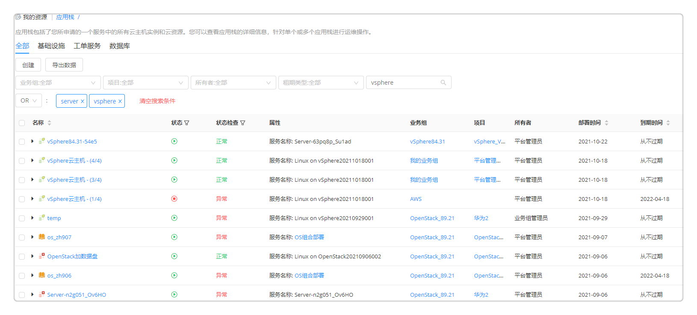

**应用栈**

应用栈包括了用户所申请的一个服务中的所有云主机实例和云资源。

应用栈页面可查看应用栈的状态、详情、监控等。用户可通过统一页面，看到申请的所有应用栈和云资源，包括，云主机、存储、网络、软件等，查看运行状态，并进行允许的各种变更运维操作。

  +  在左侧导航栏选择 我的资源 - 应用栈 后，您将会看到应用栈列表，支持勾选编辑列表的基本信息展示列（如部署时间、租期类型、业务组等），可根据业务组、所有者、项目进行筛选，也可直接进行关键词搜索操作。点击 导出数据 按钮可以导出筛选后的应用栈列表，导出格式支持CSV和Excel。
  +  同时您也可以通过设置搜索条件快速查找应用栈，如果需要设置多条搜索条件，您可以在搜索栏中以英文逗号隔开多个搜索字段。平台目前提供两种搜索条件关联方式：

    - 设置搜索条件为AND: 筛选能够满足所有搜索条件的应用栈。例如，设置搜索条件为vc8434，vsphere,则应用栈名称中同时包括以上搜索条件的应用栈才会显示。
       
 
    - 设置搜索条件为OR: 筛选能够满足任一搜索条件的应用栈。例如，设置搜索条件为vc8434，vsphere,则应用栈名称中包括以上任一搜索条件的应用栈就会显示。
       

  + 列表页面进行重构，如下图所示，用户可以按需拖动间距，表头支持筛选和搜索。

  +  在应用栈列表中，用户可以选中一个或者多个应用栈快速进行一些操作，包括“刷新状态”，“停止”，更多操作如：卸除“应用栈”，“删除管理信息”，“更改所有者”，“更改第二所有者”，“更改项目”，“更改业务组”，“重新执行部署”等。

  +  点击应用栈名称，可查看该应用栈的详细信息。应用栈详情信息界面包括概况，部署拓扑，操作历史，监控（对云主机和应用组件的监控），操作历史以及顶部的运维操作

  +  概况包括应用栈的名称、业务组、项目、蓝图、资源池、云平台，以及费用、状态、时间等相关信息。还包括该应用栈的输入参数列表以及输出参数信息。应用栈部署失败后，某些场景可线下修复，修复成功后支持更改应用栈状态，将操作失败更改为运行
    + 费用信息：展示该应用栈最近一个月的费用。点击费用详情按钮可以跳转至该应用栈的费用分析概览页，包括“费用趋势”和“预测今天（本月）费用”。支持根据时间粒度和时间跨度筛选展示，以及图表形式切换。

  +  部署拓扑包括应用栈的蓝图、详情和流程信息。鼠标悬停至服务拓扑图中，将显示该节点的关键信息，如Server节点将显示云主机名称、客户操作系统、IP地址、内存、磁盘总空间、vCPU数量、CPU使用率、内存使用率等

  +  定时任务显示定时部署服务的相关信息，例如：操作名称、节点名称、定时设置、定时任务描述、创建时间、创建者

  +  操作历史显示该应用栈的操作历史记录，例如启用/切换监控等。如果一个操作正在执行中，您可以点击“取消”按钮取消该操作，也可以批量进行取消操作。

  +  监控显示对该部署中有的组件应用的监控信息，监控的时间跨度有种选择可选（30分钟，1小时，3小时，1天，30天，90天等）

  ## 应用栈运维操作{#应用栈运维操作}

在应用栈列表界面或点击应用栈名称进入应用栈详情界面，均可对应用栈做运维操作。应用栈的运维操作由授权配置进行控制。管理员可在[授权配置](https://cloudchef.github.io/doc/AdminDoc/04组织架构管理/授权配置.html)中创建和管理授权配置模板，定义用户对应用栈可以进行的操作，同时可以指定审批流程。

  ### 刷新状态
状态为遗失的虚拟机无法查看详情，在某些业务场景中，遗失的虚拟机会重新加入平台中，需要支持能够手动刷新状态。同时，也要能够支持其他云资源状态的刷新。
+ 支持批量刷新，在应用栈列表中，选中一个或多个部署
+ 点击刷新状态按钮，可以手工刷新状态。刷新状态的按钮放在第一个。
+ 刷新后，后台更新每个应用栈的状态还包括：规格配置的修改，磁盘的增加，IP地址的修改，刷新的结果通过通知返回。刷新的操作会记录到操作历史中。
+ 在云主机中进行运维操作时，SmartCMP能够根据虚拟机的UUID重新刷新虚拟机的正确状态

  ### 启动应用栈 

若应用栈处于关闭状态，则点击重启按钮进行启动应用栈的操作。可以通过设置启用定时，从而定时（将来某一时刻）触发此项任务。

  ### 停止应用栈 

若应用栈处于正在运行的状态，则可以点击停止按钮完成停止应用栈，该操作将对该应用栈下的所有虚机进行关机操作。可以通过设置启用定时，从而定时（将来某一时刻）触发此项任务。

  ### 付费方式转换

 若应用栈下的资源为私有云云资源，则平台支持付费方式的互转。勾选某个应用栈，点击按需转包年包月按钮或者包年包月转按需按钮，该操作将对应用栈下的所有云资源进行付费方式转换的操作。当多个应用栈拥有相同的付费方式，您也可以进行批量转换。

  ### 安装软件

选择应用栈下的云主机，并选择需要安装的软件。该软件列表来源于 我的资源 - 云资源 - 软件组件，可对软件的属性键值进行更改。 

  ### 更改组织信息
  
您可通过以下操作更改组织信息：

   
   - 更改所有者 

     更改应用栈的所有者，将会同时改变该应用栈下的所有云资源的所有者。所选的目标所有者，为该业务组下的成员。

   - 更改第二所有者

      第二所有者可以访问当前应用栈（以及部署所包含的所有云资源）。您可以对第二所有者单独配置授权，指定其对应用栈和云资源可进行的操作。

   - 更改项目 

      更改应用栈的所属项目，将会同时改变该应用栈下的所有云资源的所属项目和所有者。选择目标项目，并选择该项目下的所有者。

   - 更改业务组 

      将会把该应用栈下的所有云资源同时更改到新业务组中，并修改所有者等相关信息。请确保目标和源业务组使用了相同的共享资源池，否则将无法进行更改。选择目标业务组，项目（可选），所有者（该业务组下的成员）。

### 设置标签

可为云主机设置键值标签或云资源标签，从而为云主机分类和过滤。设置标签的方法如下：

1.  在应用栈列表页面点击应用栈左侧三角展开已部署云主机列表，点击右侧···展开云主机运维操作列表。

2.  点击设置键值标签（或设置云资源标签）

3.  设置键值标签：填写键、值，点击创建，标签创建成功；也可选择已有的标签，点击确定。
    设置云资源标签：选择管理员定义好的云资源标签，通常由一对键值对组成。
    
>「Note」管理员需在 界面配置 - 服务申请 中打开键值标签/云资源标签的字段配置以允许用户进行设置标签操作。

### 扩展与收缩

针对已部署集群的应用栈，系统支持扩展与收缩的功能，即您可以增加或者减少该集群中的云主机数量。具体方法如下：

1. 点击应用栈名称，进入操作详情页，选择 全部操作 - 伸缩。

2. 选择当前集群，并设置目标节点数量，该目标数量需在设置的节点范围之内。

### 复制
复制应用栈：应用栈部署成功后，可将该应用栈整体的应用环境复制至其他云平台或克隆至当前云平台。

常见应用场景：例如将vSphere应用栈复制至阿里云，vSphere至vSphere，阿里云至阿里专有云

操作步骤：

1.  选择目标服务：选择目标业务组、项目（可选）、所有者以及服务，选择当前实例节点作为模板来复制/新建到所选的服务拓扑图中的目标节点

2.  配置参数：填写应用栈名称（若业务组有规则将根据业务组规则自动生成）、应用栈租用到期时间，以及配置该服务拓扑图中的其他节点参数，针对每个计算节点，可以选择复制或者新建（从模板部署一台新机器）

3.  点击提交，等待执行。

>「Note」若是跨云复制，则需要第三方支持

延长过期时间：延长应用栈的租用到期时间，点击将显示业务组中设置的最大可延期次数以及已延期次数，选择延长到哪一时间到期，精确到分钟。

### 删除

您可通过以下步骤进行删除操作：

 - 卸除应用栈 

 应用栈部署后，可卸除该应用栈下的云资源。选择部署的服务，点击更多操作-删除-卸除，可以通过设置启用定时，从而定时（将来某一时刻）触发此项任务。卸除应用栈将删除在SmartCMP中新建的所有资源。若该应用栈中包含共享资源，将不删除共享资源；若该应用栈包含已有资源，如LoadBalance"使用已有资源"，将不删除已有资源；若导入资源后，您是该资源的Owner，可删除导入资源。

 - 删除管理信息 

 删除该应用栈以及所属虚拟机在SmartCMP上的管理信息，在相关云平台中仍然保留，不进行删除。选择部署的服务，点击更多操作-删除-卸除，可以通过设置启用定时，从而定时（将来某一时刻）触发此项任务

 - 删除节点 
 可在应用栈后删除计算节点、存储和软件组件。点击删除节点，将展示该应用栈名称、该部署下的所有计算节点、存储和软件组件节点以及部署状态，可单选或多选节点进行删除，可启用定时指定时间进行操作。

### 重新部署 

您可通过以下操作重新部署：

+ 重新执行部署：可在应用栈部署后针对部署节点进行重新执行部署的操作。

  操作步骤：

  1.  点击更多操作-重新部署-重新执行部署，将展示该应用栈名称、该部署下的所有计算节点/存储节点/软件组件节点以及部署状态。

  2.  可单选或多选节点进行重新执行；可启用定时，从而定时（将来某一时刻）触发此项任务。

  3.  点击确定，等待执行。

+ 重新申请部署：可在应用栈部署成功或失败后重新申请部署操作。

  操作步骤：

  1.  点击更多操作-重新部署-重新申请部署。

  2.  服务申请页面将自动带入该部署执行所用的参数，允许修用户修改参数。

  3.  点击申请，等待部署执行。

