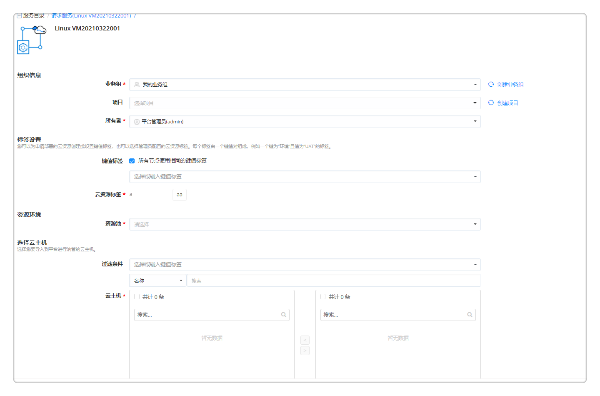
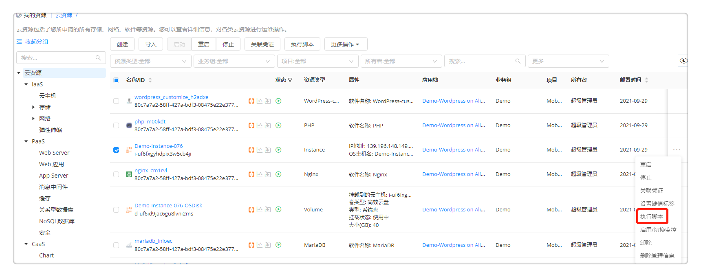
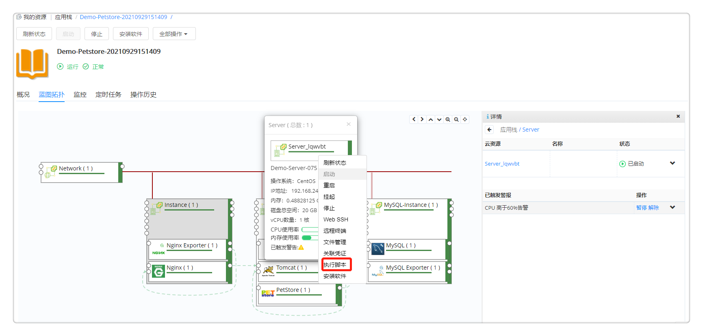
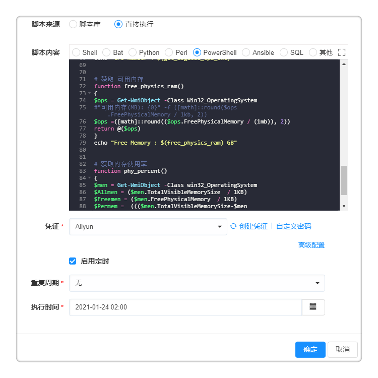

**云主机**

用户可以查看云主机列表来对其进行管理和操作，操作的启用和是否需要审批需要在业务组级别或者服务配置级别进行设置。

# 云主机信息查看

在左侧导航栏选择 我的部署 - 云主机 后，用户将会看到云主机的列表。可在该列表界面查看云主机的详细信息。可通过点击右上角选择展示列的按钮，选择您需要的列进行展示。

在云主机列表中，用户可以选中一个或者多个云主机快速进行一些操作，包括启动、重启、挂起、停止、执行脚本、设置标签、启用/切换监控、更新监控代理，具体操作介绍会在下文展开

您也可以单击某一个云主机进入其详情界面进行管理和操作：

  - 概况：包括了云主机的主要配置信息，监控信息（如果启用了监控），凭证信息（如果关联了凭证）等。

  - 网络连通：显示连接云主机的方式
     -  平台直连：直接访问云主机
     -  通过云网关（云网关的名称）进行连接：云网关已部署，并与资源池作关联，通过云网关访问该云主机。
  
  - 监控：包括了该云主机CPU、内存、磁盘、网络的监控数据（可以按照需要调整时间跨度或者平均时间来查看历史监控数据）

  >「Note」只有在云主机模板中配置安装监控的云主机在部署生成后，才可以在监控中看到数据，如何配置安装监控请参看 云主机模板 章节。

  - 已触发警报：如果配置了告警，该云主机有警报产生，可在此处查看所有警报。

  - 快照信息：显示当前的快照信息（快照名称、创建时间等），点击添加可以创建快照。支持vSphere、OpenStack和阿里云主机。

  - 定时任务：列出了您针对该云主机设置的所有定时任务。

  - 操作历史：包括了该云主机进行过的操作的历史记录

  - 操作列表：云主机图标的上方显示了运维的操作列表，具体操作介绍会在下文展开

# 云主机快速导入{#云主机快速导入}
在云主机列表界面，您可以点击导入按钮快速导入已有云资源至SmartCMP进行纳管。

 + 导入存量机器至SmartCMP进行纳管，当您有物理机需要管理，或者在SmartCMP暂未支持的云平台上已部署云资源，并需要导入至SmartCMP进行纳管，普通用户（有云主机列表查看和创建权限）可以进行以下操作：
   1. 在 我的部署 - 云主机 界面，点击导入按钮，选择导入存量机器 ，根据需求选择导入Linux云主机或者Windows云主机。
   2. 在请求服务页面填写申请信息，信息填写请您参考[创建HostPool资源池](https://cloudchef.github.io/doc/AdminDoc/03基础设施管理/资源池管理.html#添加HostPool资源池)。
   3. 点击申请按钮，完成导入云资源的申请。

 + 导入云主机至SmartCMP进行纳管，当您在主流公有云，私有云（例如阿里云，腾讯云，AWS, Azure, vSphere等）上已部署云资源，并需要导入至SmartCMP进行纳管，平台管理员可以进行以下操作：
   1. 在 我的部署 - 云主机 界面，点击导入按钮，选择导入云主机。
   2. 在导入云主机页面填写配置信息
     + 资源池：请选择需要纳管的云主机的所属资源池，如无法选择，请先添加对应的资源池。
     + 云主机：请选择需要导入纳管的云主机。
     + 业务组：请选择导入云主机所属的业务组，如无法选择，请先添加对应的业务组。
     + 项目：请选择导入云主机所属的项目，如无法选择，请先添加对应的项目。
     + 所有者：请选择导入云主机所属的所有者。
     + 键值标签：请选择或输入键值标签，为您所要导入的主机打上标签。键值标签由一个键值对组成。例如，您可以定义一个键为“环境”且值为“UAT”的标签。
       
   3. 点击确定按钮，完成导入云主机的申请。

# 云主机运维操作

在云主机列表界面或点击云主机名称进入云主机详情页面，均可对云主机进行下列运维操作。

  >「Note」
  * 列表页面可批量对云主机进行操作。不能批量进行的操作请进入云主机详情页面。
  * 只有在授权配置模板中配置云主机的操作许可，云主机在部署生成后才能看到允许的操作列表，如何配置云主机操作许可请参看授权配置章节。
  * 运维操作针对不同云平台的云主机略有不同。

 ## 启动

可以实时启动（关机状态的）云主机，也可以通过设置启用定时，定时（在将来某一时刻）触发此项任务。

 ## 挂起（vSphere）

挂起一个或者多个（开机状态的）云主机，可以通过设置启用定时，定时（在将来某一时刻）触发此项任务。

 ## 停止

可以实时关机（开机状态的）云主机，可以通过设置启用定时，定时（在将来某一时刻）触发此项任务。

 ## 重启

重启一个或者多个（开机状态的）云主机，可以通过设置启用定时，定时（在将来某一时刻）触发此项任务。

 ## 执行脚本 

在该云主机中执行一个脚本库的脚本，可以通过设置启用定时，定时（在将来某一时刻）触发此项任务，具体操作步骤请参考[执行脚本](https://cloudchef.github.io/doc/AdminDoc/11作业管理/脚本库.html#脚本执行)。

您也可以直接输入脚本，通过设置启用定时，定时（在将来某一时刻）触发此项任务，具体步骤如下：
  1. 您可以通过以下不同的方式执行脚本操作
   + 在左边导航选择 我的部署 - 云主机 ，选择云管平台已纳管的云主机，点击执行脚本。
    
     　 　
   + 在左边导航选择 我的部署 - 云资源 ，选择云管平台已纳管的云主机或者RDS资源，点击执行脚本。
     
   + 在左边导航选择 我的部署 - 服务部署 ，选择云管平台已纳管的云主机或者RDS资源，点击执行脚本。
     
   + 在左边导航选择 我的部署 - 服务部署 ，点击服务的部署拓扑，选择云主机或者RDS资源，点击执行脚本。
     
  2. 在执行脚本配置页面，选择直接执行，并点击脚本类型，直接输入脚本内容。
  3. 输入凭证或者自定义用户密码
  4. 点击确定按钮，完成脚本执行任务。

  　
>「Note」如果您输入的是ansible脚本或者输入其他类型脚本且并未安装代理，执行脚本时必须使用凭证或者自定义密码。

 ## 迁移（即vSphere vMotion迁移）

支持对vSphere的计算资源迁移和存储迁移。利用vSphere的vMotion迁移功能，使用不同的迁移方式，将云主机在不同主机之间进行迁移。

   -   计算资源迁移：选择目标主机，可以通过设置启用定时，定时（在将来某一时刻）触发此项任务。

   -   存储迁移：

    -   链接克隆：选择需要存储，将目标云主机迁移到所选的存储中去；

    -   完全克隆：选择置备模式（与源格式相同、精简置备、厚置备延迟置零、后置备置零）；选择云主机存储策略（保留现有云主机存储策略、数据存储默认值，以及其他自定义存储策略）；存储（根据所选的存储策略判定存储的兼容性，并显示各存储的空间和占比）

   -   启用定时：设置时间在将来某一时刻触发此项任务

## 远程终端

vSphere的云主机，将使用vSphere的Web console client，无需浏览器特别支持。

OpenStack云主机远程终端操作需要使用VNC Web Client，您的浏览器需要支持HTML5 Canvas和HTML5 WebSockets。如果需要了解VNC WebClient所支持的全部浏览器，可以访问https：//github.com/kanaka/noVNC/wiki/Browser-support

阿里云的云主机，远程终端使用VNC的方式，请首先在 更多操作 - 其他 - 设置VNC密码 中设置密码，然后通过远程终端，输入VNC密码后进行访问。

## 关联凭证 {#关联凭证}

可为云主机关联用户凭证。将云主机与您的凭证关联之后，下次访问云主机时，平台将自动选用关联的凭证。当您修改凭证的密码或密钥时，可同步更新云主机操作系统中的密码或密钥。
   + 从下拉框内选择已有凭证，与云主机关联
   + 勾选 将凭证信息录入到云主机中 ，如果虚拟机的操作系统中已存在凭证中的用户，会将该用户的密码进行更新；如果不存在，则将创建新的用户。
   + 输入连接云主机的密码。可以通过下拉框选择已有凭证，或者点击自定义密码并输入用户名与密码。

## 设置标签

可为云主机设置键值标签或云资源标签，从而为云主机分类和过滤。云主机标签的使用方法如下：

 - 添加标签

    + 对新建的云主机添加标签：

      1.  在左侧导航栏选择 我的部署 - 云主机 ，在云主机的列表界面，选择一个云主机

      2.  点击上方的 更多操作 - 更改配置 - 设置键值标签（或设置云资源标签） ，出现标签的设置界面

      3.  设置键值标签：填写键、值，点击创建，标签创建成功；也可选择已有的标签，点击执行。
          设置云资源标签：选择管理员定义好的云资源标签，通常由一对键值对组成。
      
      4.  在云主机详情页，可查看已添加的云主机标签。用户亦可在已添加的键值标签/云资源标签处点击+号，为云主机添加新的标签。

    + 对导入的云主机添加标签：

      1.  在左侧菜单选择 服务部署 - 云主机，点击导入按钮导入云主机

      2.  在标签设置中，可以为导入的云主机选择键值标签，也可以输入键值创建新的标签
      
   >「Note」管理员需在 界面配置 - 服务申请 中打开键值标签/云资源标签的字段配置以允许用户进行设置标签操作。管理员可在 系统配置 - 系统参数 启用同步标签功能，启用后在服务申请时新建的键值标签将被同步至云平台。

 - 修改/删除标签：

   在云主机列表界面，选择一个云主机；点击更多操作- 更改配置 - 设置键值标签/设置云资源标签，可直接删除并重新创建键值标签，或重新选择云资源标签。

## 管理磁盘

您可通过以下操作管理磁盘：

  - 添加新磁盘

    点击 更多操作 - 管理磁盘 - 添加新磁盘 给云主机添加一块新的磁盘。

>「Note」vSphere云主机在挂起状态下不能执行该操作；Azure云主机在添加磁盘时需是关机状态。

  - 扩展磁盘

    点击 更多操作 - 管理磁盘 - 扩展磁盘 给云主机扩展一块已有的磁盘。

>「Note」vSphere云主机在挂起状态下不能执行该操作；Azure仅支持卷分离后调整磁盘大小。

## 管理文件系统

您可通过以下操作管理文件系统：

  - 添加文件系统
  
    点击 更多操作 - 管理磁盘 - 添加文件系统 给云主机添加新的文件系统。
    
    允许创建一个或者多个文件系统。如果需要在逻辑卷上创建一个文件系统, 请在文件系统的来源中指定或选择一个卷组。若该卷组已存在，系统将直接在已创建的逻辑卷上创建一个文件系统；若指定的逻辑卷不存在，将自动创建该逻辑卷然后在该逻辑卷上创建一个文件系统。如果需要直接从一个磁盘上创建一个文件系统, 请在文件系统的来源中选择自动创建一块新磁盘。
   

  - 扩展文件系统
  
    点击 更多操作 - 管理磁盘 - 扩展文件系统 给云主机扩展已有的文件系统。

>「Note」导入的云主机在添加和扩展文件系统前请先关联凭证。

## 更改配置

您可通过以下操作更改配置：

 - 调整虚机配置

     更多操作 - 更改配置 - 调整虚机配置，可调整云主机的CPU和内存配置。

>「Note」阿里云云主机需要在关机状态下进行调整。

 - 添加网卡

    添加一个新网卡，针对该计算节点的所有实例生效，选择网络标签和IP分配方式，目前vSphere只支持DHCP，OpenStack和PowerVC支持DHCP和IP池两种IP分配方式，OpenStack云主机还支持手动指定IP。

 - 删除网卡

    删除运维新增加的网卡，该操作会影响该节点的所有云主机。

 - 更新云主机名称

    点击更多操作 - 更改配置 - 更新云主机名称，可以重新设置云主机的显示名。

 - 重置操作系统主机名

    点击更多操作 - 更改配置 - 重置操作系统主机名，可以重新设置操作系统主机名，即OS Hostname。

## 管理快照

您可通过以下操作管理快照：

 - 创建快照

  支持创建快照的时候，设置定时循环任务，例如在每天的某个时间，每周或每月的某一天，自动的进行快照创建，并且支持随时查看、取消已经设置的定时循环任。

   1.  在左边导航选择 我的部署- 云主机 ，在右边选择快照信息

   2.  点击添加按钮 ，输入名称，若启用定时循环任务，名称将由系统自动生成。

   3.  点击确定，定时创建快照的任务设置成功。

   4.  在左边导航选择 我的部署 - 云主机 ，在右边选择定时任务

   5.  选中操作名称，点击上方的删除，即可取消已经设置的定时循环任务。

 - 恢复至快照

    把云主机恢复到之前的某一个快照。

 - 删除快照

   点击删除按钮，选择快照名称，删除已创建的快照

>「Note」阿里云的快照管理在云资源的磁盘中进行配置。

## 监控和代理

您可通过以下操作管理监控代理：

 - 启用/切换监控

   目前对云主机支持两种监控方式：平台的代理监控以及云平台监控。
   - 代理监控是通过在云主机中安装平台的监控代理，获取监控信息；
   - 云平台监控是指通过云平台的API，获取监控信息，无需安装代理。vSphere和微软Azure的云主机，阿里云的ECS、SLB、OSS、RDS等资源支持这种方式。

>「Note」请首先在阿里云和Azure云平台入口的配置中，启用云平台监控。启用后会频繁调用云平台API，可能会触发云平台的API限流机制，并需要为超出免费次数限制的API调用支付额外的费用。

 - 更新监控代理

   如果云主机安装了监控代理，可通过该操作进行更新。

## 其他

如果您在组件中，增加了新的运维操作，可以在此处显示。例如下图，如果您在vSphere的Instance组件中，自定义了一个备份的操作，并加入了 其他 操作分组，配置授权之后，用户可在 更多操作 - 其他 中进行点击操作。自定义组件操作的具体步骤，请参考：[配置操作](https://cloudchef.github.io/doc/AdminDoc/05服务建模/组件库.html#配置操作)

