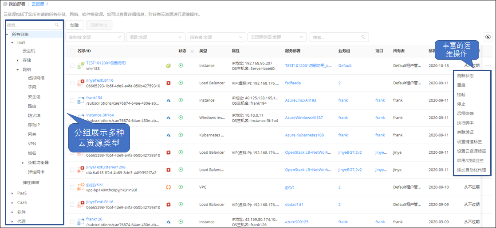

**云资源**

云资源菜单下统一纳管所有的云资源，展示其相关信息以及提供各云资源对应的运维操作。

用户可通过统一页面，看到申请的所有云资源，包括，云主机、存储、网络、软件等，查看运行状态，并进行允许的各种变更运维操作。

如下图，用户能快速查看云资源分组，并针对任意云资源统一地进行运维变更操作。
  + 在云资源列表和详情页均可为云资源设置键值标签或云资源标签，从而为云资源分类和过滤。设置后，云资源列表及详情页将展示当前云资源的所有标签。管理员需在系统设置 - [界面配置](https://cloudchef.github.io/doc/AdminDoc/09系统管理/#界面配置) 中启用键值标签或云资源标签的申请字段配置，并在[资源标签](https://cloudchef.github.io/doc/AdminDoc/03基础设施管理/资源标签.html)中预设云资源标签。
  

# 云资源快速导入{#云资源快速导入} 
在云资源列表界面，您可以点击导入按钮快速导入已有云资源至SmartCMP进行纳管。

## 云主机导入

您可以点击导入按钮快速导入已有云资源至SmartCMP进行纳管。详情请参考[云主机快速导入](https://cloudchef.github.io/doc/AdminDoc/14我的部署/云主机.html#云主机快速导入)

## 存量机器导入

您可以导入存量机器至SmartCMP进行纳管。当您有物理机需要管理，或者在SmartCMP暂未支持的云平台上已部署云资源，并需要导入至SmartCMP进行纳管，普通用户（有云主机列表查看和创建权限）可以进行以下操作：
   1. 在 我的部署 - 云资源 界面，点击导入按钮，选择导入存量机器 ，根据需求选择导入Linux云主机或者Windows Machine。
   2. 在请求服务页面填写申请信息：
     + 组织信息
       + 业务组: 您可以选择资源所属的业务组，如无法选择，可选择添加业务组
       + 项目: 您可以选择资源所属的项目，如无法选择，可选择添加业务组
       + 所有者：您可以指定资源所属的人员
     + 部署信息
       + 名称：自定义资源名称，或者您可以点击 组织架构 － 命名规范 创建命名规则，则在此可以根据业务组上的规则自动生成
       + 数量：您可以一次创建多个服务部署
       + 执行时间：您可以指定在未来的某个时间，进行服务部署的创建
       + 付费方式：可选包年包月或者按需
       + 租用到期时间：您可以指定服务部署的使用期限。到期之后，所有的服务将被停机
       + 保留时间（日）：您可以指定使用期限到期之后，服务部署的保留时间。到期之后，所有的服务将被卸除。您可以输入大于等于2，留空为无限期
     + 标签设置：您可以为申请部署的云资源设置管理员配置的云资源标签。每个标签由一个键值对组成，例如一个键为“环境”且值为“UAT”的标签。
     + 资源环境
       + 资源池：指定导入资源的Hostpool资源池
       + IP地址：请输入云主机的IP地址，以供访问
       + 主机名：输入主机名
       + IPMI配置信息：勾选则您需要配置接入智能平台管理的接口，您可以通过IPMI实现对物理设备的开关机操作。
       + IPMI访问配置：请输入IPMI本地地址，用户，密码，主机IP以及端口信息等。
     + 系统配置
       + 协议：您可以选择安全协议，例如SSH(安全外壳协议)
       + 端口：填写端口号 
       + 验证方式：您可以选择“凭证”或者“密码”
       + 凭证：当验证方式选择“凭证”，请选择可以SSH登录云主机的用户凭证。若下拉为空，请首先创建。
       + 用户名，密码：当验证方式选择“密码”，请输入可以通过SSH登录云主机的用户名和用户密码。   
   3. 点击申请按钮，完成导入云资源的申请。

## 云上资源导入

您可以根据以下步骤导入云上资源至SmartCMP进行纳管：
   1. 在 我的部署 - 云主机 界面，点击导入按钮，选择需要导入的云上资源，如RDS等。
   2. 在请求服务页面填写申请信息：
     + 组织信息
       + 业务组: 您可以选择资源所属的业务组，如无法选择，可选择添加业务组
       + 项目: 您可以选择资源所属的项目，如无法选择，可选择添加业务组
       + 所有者：您可以指定资源所属的人员
     + 部署信息
       + 名称：自定义资源名称，或者您可以点击 组织架构 － 命名规范 创建命名规则，则在此可以根据业务组上的规则自动生成
       + 数量：您可以一次创建多个服务部署。点击申请参数的“+”可以同时导入多个资源，部署信息内的数量值会对应调整。
     + 标签设置：您可以为申请部署的云资源设置管理员配置的云资源标签。每个标签由一个键值对组成，例如一个键为“环境”且值为“UAT”的标签。
     + 资源环境：指定导入资源的资源池及可用区（如有）等。
     + 资源参数：选择表单定义的资源参数
     + 系统配置
       + 名称：输入导入资源的名称，留空将使用业务组命名规则自动生成。
       + 管理员凭证：选择一个共享给所有业务组的凭证。若下拉为空，请首先创建。您也可以点击自定义密码，手动输入管理员密码并确认。 
   3. 点击申请按钮，完成导入云资源的申请。 

## 非云资源导入

您可以根据以下步骤导入非云资源至SmartCMP进行纳管：
   1. 在 我的部署 - 云主机 界面，点击导入按钮，选择需要导入的非云资源，如数据库、网络设备等。
   2. 在请求服务页面填写申请信息：
     + 组织信息
       + 业务组: 您可以选择资源所属的业务组，如无法选择，可选择添加业务组
       + 项目: 您可以选择资源所属的项目，如无法选择，可选择添加业务组
       + 所有者：您可以指定资源所属的人员
     + 部署信息
       + 名称：自定义资源名称，或者您可以点击 组织架构 － 命名规范 创建命名规则，则在此可以根据业务组上的规则自动生成
       + 数量：您可以一次创建多个服务部署。点击申请参数的“+”可以同时导入多个资源，部署信息内的数量值会对应调整。
     + 标签设置：您可以为申请部署的云资源设置管理员配置的云资源标签。每个标签由一个键值对组成，例如一个键为“环境”且值为“UAT”的标签。
     + 资源参数：选择表单定义的资源参数
     + 系统配置
       + 名称：输入导入资源的名称，留空将使用业务组命名规则自动生成。
       + 管理员凭证：选择一个共享给所有业务组的凭证。若下拉为空，请首先创建。您也可以点击自定义密码，手动输入管理员密码并确认。 
   3. 点击申请按钮，完成导入云资源的申请。 

下面对云资源菜单下包含的存储、网络、软件等资源及相关运维操作进行介绍：

# 容器服务 

支持在云资源中展示kubernetes的各个组件信息，包括部署（Deployment）、容器（Container）、服务（Service）、路由（Ingress）、存储卷（PVC）、配置字典（ConfigMap）、保密字典（Secrets）等。

## 部署
Kubernetes的部署（Deployment）为Pod和ReplicaSet提供声明式更新。通过在Deployment中描述所期望的集群状态，DeploymentController会将现在的集群状态在一个可控的速度下逐步更新成所期望的集群状态。Deployment的主要职责同样是为了保证Pod的数量和健康，90%的功能与ReplicationController完全一样，可以看作下一代的Replication Controller。
  + 支持对部署（Deployment） 的资源展示，点击 容器服务 - 部署 ，将看到Kubernetes的部署列表：显示名称、云平台类型、状态、业务组、服务部署、项目、所有者、标签、容器组、镜像以及创建时间。高级搜索可通过业务组、状态、项目和所有者对列表信息进行快速筛选定位

  + 点击名称，进入部署详情页面。部署详情页面包括基本信息、容器组、操作历史、监控、已触发警报，以及更新副本数量、更新镜像调整配置等运维操作

    >「Note」监控、已触发警报标签页需要在Kubernetes的云平台处设置Prometheus监控地址后才会出现。

  + 部署的基本信息标签页包括：

    -   基本信息：名称、命名空间、标签、注释、策略、镜像、创建时间等

    -   组织信息：服务部署名称、服务名称、业务组、项目等

    -   运维操作
        -   更新副本数量：更新POD的副本数量（Replicas），点击后在弹框中选择需要更新的副本数量，也可启用定时在特定时间执行操作

        -   更新镜像：更新该部署的实例镜像，点击后在弹出框中选择需要更新的容器节点（必填），选择镜像源，选择镜像名称（必填），选择镜像标签，也可启用定时在特定时间执行操作。点击提交，等待操作执行完成

 >「Note」支持集成Habor以及Docker 原生镜像作为Image Registry。在Kubernetes云平台中，可添加容器镜像源。参考[[添加Kubernetes云平台](https://cloudchef.github.io/doc/AdminDoc/03基础设施管理/云平台管理.html)

  -   调整容器配置：调整选定容器节点的vCPU和内存的大小，包括请求值和最大值，请求值（request）必须小于最大值（limit）

+ 操作历史标签页：包括了该Deployment进行过的操作历史记录

+ 监控标签页：显示该部署的监控信息，如Pod
    CPU使用情况、Pods内存使用情况、Pod网络流量等，可更改时间跨度查看不同时间段的监控信息

+ 已触发警报标签页：根据定义好的对容器的告警策略和告警操作，若监控信息检测到该部署已达到触发警报条件，将触发警报。该页面显示已触发的警报信息，以及可对该警报做恢复、暂停、解除等操作

## 守护进程集

Kubernetes的守护进程集（DaemonSet）保证在每个Node上都运行一个容器副本，常用来部署一些集群的日志、监控或者其他系统管理应用。部署成功后可在左侧导航栏选择 云资源 - 容器服务 - 守护进程集 中查看详细信息。

+ 在 容器服务 - 守护进程集 中可查看守护进程集的基本信息，如：名称、云平台类型、状态、业务组、服务部署、项目、所有者、标签、容器组、镜像和创建时间等。高级搜索可通过业务组、状态、项目和所有者对列表信息进行快速筛选定位

+ 点击名称，进入DaemonSet的详情页面。包括基本信息、容器组、操作历史、监控、已触发警报等

  - 基本信息标签页包括了：

      -   基本信息：名称、命名空间、标签、注释、镜像、创建时间等

    -   组织信息：服务部署名称、服务名称、业务组、项目等

    -   运维操作：更新镜像、调整配置

    -  操作历史标签页：包括了对守护进程组进行过的操作历史记录

>「Note」 监控、已触发警报标签页需要在Kubernetes的云平台处设置Prometheus监控地址后才会出现。

## 有状态副本集

Kubernetes的有状态副本集（StatefulSet）是为了解决状态服务的问题。由以下几个部分组成：用于定义网络标志（DNS domain）的Headless
Service、用于创建PersistentVolumes的volumeClaimTemplates、定义具体应用的StatefulSet。部署成功后可在左侧导航栏选择 云资源 - 容器服务 - 有状态副本集 中查看详细信息。

+ 在 容器服务 - 有状态副本集 中可查看有状态副本集的基本信息，如：名称、云平台类型、状态、业务组、服务部署、项目、所有者、标签、容器组、镜像和创建时间等。高级搜索可通过业务组、状态、项目和所有者对列表信息进行快速筛选定位

+ 点击名称，进入StatefulSet的详情页面。包括基本信息、容器组、操作历史、监控、已触发警报，以及更新副本数量、更新镜像、调整配置等运维操作

## 容器

K8s Container部署成功后可在左侧导航栏选择 云资源 - 容器服务 - 容器 中查看详细信息。

+ 在容器（Container）的列表界面，可查看该容器的名称、云平台类型、状态、业务组、服务部署、项目、所有者、镜像、端口、创建时间等。高级搜索可通过业务组、状态、项目和所有者对列表信息进行快速筛选定位

+ 点击名称，进入容器的详情页面。包括基本信息、操作历史

+ 运维操作：调整配置

## 服务

在K8集群中，客户端需要访问的服务就是Service对象。每个Service会对应一个集群内部有效的虚拟IP，集群内部通过虚拟IP访问一个服务。部署成功后可在左侧导航栏选择 云资源 - 容器服务 - 服务 中查看详细信息。

+ 在容器服务的服务（Service）的列表界面，可查看该服务的名称、云平台类型、状态、业务组、服务部署、项目、所有者、集群IP、内部端点、外部端点、创建时间等。高级搜索可通过业务组、状态、项目和所有者对列表信息进行快速筛选定位

+ 点击名称，进入服务的详情页面。包括基本信息、容器组、操作历史、监控、已触发警报等页面

+ 运维操作：更新副本数量、更新镜像、调整配置

## 路由

在kubernetes中，通常情况下，服务（service）和pod的IP仅可在集群内部访问。集群外部的请求需要通过负载均衡转发到service在Node上暴露的NodePort上，然后再由kube-proxy将其转发给相关的Pod，而路由（Ingress）就是为进入集群的请求提供路由规则的集合。部署成功后可在左侧导航栏选择 云资源 - 容器服务 - 路由 中查看详细信息。

1.  在路由（Ingress）的列表界面，可查看该路由的名称、云平台类型、状态、业务组、服务部署、项目、所有者、端点、规则、创建时间等。高级搜索可通过业务组、状态、项目和所有者对列表信息进行快速筛选定位

2.  点击名称，进入路由的详情页面。包括基本信息、操作历史

## 存储卷

Kubernetes中的存储卷（PVC：PersistentVolumeClaim）是用户存储的请求。它类似于pod。Pod消耗节点资源，PVC消耗光伏资源。部署成功后可在左侧导航栏选择 云资源 - 容器服务 - 存储卷 中查看详细信息。

1.  在存储卷（PVC）的列表界面，可查看该存储卷的名称、云平台类型、状态、业务组、服务部署、项目、所有者、卷状态、总量、访问模式、存储类、创建时间等。高级搜索可通过业务组、状态、项目和所有者对列表信息进行快速筛选定位

2.  点击名称，进入存储卷的详情页面。包括基本信息、操作历史

## 配置字典

在kubernetes中，配置字典（ConfigMap）用于保存配置数据的键值对，可以用来保存单个属性，也可以用来保存配置文件。ConfigMap跟保密字典（Secret）很类似，但它可以更方便地处理不包含敏感信息的字符串。部署成功后可在左侧导航栏选择 云资源 - 容器服务 - 配置字典 中查看详细信息。

1.  在配置字典（ConfigMap）的列表界面，可查看该配置字典的名称、云平台类型、状态、业务组、服务部署、项目、所有者、创建时间等。高级搜索可通过业务组、状态、项目和所有者对列表信息进行快速筛选定位

2.  点击名称，进入配置字典的详情页面。包括基本信息、操作历史

## 保密字典

在kubernetes中，保密字典（Secret）解决了密码、token、密钥等敏感数据的配置问题，而不需要把这些敏感数据暴露到镜像或者Pod Spec中。Secret可以以Volume或者环境变量的方式使用。部署成功后可在左侧导航栏选择 云资源 - 容器服务 - 保密字典 中查看详细信息。

1.  在保密字典（Secret）的列表界面，可查看该保密字典的名称、云平台类型、状态、业务组、服务部署、项目、所有者、类型、创建时间等。高级搜索可通过业务组、状态、项目和所有者对列表信息进行快速筛选定位

2.  点击名称，进入保密字典的详情页面。包括基本信息、操作历史

# IaaS资源

## 云主机

用户可以查看已部署云主机列表，快速部署云主机并进行运维管理操作。

可执行的云主机运维操作包括：刷新状态、启动、停止、执行脚本、关联凭证、设置键值标签和云资源标签、启用/切换监控等，各项运维操作详情请参考：[云主机运维操作](https://cloudchef.github.io/doc/AdminDoc/14我的部署/云主机.html#云主机运维操作)。

当前页面支持批量执行云主机运维操作，不能批量进行的操作请进入云主机详情页面。

## 存储资源 

### 云硬盘

支持对OpenStack/Azure/阿里云/青云的云硬盘进行统一管理。

1.  点击 存储资源 下的 云硬盘 ，将看到云硬盘列表

2.  在云硬盘的列表界面，可查看云硬盘的相关信息：名称、云平台类型、状态、业务组、服务部署、项目、所有者、大小（GB）、挂载状态、挂载到的云主机以及创建时间

3.  点击名称，进入云硬盘详情页面。云硬盘详情页面包括基本信息、操作历史

4.  云硬盘详情的基本信息标签页包括：

  -   基本信息：名称、云平台类型、状态、业务组、服务部署、项目、所有者、大小挂载到的云主机、创建时间等

  -   组织信息：服务部署名称、服务名称、业务组、项目等

  -   运维操作：

      -   卷分离：去除云硬盘和云主机的挂载关系

      -   卷挂载：建立云硬盘和云主机的挂载关系

      -   调整大小：支持对硬盘调整大小（Azure/AWS）

5.  云硬盘详情的操作历史标签页：包括了该云硬盘进行过的操作历史记录

### 对象存储

支持对AWS、Azure、阿里云的对象存储进行统一管理，分别是S3、Blob、OSS。

1.  在云资源标签页中，点击所有分组中的"Iass"下的“存储”，点击对象存储，将看到对象存储列表

2.  在对象存储的列表界面，可查看对象存储的相关信息：名称、云平台类型、状态、业务组、服务部署、项目、所有者、创建时间

3.  点击名称，进入对象存储详情页面。对象存储详情页面包括基本信息、操作历史

4.  对象存储详情的基本信息页面包括：

  -   基本信息：名称、云平台类型、状态、所有者、公共访问级别、存储账户、资源组、创建时间等

  -   组织信息：服务部署名称、服务名称、业务组、项目等

5.  对象存储详情的操作历史页面：包括了该云硬盘进行过的操作历史记录

## 网络资源 

支持OpenStack的防火墙（FireWall）、浮动IP（Floating IP）的独立部署和全生命周期管理。

部署完成后，可在云资源标签页， 云资源 - 网络资源 处查看基本信息和运行状况。并支持OpenStack的负载均衡器（LoadBalance）和负载均衡监听器（Listener），以及VMware　NSX的虚拟服务器（VirtualServer）。

### 负载均衡器

负载均衡是高可用网络基础架构的关键组件，通常用于将工作负载分布到多个服务器来提高网站、应用、数据库或其他服务的性能和可靠性。

若部署中包含负载均衡器（LoadBalancer），则部署成功后可在 云资源 - 网络资源 - 负载均衡器 中查看详细信息。

1.  在负载均衡器（LoadBalancer）列表界面，显示负载均衡器的名称、云平台类型、状态、业务组、服务部署、项目、所有者、IP地址、创建时间等

2.  点击名称进入详情页面，包括基本信息、操作历史

3.  运维操作（OpenStack）：

  -   绑定浮动IP：选择某一浮动IP，将该负载均衡器和浮动IP进行绑定，可启动定时在特定时间执行操作

  -   解绑浮动IP：若该负载均衡器已绑定浮动IP，则可进行解绑操作，可启动定时在特定时间执行操作

### 负载均衡监听器

支持VMWare NSX / OpenStack / Azure的负载均衡监听器，VMWare NSX负载均衡监听器为VirtualServer，OpenStack 负载均衡监听器为Listener，Azure负载均衡监听器为LoadBalancerRule。负载均衡器可以监听多个端口上请求，每个端口通过负载均衡监听器指定。部署成功后可在 云资源 - 网络资源 - 负载均衡监听器 中查看详细信息。

1.  在负载均衡器监听器（Listener）列表界面，显示负载均衡监听器的名称、状态、描述、业务组、项目、所有者、协议、云平台类型、创建时间等

2.  点击名称进入详情页面，包括基本信息、操作历史界面，以及添加成员、删除成员等运维

3.  运维操作 -- OpenStack

  -   添加成员：添加成员（member），可添加内部成员和外部成员。选择要添加成员的云主机、指定IP地址、端口和权重。可启动定时在特定时间执行操作

  -   删除成员：点击后选择需要删除的成员，可启动定时在特定时间执行操作

### 浮动IP

支持OpenStack的的浮动IP（FloatingIP），FloatingIP可单独部署，部署成功后可在左侧导航栏选择 云资源 - 网络资源 - 浮动IP 中查看详细信息。

1.  在选择 云资源 - 网络资源 - 浮动IP ，可查看已部署成功的浮动IP的列表界面，该界面显示浮动IP的名称、云平台类型、状态、业务组、服务部署、项目、所有者、IP地址、网络、映射地址、创建时间等

2.  点击名称，进入详情页面，包括基本信息、操作历史

3.  基本信息标签页，显示该浮动IP的的基本信息和组织信息

4.  操作历史标签页，显示操作历史记录，点击后将在操作历史列表下方显示操作详情

5.  运维操作：

  -   关联端口：若当前FloatingIP未关联任何一个端口，则在详情页上方会显示「关联端口」操作，点击后在弹框中选择需要绑定的端口，下拉框中会列出当前业务组下，OpenStack云平台中所有未被关联的端口（Port）。选择后点击提交

  -   解除绑定：若当前FloatingIP已关联端口，则在详情页上方会显示「解除绑定」操作，点击后提交，也可启用定时在特定时间执行操作

### 防火墙

支持OpenStack防火墙即服务（Firewall as a service），Fwaas应用于OpenStack对象，如项目，路由器和路由器端口。OpenStack防火墙的核心概念是防火墙策略和防火墙规则。策略是有序的规则集合。可在左侧导航栏选择 云资源 - 网络资源 - 防火墙 查看已部署成功的防火墙。

1.  选择 云资源 - 网络资源 - 防火墙 ，可查看已部署成功的防火墙列表界面，该界面显示防火墙的名称、云平台类型、状态、业务组、服务部署、项目、所有者、策略、路由、激活状态、管理员状态、创建时间等

2.  点击名称，进入详情页面，包括基本信息、操作历史

3.  基本信息标签页：显示该防火墙的的基本信息和组织信息

4.  操作历史标签页：显示操作历史记录，点击后将在操作历史列表下方显示操作详情

5.  运维操作：

  +  更新防火墙：点击后可在页面中选择已有的防火墙策略或新建防火墙策略。勾选 使用已有策略 ，将列出当前业务组下，OpenStack云平台中所有可用的防火墙策略。若未勾选，则新建防火墙策略，需填写策略名称（必填），策略描述（选填），可选择是否属于已共享、已审计，还可定时，操作完成后点击提交

  +  更新防火墙策略：该页面将列出当前所有可用的规则列表。支持使用已有规则和新建规则。若使用已有规则，在列表中勾选将使用的规则即可。若新建规则，将展现新建规则界面：

      -   填写基本信息：名称、描述、协议（必填，TCP、UDP、ICMP和任何）、动作（必填，允许、拒绝）、源IP、源端口、目的IP、目的端口、选择是否是共享的、激活

      -   可选择新增的规则的位置，指定当前规则在某条规则之前插入（规则前于），或指定规则在某条规则后插入（规则后于）。如果两者均被指定，前者优先级更高。

    >「Note」：一个防火墙策略可关联多个规则，但规则只能被一个策略所关联

  +  删除防火墙规则：删除防火墙中已关联的规则，删除后将不可恢复。可同时选择多个规则删除，也可启动定时在特定时间执行操作

### 安全组

安全组是一种虚拟防火墙，具备状态检测和数据包过滤功能，用于在云端划分安全域。您可以通过配置安全组规则，允许或禁止安全组内的虚拟机实例对公网或私网的访问。

支持展示OpenStack、AWS、Azure、阿里云的安全组。若安全组组件部署后，将在 云资源 - 网络资源 - 安全组 中查看部署的安全组组件。

1.  在安全组列表界面，显示安全组名称、云平台类型、状态、所属业务组、服务部署、所属项目、所有者、创建时间等

2.  点击名称进入详情页面，包括基本信息、操作历史界面

3.  基本信息标签页，显示该安全组的的基本信息、组织信息和入站/出站安全组规则。

4.  操作历史标签页，显示操作历史记录，点击后将在操作历史列表下方显示操作详情

### 域名系统DNS

支持OpenStack域名系统DNS，若DNS组件部署后，将在 云资源 - 网络资源 - 域名系统DNS中查看部署的DNS组件。

1.  在域名系统DNS列表界面，显示DNS名称、状态、业务组、项目、所有者、DNS类型、DNS域、DNS服务器、DNS参数等

2.  点击名称进入详情页面，包括基本信息、操作历史界面

3.  运维操作

  -   更新DNS：更新DNS参数，DNS类型不可更改

# PaaS资源 

支持AWS、Azure、阿里云的关系型数据库（RDS）的独立部署和全生命周期管理，支持关系型数据库即服务（RDS as a Service）和Web应用。部署完成后，可在 云资源 - PaaS资源 处查看基本信息和运行状况。

## 关系型数据库

在左侧导航栏选择 云资源 - PaaS资源 - 关系型数据库 查看已部署成功的关系型数据库（RDS）。

1.  在关系型数据库的列表界面，可查看关系型数据库的相关信息，如名称、所属业务组、所属项目、所有者、云平台类型、创建时间等

2.  点击名称可进入该关系型数据库详情页面，有基本信息、操作历史两个页面

3.  基本信息标签页，显示该关系型数据库的基本信息和组织信息。

4.  操作历史标签页，显示对该关系型数据库的操作历史记录，点击后将在操作历史列表下方显示操作详情

5.  运维操作：

  -   更新防火墙：点击关系型数据库名称进入详情页，或在关系型数据库的列表页勾选一个关系型数据库，点击更新防火墙按钮，打开 更新防火墙 - RDS名称 弹窗。勾选"定时"，设置执行时间，点击提交按钮，定时更新防火墙；或者直接点击提交按钮，立即更新防火墙

## Web应用

在左侧导航栏选择 云资源 - PaaS资源 - Web应用 查看已部署成功的Web应用

1.  在Web应用的列表界面，可查看Web应用的相关信息，如名称、所属业务组、所属项目、所有者、云平台类型、创建时间等

2.  点击名称可进入该Web应用详情页面，有基本信息、操作历史两个页面

3.  基本信息标签页，显示该Web应用的基本信息和组织信息。

4.  操作历史标签页，显示对该Web应用的操作历史记录，点击后将在操作历史列表下方显示操作详情

# 软件资源

>「Note」  支持对软件资源的统一展示和管理。

1.  选择 云资源 - 软件资源 - 软件 ，可查看已部署成功的软件列表，该界面显示软件名称、云平台类型、状态、业务组、服务部署、项目、所有者、版本、系统类型、创建时间等。可通过高级搜索对业务组、状态、项目或所有者进行筛选，也可使用普通搜索进行快速定位

2.  点击名称，进入详情页面，包括基本信息、操作历史

3.  基本信息标签页：显示该软件的基本信息、组织信息、参数

4.  操作历史标签页：显示操作历史记录，点击后将在操作历史列表下方显示操作详情

5.  运维操作：

>「Note」  运维操作根据 服务建模 - 软件组件 中对个软件的操作定义显示对应的运维操作，例如：启动、停止、删除、创建、配置等
