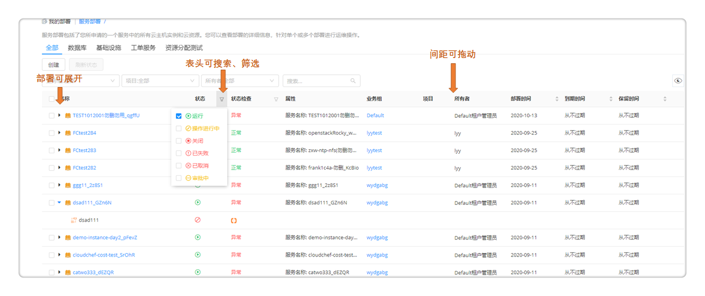

**服务部署**

服务部署包括了用户所申请的一个服务中的所有云主机实例和云资源。

+ 服务部署页面可查看服务部署的状态、详情、监控等。用户可通过统一页面，看到申请的所有服务部署和云资源，包括，云主机、存储、网络、软件等，查看运行状态，并进行允许的各种变更运维操作。

+  在左侧导航栏选择「我的部署」-「服务部署」后，用户将会看到服务部署列表，点击高级搜索，可根据业务组、阶段（运行、操作进行中、关闭、操作失败、已取消、部署审批中）、状态（正常、异常）、所有者、项目进行筛选，也可直接进行搜索操作。

+ 列表页面进行重构，如下图所示，用户可以按需拖动间距，表头支持筛选和搜索。

+  在服务部署列表中，用户可以选中一个或者多个服务部署快速进行一些操作，包括「停止服务部署」「安装软件」「复制服务部署」「延长过期时间」「卸除服务部署」「删除管理信息」「更改所有者」，更多操作如：「更改项目」「更改业务组」和「伸缩」

+  点击服务部署名称，可查看该服务部署的详细信息。服务部署详情信息界面包括「基本信息」「服务部署拓扑」「操作历史」「监控」（对云主机和应用组件的监控）以及顶部的运维操作

+  「基本信息」包括服务部署的名称、业务组、项目、蓝图、资源池、云平台，以及费用、状态、时间等相关信息。还包括该服务部署的输入参数列表以及输出结果信息。服务部署失败后，某些场景可线下修复，修复成功后支持更改服务部署状态，将操作失败更改为运行

+  「服务部署拓扑」包括服务部署的蓝图、详情和流程信息。鼠标悬停至服务拓扑图中，将显示该节点的关键信息，如Server节点将显示云主机名称、客户操作系统、IP地址、内存、磁盘总空间、vCPU数量、CPU使用率、内存使用率等

+  「操作历史」显示该服务部署的操作历史记录

+  「监控」显示对该部署中有的组件应用的监控信息

## 服务部署运维操作{#服务部署运维操作}

在服务部署列表界面或点击服务部署名称进入服务部署详情界面，均可对服务部署做运维操作。服务部署的运维操作由业务组和服务配置进行控制。可在「业务组」-「服务部署操作许可」中选择启用或不启用相应的运维操作给相应的角色，若启用还可指定是否需要审批，以及其审批模板。若启用，则可以在「服务建模」-「服务配置」-「服务部署操作许可」中选择为该服务继承业务组配置或在业务组配置基础上，对运维操作进行删减。在展示页面对服务部署运维的更多操作进行分组。

### 刷新状态
状态为遗失的虚拟机无法查看详情，在某些业务场景中，遗失的虚拟机会重新加入平台中，需要支持能够手动刷新状态。同时，也要能够支持其他云资源状态的刷新。
+ 支持批量刷新，在服务部署列表中，选中一个或多个部署
+ 点击“刷新状态”按钮，可以手工刷新状态。刷新状态的按钮放在第一个。
+ 刷新后，后台更新每个服务部署的状态还包括：规格配置的修改，磁盘的增加，IP地址的修改，刷新的结果通过通知返回。刷新的操作会记录到操作历史中。
+ 在云主机中进行运维操作时，SmartCMP能够根据虚拟机的UUID重新刷新虚拟机的正确状态

### 启动服务部署 

若服务部署处于关闭状态，则「启动服务部署」操作可用。可以通过设置「启用定时」，从而定时（将来某一时刻）触发此项任务。

### 停止服务部署 
若服务部署处于正在运行的状态，则可以「停止服务部署」，该操作将对该服务部署下的所有虚机进行关机操作。可以通过设置「启用定时」，从而定时（将来某一时刻）触发此项任务。

### 安装软件

选择服务部署下的云主机，并选择需要安装的软件。该软件列表来源于「软件组件」，可对软件的属性键值进行更改。 

### 更改组织信息
 更改所有者 

更改服务部署的所有者，将会同时改变该服务部署下的所有虚机的所有者。现在目标所有者，该所有者为该业务组下的成员。

 更改第二所有者

第二所有者可以访问当前服务部署（以及部署所包含的所有云资源）。您可以对第二所有者单独配置授权，指定其对服务部署和云资源可进行的操作。

 更改项目 

更改服务部署的所属项目，将会同时改变该服务部署下的所有虚机的所属项目。选择目标项目，并选择该项目下的用户。

 更改业务组 

将会把该服务部署下的所有虚机同时更改到新业务组中，并修改所有者等相关信息。选择目标业务组，项目（可选），所有者（该业务组下的成员），资源池（该业务组下的资源池）。如果资源池列表为空，表示该业务组上没有可用的资源。

 更改部署信息

修改服务部署名称、描述，勾选启用定时可设置该服务部署执行时间与重复频率。
 

### 扩展与收缩
伸缩 

扩展当前部署下的实例，静态IP部署的Server不支持伸缩。至少伸缩1个实例，最多6个。可以通过设置「启用定时」，从而定时（将来某一时刻）触发此项任务。
复制服务部署
服务部署成功后，可将该服务部署整体的应用环境复制至其他云平台或克隆至当前云平台。

常见应用场景：例如将vSphere服务部署复制至阿里云，vSphere至vSphere，阿里云至阿里专有云

操作步骤：

1.  选择目标服务：选择目标业务组、项目（可选）、所有者以及服务，选择当前实例节点作为模板来复制/新建到所选的服务拓扑图中的目标节点

2.  配置参数：填写服务部署名称（若业务组有规则将根据业务组规则自动生成）、服务部署租用到期时间，以及配置该服务拓扑图中的其他节点参数，针对每个计算节点，可以选择复制或者新建（从模板部署一台新机器）

3.  点击提交，等待执行。

>「Note」若是跨云复制，则需要第三方支持

 延长过期时间

延长服务部署的租用到期时间，点击将显示业务组中设置的最大可延期次数以及已延期次数，选择延长到哪一时间到期，精确到分钟。

### 删除
 卸除服务部署 

服务部署后，可卸除该服务部署下的云资源。卸除服务部署将删除在SmartCMP中新建的所有资源。若该服务部署中包含共享资源，将不删除共享资源；若该服务部署包含已有资源，如LoadBalance"使用已有资源"，将不删除已有资源；若导入资源后，您是该资源的Owner，可删除导入资源。

删除管理信息 

删除该服务部署以及所属虚拟机在SmartCMP上的相关信息，在相关云平台中仍然保留，不进行删除。

 删除节点 
可在服务部署后删除计算节点、存储和软件组件。点击「删除节点」，将展示该服务部署名称、该部署下的所有计算节点、存储和软件组件节点以及部署状态，可单选或多选节点进行删除，可启用定时指定时间进行操作。

### 重新部署

+ 重新执行部署：可在服务部署后针对部署节点进行重新执行部署的操作。

  操作步骤：

  1.  点击「重新执行部署」，将展示该服务部署名称、该部署下的所有计算节点/存储节点/软件组件节点以及部署状态

  2.  可单选或多选节点进行重新执行；可启用定时，指定时间进行操作

  3.  点击「提交」，等待执行

+ 复制部署

  复制部署可以帮助您完成下列操作：

  1. 将云主机/云资源进行克隆，在同一个云平台上生成新的云主机/云资源。

  2. 使用云主机/云资源的快照进行恢复，在同一个云平台上生成新的云主机/云资源。

  3. 在不同云平台之中的云主机之间，实现数据的迁移。

