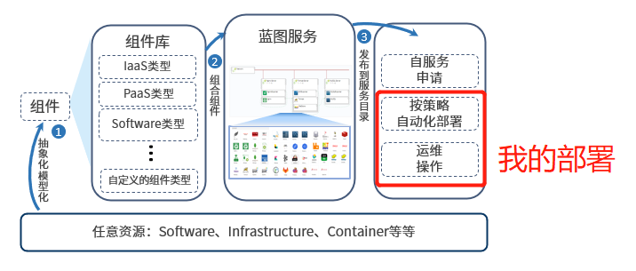

**我的部署**
+ 任意资源通过组件来描述，经过蓝图编排，服务配置之后，云管理平台将根据策略自动化部署，用户申请服务包含的所有云资源，例如一台虚拟机，一个数据库，或是一个多层次架构的应用环境。用户可在配置的服务租期内，使用该服务部署的所有资源，并能够根据管理员配置的操作许可，自助进行运维或变更操作。如下图所示：

+ 在云管理平台的我的部署功能区域，实现服务按策略部署；查看云主机、云资源；选中一个或者多个服务部署或者云资源快速进行已被授权的运维操作；优化资源回收流程，支持手动回收和按策略自动回收资源，如果存在误删除的情况时，支持通过回收站找回资源与数据。

