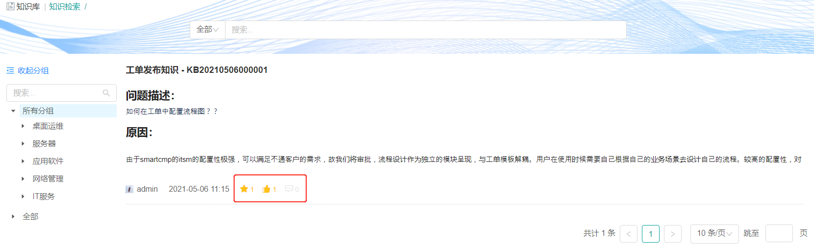

**SmartCMP平台通用功能**

骞云科技自主研发的六大云原生管理平台和多种场景解决方案，率先将ITSM+ITOM+ITBM相融合，帮助企业实现AI驱动的高度自动化的统一管理和极致体验，全面深度赋能企业数字化转型。

下面为您介绍六大云原生管理平台通用功能。

# 服务请求

## 我的申请 {#我的请求}

当您选择某一个云资源蓝图服务或工单服务，点击进入服务信息详情页，输入服务基本信息并点击申请即可申请服务成功。服务申请成功之后，服务申请状态变更为处理中，申请进入我的申请当中。

用户可查看自己已经申请的云资源蓝图服务或工单并跟踪处理进程，同时，用户也可以通过高级搜索或者选择不同条件来筛选工单，筛选条件包括工单所属服务目录，工单处理阶段，请求工单类型，业务组，项目，状态等。具体步骤可参考[我的申请](https://cloudchef.github.io/doc/AdminDoc/06云服务管理/服务请求.html#我的请求)。

## 我的审批 {#待审批}

在我的审批页面，管理员在审批流程中配置审批人，审批人具有审批权限，则能够查看待审批的服务请求的详细信息，并进行审批操作。详细的操作步骤请参考[我的审批](https://cloudchef.github.io/doc/AdminDoc/06云服务管理/服务请求.html#待审批)。

# 服务管理

## 我的待办 {#待处理}

此处显示等待您处理的服务请求工单。您可以查看详细的请求信息，并进行相应的处理操作。具体的处理操作可参考[请求管理](https://cloudchef.github.io/doc/AdminDoc/06云服务管理/服务请求.html#待处理)。

## 所有工单{#所有工单}

您可查看所有申请工单的详细信息，具体步骤可参考[所有工单](https://cloudchef.github.io/doc/AdminDoc/06云服务管理/服务请求.html#所有工单)。

## 排班管理

在排班管理中，平台管理员或排班管理员可以查看并管理服务团队排班的详细信息，拥有ITIL权限的用户（包括ILIL处理员、事件管理员、变更管理员、问题管理员和请求管理员）只能查看其所在排班的信息。添加排班表之后，可以选择值班人员处理工单等任务。以为一个服务团队中成员添加不同班次为例，具体添加排班的步骤请参考[排班管理](https://cloudchef.github.io/doc/AdminDoc/06云服务管理/服务请求.html#排班管理)。

# 我的资源

用户申请服务之后，云管理平台将根据策略自动化部署用户申请服务包含的所有云资源，例如一台虚拟机，一个数据库，或是一个多层次架构的应用环境。用户可在配置的服务租期内，使用该应用栈的所有资源，并能够根据管理员配置的操作许可，自助进行运维或变更操作。

在云管理平台的 我的资源 菜单下，实现服务按策略部署；查看云主机、云资源；选中一个或者多个应用栈或者云资源快速进行已被授权的运维操作；优化资源回收流程，支持手动回收和按策略自动回收资源，如果存在误删除的情况时，支持通过回收站找回资源与数据。

## 应用栈

应用栈包括了用户所申请的一个服务中的所有云主机实例和云资源。

应用栈页面可查看应用栈的状态、详情、监控等。用户可通过统一页面，看到申请的所有应用栈和云资源，包括，云主机、存储、网络、软件等，查看运行状态，并进行允许的各种变更运维操作。

查看应用栈列表与进行应用栈运维操作的方法请参考[应用栈](https://cloudchef.github.io/doc/AdminDoc/14我的资源/应用栈.html)。

## 云主机

用户可以查看云主机列表来对云主机进行管理和操作，操作的启用和是否需要审批需要在业务组级别或者服务配置级别进行设置。

当您在主流公有云，私有云（例如阿里云，腾讯云，AWS, Azure, vSphere等）上已部署云资源，并需要导入至SmartCMP进行纳管时，您可以在云主机列表界面或资源池管理的云资源标签页点击导入按钮快速导入已有云资源至SmartCMP进行纳管。

导入云主机与进行云主机运维操作的方法请参考[云主机](https://cloudchef.github.io/doc/AdminDoc/14我的资源/云主机.html)。

## 云资源

云资源菜单下统一纳管所有的云资源，展示其相关信息以及提供各云资源对应的运维操作。

用户可通过统一页面，看到申请的所有云资源，包括，云主机、存储、网络、软件等，查看运行状态，并进行允许的各种变更运维操作。同时支持快速导入存量云资源。

导入云资源与进行云资源运维操作的方法请参考[云资源](https://cloudchef.github.io/doc/AdminDoc/14我的资源/云资源.html)。

# 知识库

知识库(Knowledge Base) , 作为ITIL/ITSM的重要内容， 包含企业IT服务部门希望保留和共享的信息，避免信息孤岛和知识流失，为终端用户提供更快的解决方案，让IT技术人员具备更高的效率。

## 知识检索

知识库展示了已发布的文章列表，列表包含标题、内容、创建人和发布时间。同时知识库支持知识信息的检索查找，您可以在搜索栏搜索关键词来查找您需要的知识库文章，也可以根据分组搜索相关文章，分组类别包括桌面运维，服务器，应用软件，网络管理和IT服务。

普通用户可以对知识库中的文章进行收藏，点赞和评论，点击进入文章详情页，您可以查看当前知识库文章的所有评论，也可以对别人的评论进行回复。
 

## 知识管理

在知识管理模块，ITIL处理员、变更管理员、事件管理员、问题管理员、请求管理员和知识库管理员可以添加，编辑，发布并取消发布知识库的文章，已发布的文章能够在知识检索中展示，而只有知识库管理员可以归档知识库的文章，并且归档的文章无法在知识检索中展示或搜索。

当您需要添加知识库文章，可参考[知识管理](https://cloudchef.github.io/doc/AdminDoc/07云资源分析/知识库.html#知识管理)。

# 仪表盘

仪表盘页面可展示用户登录后最关心的内容，如申请的资源总量、资源的利用率排名，正在执行的部署、正在等待的审批、即将到期的资源等。

系统提供四个内置仪表盘：云资源使用情况仪表盘、业务组仪表盘、项目仪表盘和基础架构仪表盘。经过用户以及角色控制过滤后，在仪表盘菜单目录下能够为不同的用户展示不同的内置仪表盘。

同时系统提供自定义仪表盘功能，由用户自定义设置所展现内容。如果您需要编辑现有仪表盘或者添加自定义表盘，请参考[编辑仪表盘](https://cloudchef.github.io/doc/AdminDoc/07云资源分析/仪表盘.html#编辑现有仪表盘)。

## 云资源使用情况仪表盘

云资源使用情况仪表盘以图表形式展示了已部署的云资源使用情况，用户可查看云资源的分布、告警、即将到期的应用栈等。

系统默认展示以下模块：云资源分布、云主机总览、云主机操作系统分布、云主机和应用告警、正在进行的操作、即将卸载的应用栈、即将到期的应用栈、CPU利用率最高的云主机-Top10、CPU利用率最低的云主机-Top10、内存利用率最高的云主机-Top10、内存利用率最低的云主机-Top10、磁盘利用率最高的云主机-Top10及磁盘利用率最低的云主机-Top10。

默认普通成员可以查看云资源使用情况仪表盘，点击模块右上方箭头可下载该模块具体报告的完整结果，导出格式支持.csv、.xlsx和.json。

## 业务组仪表盘

业务组仪表盘展示了业务组内人员资源分布以及云资源概况等，使用户能够清晰直观了解业务组的基础架构整体情况。

系统默认展示以下模块：业务组云主机分布、业务组成员数量、待处理的审批、业务组云主机申请趋势、业务组云主机卸除趋势、业务组资源平均交付时间、业务组资源概况及业务组人员资源分布。

默认业务组管理员、基础设施管理员及平台管理员可以查看业务组仪表盘，点击模块右上方箭头可下载该模块具体报告的完整结果，导出格式支持.csv、.xlsx和.json。

## 项目仪表盘

项目仪表盘展示了项目云主机分布、项目成员数量、待处理的审批、项目云主机申请趋势、项目云主机卸除趋势及项目资源平均交付时间等模块。

默认项目管理员、基础设施管理员及平台管理员可以查看项目仪表盘，点击模块右上方箭头可下载该模块具体报告的完整结果，导出格式支持.csv、.xlsx和.json。

## 基础架构仪表盘

基础架构仪表盘默认展示虚拟化平台总体情况，陈列IP池、宿主机总览、CPU配额使用最高的资源池-Top10、内存配额使用率最高的资源池-Top10、存储配额使用率最高的资源池-Top10以及虚拟机配额使用率最高的资源池-Top10。

默认业务组管理员、基础设施管理员及平台管理员可以查看基础架构仪表盘，点击模块右上方箭头可下载该模块具体报告的完整结果，导出格式支持.csv、.xlsx和.json。

# 报表与分析

在报表与分析菜单中，用户可以查看资源申请情况以及查看内置或自定义的报表。

## 资源申请趋势

在资源申请趋势页面，用户可以看到当前用户下业务组的资源申请情况，详细请参考[资源申请趋势](https://cloudchef.github.io/doc/AdminDoc/07云资源分析/报表与分析.html#资源申请趋势)。

## 业务组资源占用

在业务组资源占用页面，用户可以看到当前系统中，每个业务组的资源占用情况，详细请参考[业务组资源占用](https://cloudchef.github.io/doc/AdminDoc/07云资源分析/报表与分析.html#业务组资源占用)。

## 报表

可以在报表页面，用户查看系统内置的云平台总体情况报表或添加自定义报表。

管理报表的操作方法请参考[报表](https://cloudchef.github.io/doc/AdminDoc/07云资源分析/报表与分析.html#报表)。

# 基础设施

SmartCMP统一管理数据中心的计算、存储、网络、应用等各种资源，包括私有云、公有云、混合云、容器云、x86物理机等多种类型。支持快速导入并无缝管理存量虚拟机，使用云平台标准的API进行操作，管理云资源。

平台管理员可以通过添加对应的基础设施的访问信息完成基础设施的注册。

## 云网关管理

越来越多的企业采用混合云的架构，企业底层的基础架构和网络环境较为复杂，SmartCMP云管理平台（以下简称“云管平台”）提供的云网关功能，可以帮助您连接并管理多个数据中心，多个VPC，隔离的虚拟网络环境，混合云环境（私有云+公有云）等，并且避免将所有需要管理的云资源的端口进行开通或暴露到公网。

当云管平台与隔离的区域网络不通时，您可以选择部署云网关，操作方法请参考[云网关管理](https://cloudchef.github.io/doc/AdminDoc/03基础设施管理/云平台网关.html#云网关的安装方法)。

## 云平台管理

云平台入口定义了您需要管理的公有云、私有云、容器等云基础设施的接入方式。不同云基础设施账号的形式及获取方式各有不同，您可以通过填写对应的访问信息完成云平台基础设施的接入。

当接入云平台时，为了保障云主机的安全性，公有云（包括阿里云、腾讯云、AWS）在API调用时均需要验证访问者的身份，以确保访问者具有相关权限。公有云的验证方式通过Access Key来实现。Access Key由云平台颁发给云主机的所有者，它由Access Key ID和Access Key Secret构成对应SmartCMP接入公有云云平台的访问密钥ID和访问密钥。如您需要接入云平台，请参考[添加云平台](https://cloudchef.github.io/doc/AdminDoc/03基础设施管理/云平台管理.html#添加云平台)。

## 资源池管理

通过资源池，您可以指定私有云的主机或群集、或公有云的区域和可用区为资源入口，分配不同的基础设施资源（包括计算、存储、网络等等）给不同的组织或环境进行使用，并可以设定配额。资源池可分配给一个、多个或全部业务组，从而指定不同的组织和用户使用该云平台中的基础设施资源。创建资源池的具体步骤请参考[创建资源池](https://cloudchef.github.io/doc/AdminDoc/03基础设施管理/资源池管理.html#创建资源池)。

在后续的服务配置过程中，可以选择不同的资源池分配策略，手工进行指定，或由平台自动根据资源池的使用情况和指定的资源进行分配。资源池选择策略的详情信息可查看[资源池选择策略](https://cloudchef.github.io/doc/AdminDoc/03基础设施管理/资源池管理.html#资源池选择策略)。

# 组织架构

用户可以在组织架构中，进行您的团队权限设置，并配置您团队申请资源时的命名规则与授权配置。

## 业务组

业务组是平台内的逻辑组织结构，支持创建多级业务组。业务组是一个逻辑概念，有需要把用户、服务、资源使用以及流程、规范等联系在一起的实体都可以用业务组来对应，比如子公司，不同层级的部门等。

管理业务组的操作方法请参考[业务组](https://cloudchef.github.io/doc/AdminDoc/04组织架构管理/业务组.html)。

## 项目

用户可以创建一个或多个项目，并可以选择具体用户作为项目成员，项目成员可以共享使用项目中的云资源。

管理项目的操作方法请参考[项目](https://cloudchef.github.io/doc/AdminDoc/04组织架构管理/项目.html)。

## 用户

在用户页面可以查看当前业务组下的所有用户，可对用户进行添加、编辑、重置密码和删除等操作。

管理用户的操作方法请参考[用户](https://cloudchef.github.io/doc/AdminDoc/04组织架构管理/用户.html)。

## 角色

SmartCMP混合云应用管理平台支持多种角色的权限设置，系统已有基础角色包括：平台管理员、基础设施管理员、事件管理员、普通成员等。

平台管理员可以角色页面内添加、删除、编辑角色权限。角色管理完成后，平台管理员可以用户页面内管理用户，并根据需要为用户分配相应的角色。

管理角色的操作方法请参考[角色](https://cloudchef.github.io/doc/AdminDoc/04组织架构管理/角色.html)。

## 命名后缀

命名后缀是业务组中，应用栈名命名规则、云主机名命名规则、Windows主机名命名规则以及Linux主机名命名规则中后缀的组成部分。管理员可以定义数字序列或随机字符串，来保证云资源命名的规范和唯一性。

管理命名后缀的操作方法请参考[命名后缀](https://cloudchef.github.io/doc/AdminDoc/04组织架构管理/命名后缀.html)。

## 命名规范

用户可以在命名规范页面创建和管理命名规范，定义应用栈、云主机和云资源的名称。配置命名规范模板解决了平台内多个业务组使用相同命名规范需要重复配置的问题。

管理命名规范的操作方法请参考[命名规范](https://cloudchef.github.io/doc/AdminDoc/04组织架构管理/命名规范.html)。

## 授权配置

用户可以在授权配置页面管理授权配置模板，定义用户对应用栈和云资源可以进行的操作，同时指定审批流程。授权配置模板可以应用到不同的业务组。部署操作授权规定了对主机创建成功后，可进行的运维操作以及针对该操作的审批流程。云资源操作授权规定了对该云资源授权成功后，可进行的运维操作以及针对该操作的审批流程。

管理授权配置的操作方法请参考[授权配置](https://cloudchef.github.io/doc/AdminDoc/04组织架构管理/授权配置.html)。

# 服务设计

在SmartCMP中，一切服务基于蓝图建模来定义标准的服务框架与组件，SmartCMP提供丰富的开箱即用的软件组件，以可视化的形式编排蓝图，提供自定义表单，为任意服务定义参数和字段，灵活的为各项服务配置资源满足用户多样的需求；同时提供内置的流程设计器，让用户能够以可视化拖拉拽的方式设计服务流程和审批流程，帮助用户准确和快速的完成流程策略设计。 管理员将服务分组通过服务目录发布企业或组织需要的IT产品和服务，提供给用户自助申请。服务建模为各项服务配置资源、参数、自动化的工作流程和审批策略，实现自动化部署。

## 流程配置

在云资源的自助化申请、审批、自动化部署、运维操作和手工工单处理过程中，流程定义了这些任务处理过程或服务配置过程的方法和策略。系统默认提供标准流程，同时支持管理员通过流程设计器定义灵活的各项服务所需的流程，对云主机的申请、运维操作、回收进行控制，对手工工单服务的处理、关闭进行管控，主要流程包括：审批、手工工单服务和云资源蓝图服务流程等等。

各类流程的介绍与管理方法请参考[流程配置](https://cloudchef.github.io/doc/AdminDoc/05服务建模/流程配置.html)。

## 表单配置

在创建或配置服务时，可以选择系统内置的表单，如果您需要修改或添加额外的字段信息供用户在申请时填写，可以通过表单设计器，自定义配置表单，例如：申请新项目、申请邮箱账户、申请资源池、添加环境管理员。 

管理授权配置的操作方法请参考[表单配置](https://cloudchef.github.io/doc/AdminDoc/05服务建模/表单配置.html)。

## 目录配置

平台支持服务卡片的分类。可自定义不同服务卡片的类别，在服务配置中将相关的服务关联到不同的类别，在服务目录中分类展示，其中内置的服务分组有三种类型：数据库，基础设施，工单服务。

管理目录配置的操作方法请参考[目录配置](https://cloudchef.github.io/doc/AdminDoc/05服务建模/服务分组.html)。

## 服务等级协议

服务等级协议是服务供应商与服务申请者之间的一种承诺和约定，协议约定了服务完成的时间和其他条件，可以将服务等级协议与平台提供的服务（例如：手工工单、云资源部署、任务执行）进行关联，以确保及时地追踪服务的处理情况。

在传统的转售模式中，SLA协议是写入合同中，有专人进行跟踪。新型的转售场景中，SmartCMP将SLA和服务进行绑定，服务申请者以及服务提供者可全程自动跟踪，实时查看服务进度以及所耗费的时间。

管理服务等级协议的操作方法请参考[服务等级协议](https://cloudchef.github.io/doc/AdminDoc/05服务建模/服务等级协议.html)。

## 服务配置

SmartCMP云管平台从组件的定义，到应用的可视化拓扑建模，并将服务配置标准化，再到基于蓝图和配置的自动化部署，最终生成一个符合TOSCA规范的云资源蓝图服务。支持管理员将设计好的蓝图发布为服务，在服务配置处配置基本信息、构成蓝图的组件详细参数、输入与输出、可以将服务与企业内部的流程（例如：审批流程）集成之后发布到服务目录。

管理服务配置的操作方法请参考[服务配置](https://cloudchef.github.io/doc/AdminDoc/05服务建模/服务配置.html)。

## 服务团队

服务团队是工单服务管理过程中处理工单任务的服务人员集合，支持您指定一个或多个用户成为服务团队的成员。当您通过服务目录申请需要人工介入的手工工单服务之后，根据预先配置的服务流程，相应的服务团队将接到工单进行处理。服务团队中的指定人员收到工单请求之后，可以进行转派，也可以进行线下处理，任务完成之后更新工单状态，系统将自动通知您，同时您也可以主动实时关注处理进程。

管理服务团队的操作方法请参考[服务团队](https://cloudchef.github.io/doc/AdminDoc/04组织架构管理/服务团队.html)。

# 系统管理

## 系统配置 

在系统配置页面可以配置用户登录类型、业务组、DNS配置、安全配置、费用配置与系统参数。详细配置方法请参考[系统配置](https://cloudchef.github.io/doc/AdminDoc/09系统管理/#系统配置)。

## 界面配置 

通过界面配置来确定品牌和服务申请信息包括，配色、页眉页脚、菜单配色和是否显示帮助文档，以及调整服务目录与服务展示的显示方式，服务申请页面字段。详细配置方法请参考[界面配置](https://cloudchef.github.io/doc/AdminDoc/09系统管理/#界面配置)。

## 通知配置 

管理员可设置对接平台，将系统的通知、告警等消息发送到所连接的消息通知平台。支持SMTP邮件、SMS短消息、企业微信与钉钉。详细配置方法请参考[通知配置](https://cloudchef.github.io/doc/AdminDoc/09系统管理/#通知配置)。

## 菜单配置 

当您接入第三方系统或扩展系统（如接入百度、京东、Azure账单）时，菜单配置使接入的菜单能够更加灵活。

在菜单配置中，您也可以接入外部系统，并自由灵活的选择扩展菜单，具体的操作方法请参考[菜单配置](https://cloudchef.github.io/doc/AdminDoc/09系统管理/#菜单配置)。

## 数据字典 

平台支持数据字典功能，数据字典的名称与值集可作为服务与流程配置的字段来源。系统内置以下数据字典：服务类型、紧急程度、影响程度、优先级、工单关联关系以及合规性策略分组，内置的数据字典不支持修改名称、主键与序号，您可以选择启用或禁用部分值集、或新增自定义值集以修改上述配置中的字段。

管理数据字典的操作方法请参考[数据字典](https://cloudchef.github.io/doc/AdminDoc/09系统管理/#数据字典)。

## 操作审计 

操作审计记录每个用户在系统内的登录和操作信息。