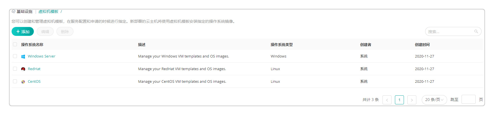
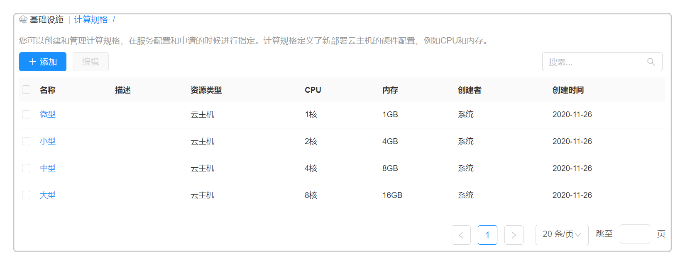

**云自动化管理产品**

云自动化管理产品是完整的、面向混合IT环境的管理平台。可统一管理公有云、私有云和混合云，提供跨平台的自动化和编排能力，以及自服务所需要的策略、配额和流程控制。平台面向多云和云原生服务
，拥有策略驱动的高度自动化、面向业务部门的自服务；云中立，告别云锁定；服务编排，云网联动；基于面向对象模型构建，扩展性强。

下面介绍云自动化管理产品特有功能，平台通用功能请参考[公共平台](https://cloudchef.github.io/doc/Products/00公共平台/README.html)。

# 服务目录

服务目录的主要作用是为用户提供统一的云服务入口。将云资源的申请、运维、变更、监控和回收都服务化，并配套提供企业级的流程、权限和配额管控。提供在一个页面，申请任意云服务的能力，这样用户可以非常方便的以服务目录的形式，访问有权限的多种类型的阿里云服务、VMware云资源服务、容器云服务、工单服务、邮件服务等等。

服务配置发布成功之后，将会在服务目录界面看到发布的服务卡片，服务目录的界面展示支持两种方式：标签页展示和层级展示。详细信息请参考[服务目录](https://cloudchef.github.io/doc/AdminDoc/06云服务管理/服务目录.html)

# 回收站

平台支持回收站功能，优化资源回收流程，存在误删除的情况时，支持找回资源与数据。SmartCMP通过在业务组或服务配置设置应用栈租用时间和保留时间，使资源在被申请使用后，能够在规定时间内自动回收；同时也支持用户手动回收资源。

使用回收站功能的操作方法请参考[回收站](https://cloudchef.github.io/doc/AdminDoc/14我的资源/回收站.html)。

# 作业管理
作业管理功能是平台整合自动化流水线和脚本库的功能而成。除了快速脚本执行、批量执行运维脚本、构建软件包、定时任务等一系列可实现的基础运维场景以外。通过定制阶段和任务，将一个操作流程制作成完整的流水线，提供丰富的任务类型来支持复杂的运维操作场景。

## 脚本库

管理员在脚本库将海量的脚本进行统一的创建和管理，支持根据业务需要创建一些共享脚本，供被授权的业务组某类角色成员，在任意场景下直接引用。支持在统一的平台上规范管理适用于多种环境的脚本，直接新建、编辑和删除脚本，还支持快速查找新建好的脚本。

创建与执行脚本的操作方法请参考[脚本库](https://cloudchef.github.io/doc/AdminDoc/11作业管理/脚本库.html)。

# 监控告警和展示

通过SmartCMP，您可以查看所拥有的云资源的监控信息并自服务设置告警。 云资源的性能监控，助您了解云环境的整体使用情况。您可以通过监控状态图总览资源性能与健康状态。同时，SmartCMP支持丰富的告警类型、策略的设置，针对云主机、应用、容器等资源进行在线状态、性能指标的检测和趋势判断并通过多种方式通知到干系人，及时掌握云平台的运行情况。

## 资源状态图

资源状态图能够显示云主机、容器等云资源的健康状态，根据性能指标的状态显示不同的颜色。若该云资源未配置监控，默认显示灰色。浅绿到深绿到红色，颜色越深代表使用的资源越多。

查看资源状态图的操作方法请参考[资源状态图](https://cloudchef.github.io/doc/AdminDoc/06云服务管理/云资源监控.html#资源状态图)。

## 告警策略

告警策略用来定义所选的对象类型（如云主机/应用/容器等）触发警报的条件。

管理告警策略的操作方法请参考[告警策略](https://cloudchef.github.io/doc/AdminDoc/06云服务管理/告警.html#告警策略)。

## 告警

告警用来定义所选告警策略应用到的范围以及触发的通知和操作。

添加告警的操作方法请参考[告警](https://cloudchef.github.io/doc/AdminDoc/06云服务管理/告警.html#告警)。

## 已触发警报

已触发警报列表包括警报级别、告警名称、触发告警对象以及告警状态等信息。可以对列表中的触发警报进行恢复、暂停、解除操作。

管理已触发警报的操作方法请参考[已触发警报](https://cloudchef.github.io/doc/AdminDoc/06云服务管理/告警.html#已触发警报)。

## 宿主机监控

在主机运行状况页面，用户可以看到当前系统中，每个平台中的主机运行状况。主机的运行状况对应三个图表，分别是：CPU使用状况（GHz）、内存使用状况（GB）、存储使用情况（GB）。

用户可以设置时间跨度来更改图表统计方式。如果当前系统中有多个云平台，用户会看到多个云平台的标签，点击不同的云平台标签，会跳到对应云平台的数据统计页面，查看相应的图表，获取云平台下的主机信息。

## 云平台告警

您可以订阅所管理的云平台提供的告警，对相关的资源进行监控和告警。

# 基础设施

SmartCMP统一管理数据中心的计算、存储、网络、应用等各种资源，包括私有云、公有云、混合云、容器云、x86物理机等多种类型。支持快速导入并无缝管理存量虚拟机，使用云平台标准的API进行操作，管理云资源。

由于通过API和各个不同云基础设施进行交互，因此用户的云基础设施账号的形式不一样的（如公有云使用AccessKey，
私用云使用用户名与密码等）。

>「Note」不同云基础设施账号的获取方式各有不同，具体请参考：[添加云平台](https://cloudchef.github.io/doc/AdminDoc/03基础设施管理/云平台管理.html#添加云平台)。

平台管理员可以通过添加对应的基础设施的访问信息完成基础设施的注册。

在基础设施中可以配置：
+ 云平台入口：添加需要连接和管理的私有云、公有云等云平台的信息，例如虚拟化管理控制器地址和用户名密码，或者公有云访问密钥。
+ 资源标签：为您所管理的资源池设置资源标签，注明资源池的不同用途和属性，从而在配置和申请服务的时候进行筛选和指定。
+ 资源池：定义资源配额并控制资源访问。
+ 虚拟机模板：创建和管理虚拟机模板，在服务配置和申请的时候进行指定。
+ 计算规格：创建和管理虚拟机模板，在服务配置和申请的时候进行指定。
+ IP地址：创建需要管理的IP地址目录结构和IP地址池，在部署云资源时自动分配IP地址。支持私有云平台以及Azure虚拟机的内网IP地址分配。
+ 物理机入口：添加和管理您的物理机。

## 资源标签

标签核心功能：为您管理的资源池、资源池中配置的资源、以及创建或导入的云资源设置资源标签，标明资源池和其他资源的不同用途和属性，从而在配置和申请服务、创建和导入云资源的时候进行选择。如您需要配置资源标签，请参考[配置资源标签](https://cloudchef.github.io/doc/AdminDoc/03基础设施管理/资源标签.html#配置资源标签)。

资源标签创建完成后，可以将资源池、存储资源或网络资源与资源标签进行绑定，从而在服务配置与申请界面进行筛选来快速匹配资源；在部署、导入云主机或云资源以及在Day2运维操作时可设置云资源标签，在应用栈、云主机及云资源列表展示资源已设置的标签并通过标签为云主机、云资源分类和过滤。具体的使用步骤可参考[使用资源标签](https://cloudchef.github.io/doc/AdminDoc/03基础设施管理/资源标签.html#使用资源标签)。

## 镜像管理

+ 镜像概述：云主机镜像提供了创建云主机所需要的信息，镜像文件相当于副本文件，该副本文件包含一块或多块云盘中的数据。
+ 平台支持用户自定义镜像，在实际的业务场景中，存在用户需要特定镜像模板的情况，然而云平台供应商可能不会提供公有云控制台或私有云的管理员账户，这就需要云管理平台具备让用户自定义镜像的能力。
+ 当用户创建了一个虚拟机并配置了软件，希望基于这个虚拟机为模板进行重复且高效地部署。
  
  补充说明：根据来源不同，镜像分为多种类型，包括：

    + 公共镜像，由阿里云官方或第三方合作商家提供的系统基础镜像，仅包括初始系统环境，需要根据实际情况自助配置应用环境和相关软件配置。
    + 镜像市场，提供基于经严格审核的优质镜像，预装操作系统、应用环境和各类软件，无需配置，可一键部署云服务器。
    + 自定义镜像，基于用户系统快照生成，包括初始环境、应用环境和相关软件配置，选择自定义镜像，快速部署云服务器，节省重复配置的时间。

+ 平台支持用户自定义阿里云镜像， 用户可以创建系统盘快照并基于该快照创建自定义镜像。用户在申请云主机的时候能指定自定义镜像进行部署，快速生成新的云主机。

如您需要添加或者使用镜像，请参考[镜像](https://cloudchef.github.io/doc/AdminDoc/03基础设施管理/镜像.html#添加、使用镜像)。

## 虚拟机模板

虚拟机模板是平台对操作系统的抽象和标准化。平台提供了内置的通用操作系统，您无需额外配置，可直接申请部署云资源，平台将会根据您选择的资源环境，读取云平台中的可用镜像。

您也可以创建新的操作系统，或为各个操作系统指定特定的虚拟机模板或操作系统镜像，供您和用户在部署虚拟机的时候进行选择，或由平台根据您的配置自动进行选择。详细步骤请参考[添加虚拟机模板](https://cloudchef.github.io/doc/AdminDoc/03基础设施管理/虚拟机模板.html#添加虚拟机模板)。

## 计算规格

计算规格定义了虚拟机的CPU和内存的配置规范（如：2核CPU，4G内存）。平台提供了内置的计算规格，您无需额外配置，可直接申请部署云资源，平台将会根据您选择的资源环境，读取云平台的可用规格。

您也可以创建新的计算规格，或为各个云平台指定特定的实例规格，供您和用户在部署虚拟机的时候进行选择，或由平台根据您的配置自动进行选择。详细步骤请参考下文。

进入菜单 基础设施 - 计算规格 ，可管理计算规格。在服务配置节点详细设置处可对计算节点做规格的配置。

>「Note」不同类型云平台的计算规格的配置方式有所不同，区别如下：
  -   私有云平台例如vSphere只需定义计算规格，不需要配置云平台规格
  -   OpenStack需要定义计算规格和云平台规格
  -   Azure、AWS、阿里云等公有云平台需要定义计算规格和云平台规格（针对每个公有云区域需要定义一个云平台规格）

如您需要为云平台添加计算规格，详细步骤请参考[计算规格](https://cloudchef.github.io/doc/AdminDoc/03基础设施管理/计算规格.html#添加计算规格)。

## IP地址管理

支持一键添加多种异构云平台的IP池，配置和管理IP地址段，并在配置界面中以树形结构展示，在资源部署时为各云平台的云主机统一分配IP地址，为资源部署带来顺畅的网络服务。

+ 支持可视化查看 IP 用量趋势，并手动释放；
+ 自动检测IP地址冲突，设置IP地址冷却期，IP释放后保留一段时间，冷却期过后重新放回IP池进行分配；
+ 还可以能查询IP地址使用情况的详细日志信息。
+ 提供IPv4、IPv6的全生命周期管理，创建IP池、与资源池关联、IP冲突检查、资源部署时自动化分配IP等等。
+ 下文将介绍如何创建并使用IP池，目前IP池支持vSphere云平台、OpenStack、Azure、PowerVC、 X86、F5 Big IP云平台、虚拟内网IP地址和Cisco ACI。

+ 支持IP地址信息以IP树形式展示：IP地址管理增加目录结构，目录包含多级，每级目录包含名称、描述、网段。

    + 平台管理员和IAAS管理员可以创建， 更新和删除IP池目录，拥有对IP池目录的创建、更新、删除、查看权限，
    + 用户内其他人只对IP池目录可以查看， 拥有对IP池目录查看权限。
    + 添加IP树的具体步骤：点击「基础设施」-「IP地址管理」，点击在添加文件夹页面，输入名称、描述、CIDR、网关。点击提交，即可创建IP树形结构。点击二次编辑名称、描述、网关等相关信息，点击即可删除IP信息。
    + 如下图所示，创建适用于数据中心的IP地址目录管理，数据中心存在开发测试、生产、UAT等多个环境，以此为分组，统一且规范地管理所有IP池。

管理员可在云管理平台中配置IP池，管理IP地址段，并可在IP池中查看IP地址使用情况，可占用以及释放被占用的IP地址。平台可创建支持IPv4，IPv6或者两者都支持的IP池。IPv4的应用范围虽广，但网络地址资源有限。IPv6地址不仅可以解决网络地址资源有限的问题，还可以解决多种接入设备连入互联网障碍的问题。目前IPv6类型仅支持vSphere云平台以及虚拟机的内网IP地址分配。创建并管理IP池的详细步骤请参考[创建IP池](https://cloudchef.github.io/doc/AdminDoc/03基础设施管理/IP地址管理.html#创建和管理ip池)。

## 物理机管理
您可以添加物理主机信息，对在云平台和暂时不在云平台上的物理机进行统一管理。详细情况请参考[添加物理机](https://cloudchef.github.io/doc/AdminDoc/03基础设施管理/物理主机管理.html#添加编辑物理主机)。

# 服务设计

## 制品库

云平台通过接入主流的制品仓库对制品进行存放管理和版本控制，云组件关联制品仓库并自定义应用的部署方式和相关参数。制品仓库管理是对软件研发过程中生成的产物的管理，制品一般作为最终交付物完成发布和交付。所有的制品包，依赖组件均能够纳入制品库中统一管理。

可快速在云管理平台上实现对多个环境的下的镜像仓库和镜像制品进行数据的统一录入和自动化存储，提供给持续集成系统和发布系统使用。

配置制品库的操作方法请参考[制品库](https://cloudchef.github.io/doc/AdminDoc/05服务建模/制品库.html)。

## 组件库

SmartCMP云管平台的云组件拥有“将任意资源”提供服务化的核心能力，不仅内置丰富的组件资源和常用的操作，同时还拥有高度可扩展的能力，根据用户需求灵活自定义添加组件资源和配置运维操作。

组件的定义采用面向对象的设计方法，使用统一的数据结构进行建模，并将配置属性标准化。支持使用Ansible， Terraform， Shell， Python， Json， Ruby等语言来自定义软件组件，并且自定义软件组件的生命周期操作（包含创建，配置，启动，停止，删除、备份、巡检等等），系统内置创建，配置和启动操作，在移除的时候调用停止和删除操作，并且支持灵活自定义操作，实现软件和应用的全生命周期管理。

管理组件库与创建组件的操作方法请参考[组件库](https://cloudchef.github.io/doc/AdminDoc/05服务建模/组件库.html)。

## 蓝图设计

软件架构师可以通过蓝图管理界面以可视化的方式设计出基于TOSCA标准的应用蓝图。蓝图是对应用的抽象。蓝图包含应用的拓扑、工作流以及策略三部分。蓝图是系统核心的概念，整个系统都是围绕着蓝图管理。

内建蓝图为系统创建的蓝图，目前SmartCMP内建了一系列典型的蓝图以方便您使用，例如Windows on vSphere, linux VM，您可以在创建服务配置时直接使用这些内建的蓝图。在左边导航栏选择 服务建模 - 蓝图设计 ，在蓝图列表中选择内建的蓝图，您便可以使用当前蓝图配置您的服务。

详细的蓝图编辑和创建方法可参考[蓝图设计](https://cloudchef.github.io/doc/AdminDoc/05服务建模/蓝图设计.html#蓝图)。

# 计量计费

用户可以在计量计费中，关联在云上的计费项，并查看你在云上的费用使用详情与费用分析报表。

## 费用分析

SmartCMP能够从不同维度统计资源费用信息，帮助您了解各个业务组、项目、云平台等在过去一段时间内的花费情况。

费用展示与Top排行榜的详细信息请参考[费用分析](https://cloudchef.github.io/doc/AdminDoc/07云资源分析/费用管理.html#费用分析)。

## 费用报表

系统提供内置的费用报表供用户查看：业务组费用统计报表，业务组费用明细报表，项目费用统计报表，云平台费用统计报表，云资源费用明细报表。

查看与导出费用报表的操作方法请参考[费用报表](https://cloudchef.github.io/doc/AdminDoc/07云资源分析/费用管理.html#费用报表)。

## 费用明细

用户可以通过云平台管理启用账单同步，定时同步导入费用信息。在费用明细页面，用户可以查看已导入的费用明细和自定义新增明细信息，同时您可以在费用明细详情中进行费用校准和更改费用归属。

查看与管理费用明细的操作方法请参考[费用明细](https://cloudchef.github.io/doc/AdminDoc/07云资源分析/费用管理.html#费用明细)。

## 计费规则

SmartCMP允许自定义计费规则，对纳管的私有云、公有云等多种不同类型资源进行计费；并能够同步公有云的费用账单（详见账单同步小节），统一公有云和私有云的费用管理和分析。平台支持多种计费模式，包括，经典模式、专家模式、公有云计费。计费规则支持多个货币单位，包括，人民币、美元、沙特里亚尔等等，都支持设定打折系数。

管理计费规则的操作方法请参考[计费规则](https://cloudchef.github.io/doc/AdminDoc/07云资源分析/费用管理.html#计费规则)。

# 容量管理

容量管理为平台、基础设施和业务组管理员等角色提供了资源池配额和IP池、IP地址使用情况的告警功能。

SmartCMP支持对基础设施的容量使用进行检测、追踪，为您进行合理的规划提供决策依据。通过图形化的界面对数据中心整体状况的检测展示；对各种云资源的容量使用进行追踪，分析，告警； 资源池、IP池等基础设施资源使用的跟踪，根据制定的策略进行告警。

## 资源告警

资源告警监控资源配额的使用情况，达到预设的条件会触发警报。您可对资源告警进行添加、编辑、启用、禁用、删除以及筛选、搜索等操作。详细的资源告警添加步骤请参考[添加资源告警](https://cloudchef.github.io/doc/AdminDoc/07云资源分析/容量管理.html#资源告警)。

## 已触发警报

平台支持展示已触发警报列表，包括警报级别、告警名称、触发告警对象、告警类型、第一次触发时间、最后一次触发时间以及告警状态。告警状态分为已触发、已暂停、已解除。还可对列表中的触发警报进行恢复、暂停、解除操作。

1.  任意选择一条已触发的警报，工具栏中的暂停和解除将变为可用，点击暂停，将会有提示，确认后，提示操作成功。

2.  点击列表中的告警名称，可查看该警报的详细信息以及历史数据。该页显示了告警触发的对象、警报的级别，触发的条件、业务组、类型、资源池配额总体情况（vCPU、内存、存储、虚机数量）或IP池使用情况、警报图表（可调控时间范围灵活查看各个时间段的警报数据）、以及该告警的后续操作历史。

3.  告警触发的对象可链接，资源池链接至 资源池管理 - 资源使用趋势 、IP池链接至 IP地址管理 - IP地址使用趋势。

# 备份与安全

## 堡垒机入口

堡垒机是集用户管理、授权管理、认证管理和综合审计于一体的集中运维管理系统，可集中管控多云环境下的云资源访问，通过脚本库，软件组件标准化企业的运维能力；全程记录操作数据，还原运维场景，助力企业用户构建云上统一、安全、高效的运维通道。

SmartCMP整合了内置的堡垒机，支持您通过堡垒机访问虚拟机，并可选择SSH/RDP/VNC等多种远程协议，为您提供统一的运维入口、构建安全、高效的运维通道。

堡垒机拥有以下主要特点：
 + 权限管理：整合堡垒机和平台的访问控制，支持对不同角色实行不同的授权配置，管控运维操作范围；
 + 管理协议：支持SSH、RDP、VNC等多种远程访问协议；
 + 运维操作：支持对主机进行批量改密和下发密钥，提高安全防护；

平台支持对接第三方堡垒机，并提供Web SSH与远程终端服务，便于您进行远程操作。详细步骤请参考[对接堡垒机](https://cloudchef.github.io/doc/AdminDoc/12安全审计/#对接第三方堡垒机)。

## 备份系统

SmartCMP支持基于Veeam实现快速、可靠地备份云平台的所有云主机。当您配置备份系统，并将资源池和备份管理平台进行绑定后，则在这个资源池部署的云主机都可以通过Veeam来进行管理，并支持恢复单个文件、整个虚拟机、应用程序等等，确保服务的安全性和高可用性。

+ 备份：是一个即时发生的备份（即手工备份），当您将资源池和备份系统进行绑定，您可以快速地备份这个资源池内的云资源，您可以在云主机的操作历史中查看备份操作的执行过程和结果（备份成功或是失败）。
例如：将当前整个云主机进行备份，类似于打快照。

+ 恢复：即支持选择备份点，在当前的云主机中进行恢复（备份点是一个列表， 允许用户进行选择备份文件的名称， 时间信息，更多额外的参数需要配置表单，点击备份点之后， 触发一次恢复的过程把备份点的数据恢复到当前云主机），您可以在云主机的操作历史中查看恢复操作的执行过程和结果（恢复成功或是失败）。
例如：实施备份的云主机副本恢复到当前云端虚拟机。

备份系统的具体配置和使用方法可参考[配置方法](https://cloudchef.github.io/doc/AdminDoc/12安全审计/#配置方法)。

