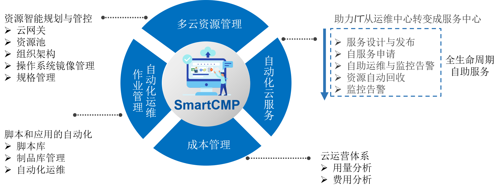

**产品介绍**

# 产品简介

## 背景简介

骞云云自动化管理产品是完整的、面向混合IT环境的管理平台。可统一管理公有云、私有云和混合云，提供跨平台的自动化和云编排能力，以及自服务所需要的策略、配额和流程控制。

## 产品架构

# 产品优势

## 面向多云和云原生服务
提供中立的单一控制台，一站式管理私有云、公有云、容器平台、x86裸金属服务器、SDN、SDS等在内的多云环境。通过统一的管理平台和资源入口，帮助企业构建标准化的IT服务管理体系。

## 云中立，告别云锁定
云自动化管理产品抽象了各个云平台的操作系统、网络、计算规格（实例类型），从而提供更加统一的多云体验，更加标准的服务。100%云中立的组件，在服务编排和设计的时候，无需绑定云平台，而是在部署的过程中根据预先配置的策略自动选择最合适的云平台进行应用安装和交付。

## 面向业务部门的自服务
针对所管理的所有云平台，用户可以建立标准的服务目录，为用户的业务和开发用户，提供单一的入口，快速获得所需的云资源与 IT 服务。根据可见性的配置，不同的用户能访问不同的服务，自助进行申请。
平台提供内置的自动化引擎，执行审批、部署等流程，完成计算、存储、网络和应用软件自动化交付。云自动化管理产品的服务目录支持应用蓝图服务，工单服务，也可以把任意IT资源封装成服务。

## 策略驱动的高度自动化
云自动化管理产品集成主流DevOps工具链，打造虚拟化、公有云和容器环境下的统一持续集成、交付与优化。通过流水线的配置，应用项目管理员可以定义代码提交、构建、测试、部署等各个阶段的触发条件与相应操作，同时可在需要的阶段中加入人工的审批过程，从而发布完整的应用上线流程。云自动化管理产品的TOSCA蓝图支持群集的拓扑结构，可自定义资源的操作流程，实现群集的蓝绿升级或灰度发布。
开发人员只需要关注代码的开发。提交代码将自动触发云自动化管理产品的流水线执行，将最新代码库的完整版本，按照事先配置的流程，完成应用的持续发布与交付。

## 服务编排，云网联动
支持不同租户、业务组使用不同网络资源，达到安全隔离。管理员配置策略与控制，无需复杂步骤，而最终用户无需网络专业就能自服务申请，实现虚拟机、应用与SDN的统一蓝图建模以及应用部署与网络配置自动化，极大提高运维效率。

## 基于面向对象模型构建，扩展性强
云自动化管理产品基于TOSCA标准，构建可扩展的组件模型，支持动态添加任意云服务。
