**快速入门**

服务是IT标准化，自动化和自服务的基础。平台支持多种服务能力，包括云资源即服务，应用即服务，流程服务等，本章节将为您介绍云资源即服务和应用即服务的相关教程。平台能够通过蓝图标准化企业需要的云服务，规范化初始配置等，支持用户自主申请云应用服务。在整个自服务的过程中，用户不需要了解各个云的配置细节，平台能够基于各种策略自动选择，提供真正的云中立服务能力。
根据快速入门的教程，您可以了解如何设计和申请云资源服务。
# 设立组织架构
## 创建用户
平台管理员可以创建用户并为不同的用户配置合适的权限，例如：申请事件工单的用户只需配置普通成员的角色权限，而处理事件工单的用户还需分配事件管理员的角色。
在【组织架构】-【用户】-「添加用户」，填写用户的相关信息，详细操作请参考[添加用户](https://cloudchef.github.io/doc/AdminDoc/04组织架构管理/用户.html#添加用户)。 
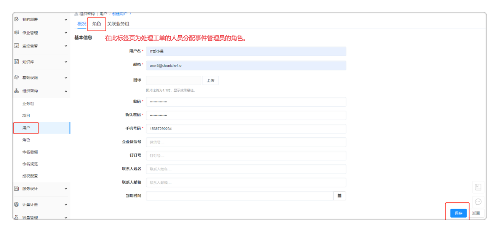 
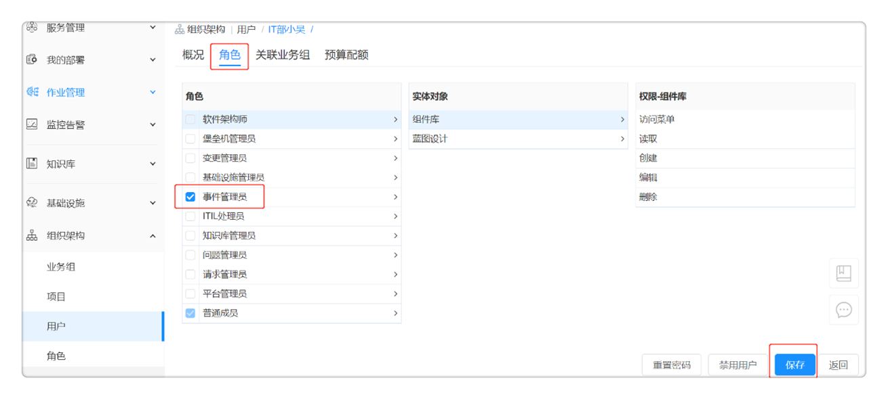
该步骤完成后，成功创建普通用户和处理人的相关账号。

## 添加业务组
业务组是平台内的逻辑组织结构，有需要把用户、服务、资源使用以及流程、规范等联系在一起的实体都可以用业务组来对应，比如子公司，不同层级的部门等。业务组的成员可以申请发布在该业务组中的服务。
添加业务组：在【组织架构】-【业务组】添加业务组，详细步骤请参考[添加业务组](https://cloudchef.github.io/doc/AdminDoc/04组织架构管理/业务组.html#添加业务组)。
关联用户：点击关联用户，勾选列表中的用户，点击确定，关联该用户到业务组。关联成功后，将在用户页面显示已关联用户。
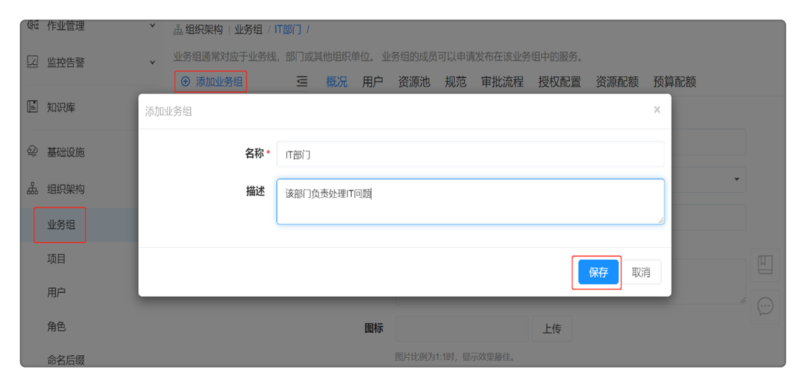 

## 添加项目
在云自动化管理产品【组织架构】-【项目】，
 - 点击「添加」，填写项目的概况信息，如名称、描述、所属业务组、资源共享等，请参考添加项目。
 - 点击「用户」标签页，管理项目关联的用户与角色。
 - 点击「云资源」标签页，展示了该项目中所有的云主机、存储、网络、软件等资源。
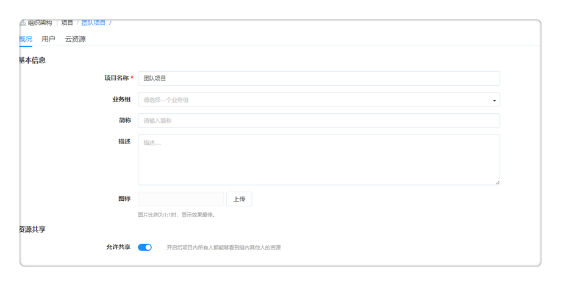 

## 配置审批流程
在云资源的审批处理过程中,流程定义了这些任务处理过程的方法和策略。平台默认提供多种审批流程，同时支持管理员通过流程设计器定义灵活的各项服务所需的流程，对自服务的申请进行实时的管控。
平台默认内置多种审批流程，包括基础设施管理员审批，平台管理员审批，业务组管理员审批等。您也可以配置钉钉或者微信进行审批，审批员可通过企业微信或钉钉收到审批消息通知，并在审批指定应用（在企业微信、钉钉中创建的第三方企业应用）完成审批流程。
您也可以根据业务需求自定义审批流程，例如设置项目管理员为一级审批员，设置业务组管理员为二级审批员：
 - 在云自动化管理产品【服务设计】-【流程配置】-「添加」，填写名称、描述、类别（审批流程）等信息；
 - 自定义审批流程，平台支持以下两种方式：
     - 上传文件名后缀为.bpmn的文件（请先在Activti中设计审批流程，并保存为bpmn文件）；
     - 点击流程设计按钮，使用流程设计器设计和定义您需要启用的审批流程；
 - 配置审批者：
     - 角色：指定拥有该角色权限的用户审批服务请求；
     - 用户：指定某个用户审批服务请求；
     - 动态用户：为服务自定义表单，在表单配置处绑定approver字段，则普通用户申请服务时可以指定任意一个用户作为审批者；
     - 基于访问权限：指定只有对该资源有读取权限的用户才能收到审批请求；
 - 配置审批规则：
     - 固定值：满足设定数目的审批者则可通过该层级审批；
     - 百分比：满足设定的百分比的成员通过此项审批则为通过；
 - 配置审批更改：选择“允许”或“不允许”审批者进行修改；
 - 高级配置：可配置审批者可以修改的具体字段，例如CPU、内存等；
点击保存按钮，生成新的审批流程。
 

## 授权配置
### 配置授权模板
授权配置模板规定了对该云资源授权成功后，可进行的运维操作以及针对该操作的审批流程。授权配置模板可以应用到不同的业务组。
在云自动化管理产品【组织架构】-【授权配置】，点击「添加」
 - 在概况标签页，填写名称、描述并勾选是否允许共享。
 - 在部署操作授权标签页，点击「添加」，选择操作名称、角色，选择该操作授权的启用/禁用状态、双因素认证的启用/禁用和审批流程（可选）。
 - 在云资源操作授权标签页，点击「添加」，通过下拉列表选择云平台类型、组件、操作、角色、该操作授权的启用/禁用状态、双因素认证的启用/禁用和审批流程（可选）。具体操作请参考[授权配置](https://cloudchef.github.io/doc/AdminDoc/04组织架构管理/授权配置.html#添加授权配置)。
 - 可对每一条添加的设置进行修改或删除，或继续添加新的操作授权规则。
 - 点击「保存」并返回授权配置页面。
 

### 业务组关联授权配置
平台支持为所有业务组全局配置默认的授权配置模板，也可以单独为特定业务组配置授权配置模板，配置后将覆盖默认授权配置。
在云自动化管理产品【系统管理】-【系统配置】-【业务组】标签页
 - 为所有业务组配置默认授权配置模板（如「允许所有操作」），配置默认模板后每个业务组不再需要单独配置。
在云自动化管理产品【组织架构】-【业务组】，点击任意业务组，
 - 在【授权配置】标签页，通过下拉列表选择需要配置的授权配置模板（如「允许所有操作」）。配置后将覆盖默认授权配置，为该业务组单独关联授权配置。

 

# 基础设施对接
## 对接云平台
在【基础设施】-【云平台管理】-【阿里云】，
 - 点击「添加」，提供阿里云平台的相关信息，请参考[添加阿里云平台](https://cloudchef.github.io/doc/AdminDoc/03基础设施管理/云平台管理.html#添加阿里云平台)。
 - 点击「验证」，验证成功则已成功连通，保存该云平台；若未保存成功，请检查阿里云平台的相关信息是否正确；
该步骤完成后，云平台对接已经完成，可以通过平台访问和管理阿里云的资源。
 

## 创建资源池
资源池，抽象池化云平台的资源，方便管理资源的导入、同步和访问策略。一个云平台可以对应多个资源池。以阿里云为例：可一个VPC对应一个资源池。以vSphere为例，一个集群对应一个资源池。
 - 在骞云自动化管理产品【基础设施】-【资源池管理】-「添加」-「阿里云」
 - 填写相关的资源池信息，请参考添加[添加阿里云资源池](https://cloudchef.github.io/doc/AdminDoc/03基础设施管理/资源池管理.html#添加阿里云资源池)。
 - 点击「保存」，资源池创建成功。
 
 

## 导入存量资源
### 通过资源池导入
在云自动化管理产品【基础设施】-【资源池管理】- 选择要导入资源的资源池，
 - 点击资源池名称进入详情，点击【云资源】Tab页面，点击「导入」，选择要导入的资源，提交请求。
 
 
 

### 通过云主机导入
在云自动化管理产品【我的部署】-【云主机】，
 - 点击「导入」，选择要导入的资源，提交请求。     
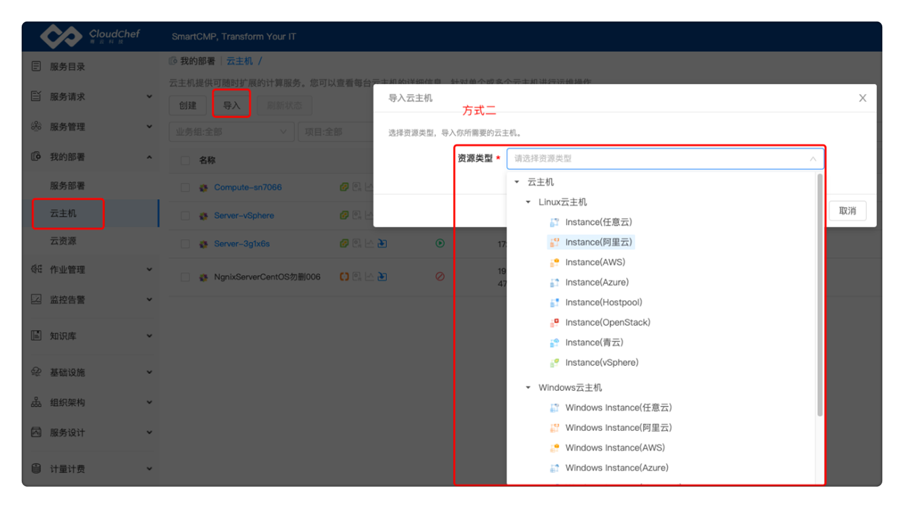 

 

# 设计云服务
在云自动化管理产品中，一切服务基于蓝图建模来定义标准的服务框架与组件，云自动化管理产品提供丰富的开箱即用的软件组件，以可视化的形式编排蓝图，提供自定义表单，为任意服务定义参数和字段，灵活的为各项服务配置资源满足用户多样的需求；同时提供内置的流程设计器，让用户能够以可视化拖拉拽的方式设计服务流程和审批流程，帮助用户准确和快速的完成流程策略设计。管理员将服务分组通过服务目录发布企业或组织需要的IT产品和服务，提供给用户自助申请。服务建模为各项服务配置资源、参数、自动化的工作流程和审批策略，实现自动化部署。云自动化管理产品支持多种云服务类型，包括云应用部署，云资源部署，通用工单，任务执行等。

## 云组件
组件采用面向对象的设计方法，使用统一的数据结构进行建模，并将配置属性标准化。平台内置大量常用的组件资源，包括IaaS（不同云平台的云主机、网络、存储等等）、PaaS（服务器、数据库、RDS等等）、容器（Kubernetes、Docker）、软件(MySQL、Oracle、Nginx等等)、代理（监控代理），不同类型资源在统一的界面进行创建和管理。
管理员可以根据需要导入或者创建可重用的组件，并通过组件管理界面管理组件。组件也是构成蓝图的基本单元，管理员能够通过可视化画布进行蓝图设计，将一个或多个组件进行组合，从而创建标准化的服务。
 
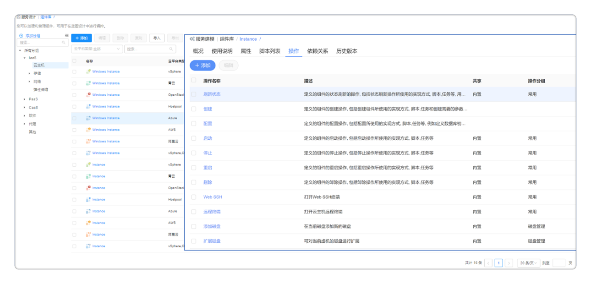 

 
 
## 蓝图
管理员可以通过蓝图管理界面以可视化的方式设计出基于TOSCA标准的应用蓝图。蓝图是对应用的抽象，包含应用的拓扑、工作流以及策略三部分。
已发布的组件将在蓝图页面左侧中显示，只需移动组件至画布内，并根据不同的依赖关系连接组件，就能构建一张蓝图，实现所见即所得。
管理员设计蓝图需要以下这些步骤：
在云自动化管理产品【服务设计】-【蓝图设计】-「添加」
 - 输入蓝图名称及描述，点击确定，进入可视化蓝图编辑页面；
 - 从左边的组件列表中选择Instance, Network, Nginx, Nginx Exporter, JMX Exporter, Tomcat, PetStore, MySQL和MySQL Exporter组件，分别将他们拖拽到右边的画布区域中，蓝图中的组件描述和连接说明可参考下文表格

|组件名 |组件描述 |云组件连接说明|
|:------:|:------:|:-----:|
|Exporter|用于监控实例运行情况|内嵌至基础组件中|
|Instance|实例的基本单元，承载运算的主体|使用时将Instance的Network连接点与Network组件的link连接点相连|
|MySQL| MySQL是一个关系型数据库管理系统 |内嵌至基础设施组件中 |                        
|Network|容器组内的容器共享相同的IP地址和端口号 |使用时将Instance的Network连接点与Network组件的link连接点相连|
|软件组件|实现快速地部署不同的软件|内嵌至基础设施组件中|

 - 	验证蓝图：点击左上角「验证」，验证蓝图的合法性；
 -  保存蓝图：验证成功后点击左上角「保存」，保存成功后点击返回，将回到蓝图列表界面；
 -  发布蓝图：在蓝图列表里选择刚编辑蓝图，点击「发布」，蓝图发布成功，则管理员能够使用已发布的蓝图配置标准化的服务。
 
 

您也可以点击【服务设计】-【蓝图设计】-「申请」，通过蓝图直接申请服务应用，以验证该应用的可用性；若需要配置标准化的申请服务，请参照下文的服务配置和发布。

## 服务配置和发布
管理员能够将设计好的蓝图发布为服务，在服务配置处配置基本信息、构成蓝图的组件详细参数、输入与输出、可以将服务与企业内部的流程（例如：审批流程）集成之后发布到服务目录。
管理员配置并发布服务卡片，需要以下几个步骤：
 1.	定义服务名称（必填）
 2.	定义服务关联的业务组（必填）
 3.	选择需要配置的应用架构，即选择已发布的蓝图（必填）
 4.	配置服务的其他参数：如服务租期策略、组件参数的配置、输入输出、表单配置、审批流程、服务条款、申请字段配置、JavaScript扩展脚本（非必填）

|服务配置Tab |各页面说明 |
|:------:|:------:|
|概况|配置服务的常用项：如图标、授权、SLA等级协议、服务目录的分组和顺序，租期策略等|
|组件配置|定义蓝图中各个组件参数的相关配置：如参数的默认值、参数的查看和修改权限、组件前序/后续条件执行脚本等|
|输入输出| 定义服务的输入输出参数，服务部署后将在应用栈详情中展示 |                        
|表单配置|选择服务申请时，需要额外展示的表单信息；在【服务设计】-【表单参数】中配置自定义表单|
|流程配置|服务的执行流程，若有特殊流程需求，可以在【流程配置】中自定义|
|审批配置|选择该服务的审批流程，可在【流程配置】中自定义审批步骤、审批人和审批规则等|
|服务条款配置| 可添加用户申请服务时需要确认的服务条款、隐私政策等|                        
|申请字段配置|可配置用户申请服务时是否显示和必填部分系统参数，如业务组、项目、所有者、名称、描述、数量、执行时间、键值标签、云资源标签等；如不勾选，则默认申请字段的配置与【系统配置】-【 界面配置】 - 【服务申请】中的字段保持一致|
|JavaScript扩展脚本| 制客户端脚本JavaScript，自定义服务申请界面上需要额外展现的内容。用户在目录配置中点击服务、加载申请页面的时候，脚本将在客户端Web浏览器中运行，展现定制内容|  

### 单蓝图服务配置
接下来我们以添加petstore App on vSphere蓝图的服务为例：
在云自动化管理产品【服务设计】-【服务配置】-「添加」，
 - 服务名称、服务描述（选填）：自定义服务名称，添加描述说明服务的用途
 - 业务组：选择服务关联的业务组，服务发布后，关联的业务组成员可以在服务目录进行查看和申请；未关联的用户将无法查看该服务。可以为服务关联一个或者多个业务组、或共享给全部业务组使用；
 - 服务类型：选择云应用部署服务， 并选择已发布的petstore App on vSphere蓝图；
>「Note」云应用部署服务：通过已发布的蓝图配置部署服务，您可以申请部署所需要的软件应用，包括中间件、网站应用、数据库、或是多层架构的应用环境。云资源部署服务：可直接通过云组件配置部署服务，范围包括可单独部署的组件（RDS、Redis、Storage、EIP等）和能够自动生成简单蓝图的组件（Instance等）。
点击保存，配置新的应用服务。
 
 1、	概况标签页
在概况标签页填写相关信息，具体操作请查看[服务配置](https://cloudchef.github.io/doc/AdminDoc/05服务建模/服务配置.html#配置云资源蓝图服务)。
 
 
 
 2、	组件配置标签页：
组件配置页是定义蓝图中各个组件参数的相关配置。
以Instance为例，点击Instance名称，为该节点配置概况信息，填写云资源配置信息，存储信息，文件系统信息和执行条件。详细操作请查看
[服务配置](https://cloudchef.github.io/doc/AdminDoc/05服务建模/服务配置.html#配置云资源蓝图服务)。
 
  

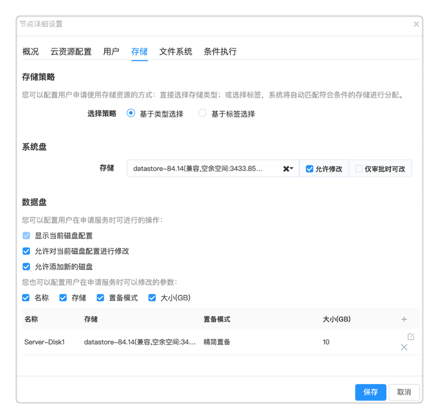  
 
 3、	审批配置标签页
选择该服务需要执行的审批流程，选择“业务组管理员审批”。系统默认配置和启用了多个审批类型的流程，若需自定义，请至【服务设计】-【流程配置】中设计。
 - 若服务中未配置审批流程，则默认使用业务组中配置的审批；【组织架构】-【业务组】-【审批流程】
 - 若服务中配置了审批流程，则会覆盖业务组中的审批；
填写完以上服务申请信息后，点击「发布」按钮，成功发布服务卡片。可以在【服务目录】中查看已发布的卡片。

### 多蓝图服务配置
管理员也可将多个蓝图发布成一个标准化服务，普通用户则能够从中选择一个蓝图进行服务部署的申请，以减少服务设计和申请的时间，提升整体效率。
配置并发布服务卡片，需要以下几个步骤：
1.	定义服务名称（必填）
2.	定义服务关联的业务组（必填）
3.	选择需要配置的应用架构，即选择已发布的蓝图（必填）
4.	配置服务的其他参数：如服务租期策略、表单配置、审批流程、服务条款、申请字段配置、JavaScript扩展脚本（非必填）
在多蓝图服务配置中，管理员无法设置蓝图中的组件参数，但能够配置服务的其他参数，详细操作请参考单上文单蓝图服务配置。

# 服务申请和审批
## 服务申请
服务目录为用户提供统一的云服务入口，将云资源的申请、运维、变更、监控和回收都服务化，并配套提供企业级的流程、权限和配额管控。产品提供千人千面的服务目录，根据配置不同的业务组及角色权限，支持为用户提供差异化服务。普通用户可通过服务目录自助批量申请所需的云资源。

### 云资源服务申请
平台支持一个服务绑定多个云组件，您可以根据需求快速选择组件，例如："申请云资源"，系统已默认配置并发布了申请云资源的服务卡片，包括虚拟机组件以及其他云资源组件（例如云硬盘、网络负载均衡等），这些组件都是可以单独部署的组件（例如RDS、Redis、Storage、EIP等）或者是能够自动部署生成简单蓝图的组件（例如Instance等）。所以针对这些云资源，您无需再设计相关蓝图，就可以直接申请部署。
以普通用户申请阿里云MySQL资源为例，需要以下这几个步骤：
 - 在云自动化管理产品【服务目录】，点击”申请云资源“服务卡片，选择申请MySQL(阿里云）的服务 
 - 填写部署信息，详细操作请参考[云资源服务申请](https://cloudchef.github.io/doc/AdminDoc/06云服务管理/服务目录.html#通过云组件部署云资源)，
     - 服务部署名称： 自定义输入部署名称;
     - 数量：输入数字，您可以一次创建多个服务部署;
     - 付费方式：您可以选择“包年包月”或者“按需”的付费方式；
     - 租用到期日期:当您选择“按需”的付费方式后,可以指定服务部署的使用期限。到期之后，所有的服务将被停机,最长到期日期无限制； 
     
        
 
 - 填写相关申请参数，例如：资源环境、部署配置、存储配置、计算规格配置、网络、其他配置等等信息；
     - 资源池：选择具体的资源环境，请先至 资源池管理 配置资源池；
     - 可用区：选择在哪个可用区域创建RDS实例；
     - 版本：选择数据库的版本；
     - 部署方式：根据需求选择不同的部署方式；
         - 多可用区部署：主节点和备节点位于不同可用区，提供跨可用区容灾；
         - 单可用区部署：主节点和备节点位于同一可用区；
     - 存储配置：选择存储云盘的类型，并设置存储空间的大小；
     - 计算规格配置：根据需求选择RDS MySQL的主实例规格；
     - 网络：设置网络类型，并选择VPC和交换机；
     - 其他配置：设置创建的数据库高权限账号和密码；
     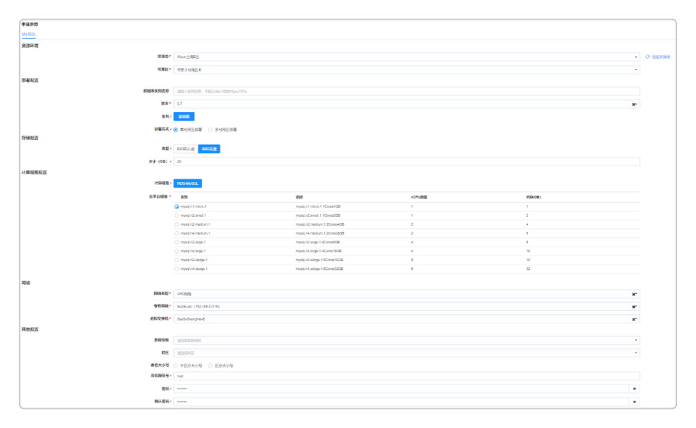   
 
 - 确认无误后点击「申请」按钮，等待管理员审批该服务。

### 应用栈服务申请
平台也支持一个服务绑定多个蓝图，支持您根据需求快速选择蓝图，例如："申请云应用"，系统提前配置了应用服务相关的蓝图，您可以申请部署所需要的软件应用，包括中间件、网站应用、数据库、或是多层架构的应用环境。
以普通用户申请petstore App on vSphere服务为例，需要以下这几个步骤：
 - 在云自动化管理产品 【服务目录】，点击”petstore App on vSphere“服务卡片，选择应用申请的服务
 - 填写组织信息，包括服务部署所属的业务组，项目和所有者；
 - 填写部署信息
     - 服务部署名称： 自定义输入部署名称;
     - 数量：输入数字，您可以一次创建多个服务部署;
     - 付费方式：您可以选择“包年包月”或者“按需”的付费方式；
     - 租用到期日期:当您选择“按需”的付费方式后,可以指定服务部署的使用期限。到期之后，所有的服务将被停机,最长到期日期无限制；
     
        
 
 - 填写申请参数，例如：资源池、私有网络、虚拟机配置、存储大小、节点数量等等信息。
     - 资源池：选择具体的资源环境，请先至 资源池管理 配置资源池。
     - 计算规格：根据业务需求选择不同规格的计算资源。
     - 操作系统：根据需求选择不同操作系统的镜像。
     - 存储：选择磁盘类型或基于存储标签选择，根据配置可以添加数据盘。
     - Network: 选择具体的网络IP地址。
     
        
 
 - 填写软件配置参数
     - 填写相关软件配置参数，例如：监听端口、安装包下载路径等。
     
        
 
 - 确认无误后点击「申请」按钮，等待管理员审批该服务。

### 工单服务申请
平台也支持普通用户进行工单服务申请。工单服务是非标准化需要人工介入和支持的服务，包括服务请求，云资源出现问题时的事件处理，例如用户忘记密码需要进行重置，或是提交一个开通邮箱或账户的请求。

## 服务审批
管理员具有审批权限，能够查看待审批的服务请求的详细信息，并进行审批操作，实时管控申请服务。目前平台也支持批量审批的功能。
管理员审批应用部署服务需要以下步骤：
在云自动化管理产品【服务请求】-【我的审批】，选择一条待审批的服务请求；
 - 点击请求链接，审批人有权限查看该请求的基本信息，部署信息，组件参数信息，服务审批信息等；
 - 请求内容修改：您可以查看该服务的所有请求参数并进行修改（若审批流程的高级配置中控制了部分参数不可改，则审批者只能查看，不能修改）
 - 审批处理：您需要审批该服务请求；
     - 批准：批准此次申请，服务的申请状态变更为已审批；
     - 拒绝：此次服务的申请被驳回；
     - 退回：填写审批意见点击退回，申请则退回申请人处修改申请详情；
 - 若审批通过后即开始应用部署，无需任何人工操作。可至【我的资源】-【应用栈】中查看该服务部署的详情动态；
 - 若审批拒绝或者退回：
     - 审批拒绝：申请者可至【我的申请】中查看被拒绝请求以及拒绝原因；
     - 审批退回上一级：上一级审批者可在【我的审批】中查看被退回的请求及退回原因，按照退回原因修改后可再次审批提交到下一级；
     - 审批退回申请者：申请者可至【我的申请】中查看被退回的请求以及退回原因，按照退回原因修改后可再次提交审批。
     
       
 
 管理员也可以通过APP进行审批操作，目前App Store, 小米，百度，腾讯等应用商店都已支持下载手机App, 帮助您实时管控服务的申请全流程。
 
   

# 云资源运维操作
用户申请服务之后，云自动化管理产品将根据策略自动化部署用户申请服务包含的所有云资源，例如一台虚拟机，一个数据库，或是一个多层次架构的应用环境。用户可在配置的服务租期内，使用该服务部署的所有资源，在云管理平台的统一界面查看和管理所有云上资源，选中一个或者多个应用栈或者云资源快速进行已被授权的运维操作。同时平台优化了资源回收流程，支持手动回收和回收站功能防止误删除。
根据以下教程，您可以了解如何对纳管的云资源进行自动化运维管理，实现资源全生命周期自服务。

## 以云主机运维为例
在云自动化管理产品【我的资源】-【云资源】，选择任一已部署云主机，可在云主机详情页面进行启动、停止、刷新状态、执行脚本、关联凭证和安装软件操作，具体操作请参考[云主机运维操作](https://cloudchef.github.io/doc/AdminDoc/14我的资源/云主机.html#云主机运维操作)。

  

>「Note」云应用部署服务：通过已发布的蓝图配置部署服务 
 用户可添加新的凭证或者管理已有凭证，以在申请资源和变更操作时，选择凭证进行配置和访问。
 在云自动化管理产品主页点击右上角头像【编辑资料】-【我的凭证】标签页，创建和管理凭证信息，
     - 点击「添加」，在概况标签页输入名称、描述、用户名并选择凭证类别：密码、密钥。
     - 允许共享：勾选允许共享，可将我的凭证共享给指定业务组的指定角色。若需要在添加虚拟机模板时选用该凭证，需将该凭证共享给全部业务组。
     - 点击保存，添加凭证成功。执行运维操作时，您可选择自己的凭证或者手动输入用户名和密码进行身份验证。
     - 在【我的凭证】标签页，点击某个凭证，您可修改凭证的名称、用户名及密码密钥。修改用户名和/或密码将同时更新凭证所关联云主机的密码。

  

 - 更改配置：在云自动化管理产品【我的资源】-【云资源】，选择任一已部署云主机，点击「更多操作」，可以更改云主机配置，包括调整虚机配置，添加网卡，删除网卡，更新云主机名称，设置云资源标签，具体操作请参考[更改配置](https://cloudchef.github.io/doc/AdminDoc/14我的资源/云主机.html#更改配置)。
 - 管理磁盘：在云自动化管理产品【我的资源】-【云资源】，选择任一已部署云主机，点击「更多操作」，可以管理云主机磁盘，包括添加新磁盘，扩展磁盘，添加文件系统，扩展文件系统等，具体操作请参考[管理磁盘](https://cloudchef.github.io/doc/AdminDoc/14我的资源/云主机.html#管理磁盘)。
 
   
 
 - 监控和代理：在云自动化管理产品【我的资源】-【云资源】，选择任一已部署云主机，点击「更多操作」，可以为云主机启用或切换监控，
     - 「启用/切换监控」：目前对云主机支持两种监控方式，平台的代理监控以及云平台监控。
         - 代理监控是通过在云主机中安装平台的监控代理，获取监控信息；
         - 云平台监控是指通过云平台的API，获取监控信息，无需安装代理。
     - 选择对应监控指标集并点击「确定」。
     
       
 
 - 删除：在云自动化管理产品【我的资源】-【云资源】，选择任一已部署云主机，点击「更多操作」，可以对云主机进行删除操作，详细操作请参考[删除云资源](https://cloudchef.github.io/doc/AdminDoc/14我的资源/云资源.html#云资源删除)。
 >「Note」在云自动化管理产品【系统管理】-【系统配置】-「系统参数」标签页，可以启用或关闭回收站功能，开启后执行卸除操作将把云资源放入回收站，放入回收站的时候系统不会删除云上的资源。
 - 「删除管理信息」：删除该云主机在云自动化管理产品上的管理信息，在相关云平台中仍然保留，不进行删除。

## 以OSS资源运维为例
在云自动化管理产品【我的资源】-【云资源】，选择任一已部署OSS资源，可在云资源详情页面进行刷新状态和执行脚本等运维操作，
 - 更改配置：”在云自动化管理产品【我的资源】-【云资源】，选择任一已部署云主机，点击「更多操作」，可以更改云主机配置，
 - 监控和代理：在云自动化管理产品【我的资源】-【云资源】，选择任一已部署云主机，点击「更多操作」，可以为云主机启用或切换监控，
 - 删除：在云自动化管理产品【我的资源】-【云资源】，选择任一已部署云主机，点击「更多操作」，可以对云主机进行删除操作，
 >「Note」在云自动化管理产品【系统管理】-【系统配置】-「系统参数」标签页，可以启用或关闭回收站功能，开启后执行卸除操作将把云资源放入回收站，放入回收站的时候系统不会删除云上的资源。
 - 「删除管理信息」：删除该云主机在云自动化管理产品上的管理信息，在相关云平台中仍然保留，不进行删除。

# 云资源回收
## 回收站
云自动化管理产品支持回收站功能，优化资源回收流程，存在误删除的情况时，支持找回资源与数据。
 >「Note」 若要启用回收站功能，请参考系统参数并设置回收站保留时间以及已回收资源展示时间。
您可以参考以下步骤找回资源：
 1.	在左侧菜单选择【我的资源】-【回收站】，在回收站列表页面再对该应用栈进行手工删除操作，该资源阶段状态显示为已删除。
 2.	回收站列表页面的服务进行还原，点击还原按钮则可以还原资源。

## 系统自动回收资源
云自动化管理产品通过在业务组或服务配置设置应用栈租用时间和保留时间，使资源在被申请使用后，能够在规定时间内自动回收。
在云自动化管理产品【组织架构】- 【业务组】，
 - 点击业务组名称，进入 概况 页面，在该页面可修改业务组下的应用栈租用时间范围和应用栈保留时间范围。
在云自动化管理产品【服务设计】- 【服务配置】，
 - 点击服务配置名称，进入 概况 页面，在该页面可修改服务配置下的应用栈租用时间和应用栈保留时间。
若服务的租用时间到期后，该部署下的所有云主机将会被自动关机；
若服务的保留时间到期后，该部署下的所有云主机将被放入回收站。系统根据用户设置的回收站展示时间保留该部署下的云主机，到期后将自动卸除，释放资源。

## 手动回收资源
用户可根据以下步骤手动回收应用栈：
在云自动化管理产品【我的资源】- 【应用栈】，
 - 选择某应用栈，顶部将出现对该服务的运维操作列表。
 - 点击更多操作-删除-卸除，
     - 若回收站开启：该应用栈的全部云资源将会被停止，同时被移入回收站。在回收保留期间，您可以去回收站进行还原或者删除操作。在回收站对该部署进行手工删除，或者保留时间过期之后，系统将从云平台上删除该部署的全部云资源。
     - 若回收站关闭：系统将删除该部署的管理信息，并从云平台中删除该部署的全部云资源。注意：该操作执行后无法恢复，请谨慎操作。
 - 您也可点击 启用定时 进行定时卸除资源的操作。
 - 点击确定后，若业务组有审批流程，则审批通过后将开始卸除；若无审批流程，则直接开始卸除。
若用户需要手动回收应用栈下的云资源，请参考[手动回收资源](https://cloudchef.github.io/doc/AdminDoc/14我的资源/回收站.html#手动回收资源)。

# 云资源告警 
## 查看监控数据
在云自动化管理产品【我的部署】-【云资源】，
 - 单击某一个云资源进入其详情界面，选择「监控」标签页查看云资源监控详情。
 - 监控标签页：展示了该云资源CPU、内存、磁盘、网络等的监控数据（可以按照需要调整时间跨度或者平均时间来查看历史监控数据）。
 
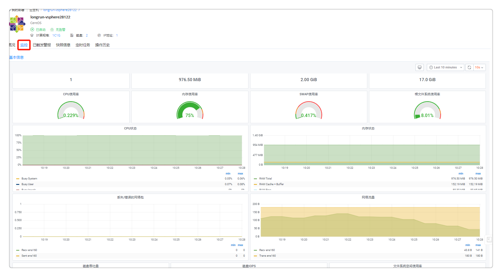

## 资源状态图
用户可以查看云主机、容器等云资源的健康状态，根据性能指标的状态显示不同的颜色。若该云资源未配置监控，默认显示灰色。浅绿到深绿到红色，颜色越深代表使用的资源越多。
在云自动化管理产品【监控告警】-【资源状态图】，
 - 鼠标移至某一蜂窝模块上，将显示该云主机或容器名称
 - 点击后显示详情：基本信息、组织信息、已装软件、键值标签、性能监控指标
 - 可根据您的需求对展示内容进行筛选，如全部或已安装监控或未安装监控、按云平台筛选、业务组筛选、项目筛选、资源类型、标签等筛选。
 

## 告警策略定义
告警策略定义了所选的对象类型（如云主机/应用/容器等）触发警报的条件。用户可以为已部署纳管资源创建自定义告警策略，定义触发警报的条件。平台支持多种告警规则，如：宕机告警、阈值告警和预测告警。
在云自动化管理产品【监控告警】-【告警策略】，
 - 点击「添加」，进入添加告警策略界面。
 - 在添加告警策略界面，定义告警策略的基本信息。依次输入告警策略的名字，选择告警类别和告警类型。
     - 告警类别支持对云主机、应用和容器的告警。
     - 告警类型支持对任意监控对象的任意指标，进行包括宕机告警、阈值告警和预测告警在内的告警。可根据选择的不同告警类型定义告警策略的触发条件。
 - 点击「保存」，提示告警策略添加成功，返回告警策略列表界面。
 
  

## 告警通知和处理
定义所选告警策略应用到的范围以及触发的通知，配置触发告警后的自愈操作。
在云自动化管理产品【监控告警】-【告警】，
 - 点击「添加」，进入添加告警界面，定义告警的基本信息。
 - 输入告警的名字，选择步骤四已配置的告警策略、告警范围、告警对象以及警报级别；设定触发xx次后，自动升级为更高级别。
 - 定义触发告警后，通知到的用户、角色、排班或特定的邮件地址。平台将根据所s选用户或角色已配置的消息通知平台发送通知。
 - 点击「保存」，返回告警列表界面。
 
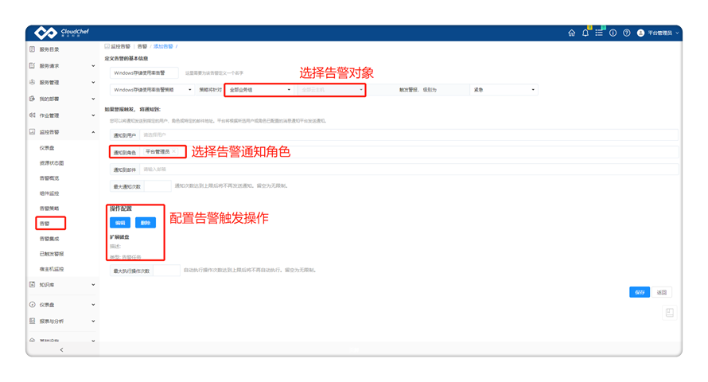   

在云自动化管理产品【监控告警】-【已触发警报】，查看已触发的云资源警报（来自云监控告警平台或第三方告警平台），追溯警报的详细情况，并对警报进行恢复、暂停、解除操作，或者通过工单进行处理。。
 - 查看所有已触发警报的警报级别、告警名称、触发告警对象、告警类型、第一次触发时间、最后一次触发时间、已触发次数以及告警状态。
 - 任意选择一条已触发的警报，在工具栏中可选择「暂停」或「解除」警报。
 - 点击列表中的告警名称，可查看该警报的详细信息以及历史数据。该页显示了告警触发的对象、警报的级别，触发的条件、业务组、所有者、IP地址、警报图表（可调控时间范围灵活查看各个时间段的警报数据）、以及该告警的后续操作历史。
     - 如果您需要为触发的告警新建一个工单任务，点击「提单」按钮
     >「Note」管理员可以预先设置服务团队处理工单任务，当用户提交工单任务时根据预先配置的服务流程和服务团队排班，相应的服务团队将接到工单进行处理。
 - 点击告警触发的对象可跳转至该对象的监控页面，如服务部署链接至服务部署监控页面、云主机链接至云主机监控页面等。
 
   

# 费用分析
## 费用分析仪表盘
在云费用分析平台【计量计费】-【费用分析】，
 - 展示了总体费用分析概览和分组费用分析概览，包含“总费用趋势”、“预测今天（本月）费用”、“费用占比”、“费用趋势”及“费用排行”模块。鼠标悬浮于图表上时，将显示悬浮区域的数据明细。
 - 点击“总费用趋势”和“费用趋势”中的某一项将跳转至费用明细页面，时间跨度根据费用分析页面时间粒度设置展示。可根据时间、云平台、资源类型、费用类型、业务组、项目和所有者等不同维度进行筛选查看。
 - 点击“费用占比”和“费用排行”的某一项资源类型，将跳转至该类型的费用概览页面，支持根据时间粒度、分组、业务组、所有者等维度筛选展示，以及图表形式切换。
 - 云费用分析平台支持费用下钻，请参考[费用分析](https://cloudchef.github.io/doc/AdminDoc/07云资源分析/费用管理.html#费用分析)。
 
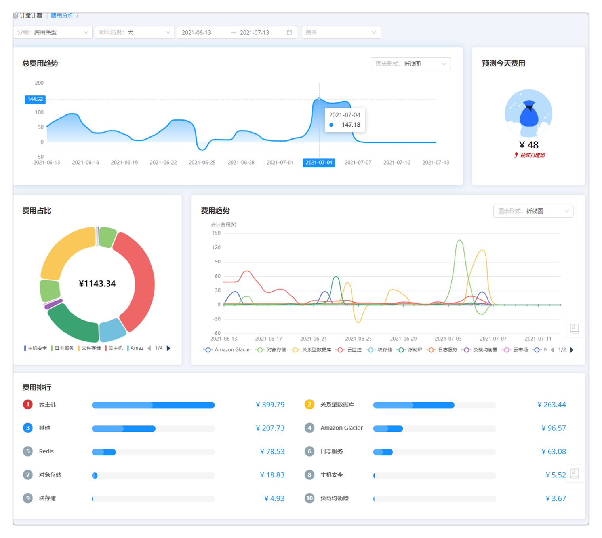   

## 费用报表
在云自动化管理产品【计量计费】-【费用报表】，可查看基于成本中心、业务组、项目和云资源的费用报表。
 - 点击任意报表名称进入报表生成页面。点击「生成」，可生成用户所属业务组所有费用明细报表。
 - 可根据云平台类型、业务组、云平台类型、费用类型及起始时间进行筛选。可点击「合并左边相同维度行」，并可选择需要展示的报表表头，如：云平台名称、费用。
 - 点击「导出」可以导出筛选后的报表，导出格式为Excel文件。
 
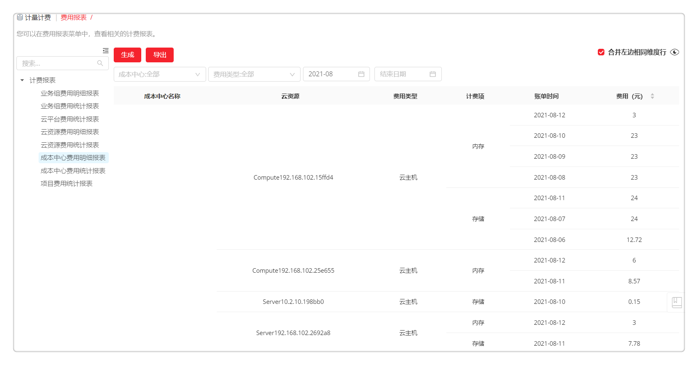

## 查看费用明细
在自动化管理产品【计量计费】-【费用明细】，
 - 在费用明细页面，用户可以查看聚合分摊的费用明细信息，支持根据业务组、项目、所有者、时间、云平台、资源标签、键值标签、费用类型、成本中心等不同维度进行筛选查看。
 - 点击费用明细页面的一条费用类型，可以编辑该费用的归属（业务组、项目及所有者）和配置（费用类型及计费项）并校准账单费用。
 
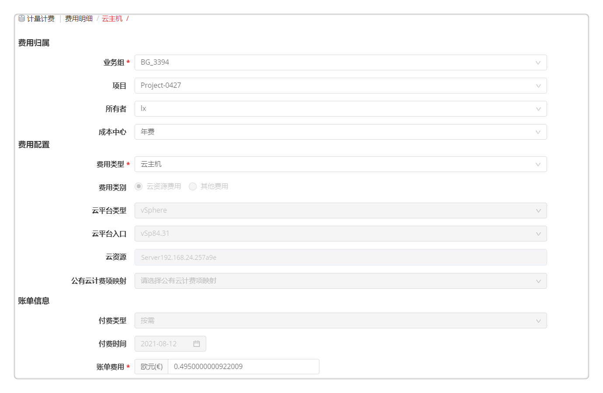

## 可扩展计费规则
平台允许自定义计费规则，对纳管的私有云、公有云等多种不同类型资源进行计费。
在云自动化管理产品【计量计费】-【计费规则】，
 - 点击「添加」，填写计费规则名称，选择云平台、资源池。
 - 选择计费模式、组件类别，设置价格和周期，支持设置折扣系数。
 - 选择费用类型和计费项，设置结单周期频率。点击「保存」。

