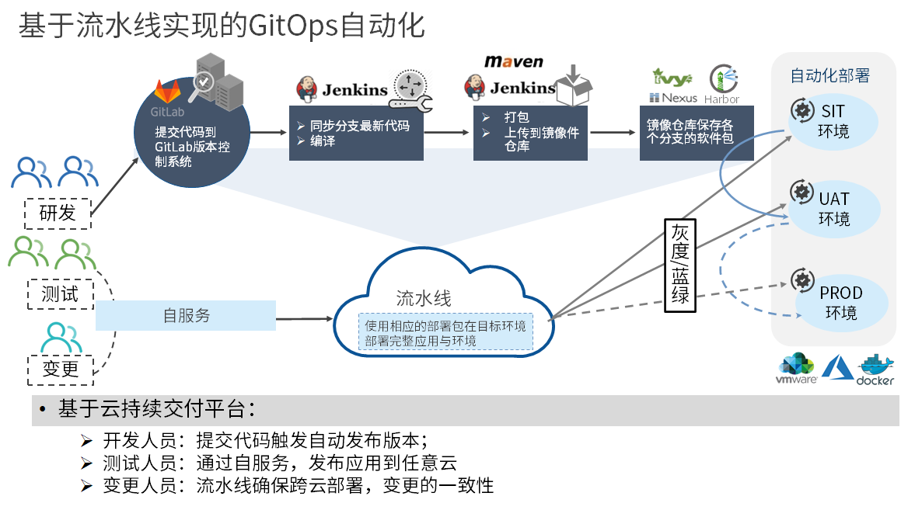

**产品介绍**

# 产品简介

## 背景介绍

过去二十年中，软件开发和交付领域发生了很大的变化。业务的需求和期望重点开始关注创新、速度和投入市场的时间，架构师和开发人员随之也做出相应改变，新的部署功能和平台不断出现，与DevOps、发布工程和站点可靠性工程等方法共同发展。与此同时，创建持续交付构建管道的最佳实践也在发展，持续交付的核心是对于所交软件的任何功能变更，在决定将其部署到生产环境前，一定要经过构建、集成、测试和验证的过程。持续交付在持续集成的基础上，将集成后的代码部署到更贴近真实运行环境的“类生产环境”之中。持续交付中包含了自动构建，打包，部署与测试的流程，以此来减少手动任务并加快软件交付速度。持续交付的部署频率也加快了整个流程中的反馈循环，用户可以快速地验收并做出判断，IT团队也可以在问题影响到开发周期之前就解决，整个交付过程进度可视化，方便团队人员与客户了解项目的进度。

骞云云持续交付产品是面向公有云、私有云和混合云的企业级持续交付产品，集 DevOps 实践、业界前沿的研发理念，提供可视化流水线，通过高度自动化的服务编排、自服务，让软件开发简单高效。

## 产品场景

# 产品优势

## 可视化蓝图编排，部署任意应用到任意云

符合TOSCA 国际标准的可视化蓝图，面向应用的多云编排管理，所见即所得，实现从简单到复杂的应用资源端到端交付。支持云中立的蓝图，按需部署到所需云平台，或者基于策略自动选择最优云平台。

## 端到端的应用自动化部署

基于国际标准TOSCA模型，提供基础设施即代码（Infrastructure as Code），实现强大的服务建模和编排能力，完成应用资源的端到端交付。特有的插件架构和可扩展组件，可用于将编排功能扩展到任何支持API的云服务。将各种面向应用、面向环境的部署规范落地到自动化交付过程。

## 面向开发测试场景的自服务

动态计算预估费用，部署拓扑展现资源的状态和告警信息，全栈自动化部署同时支持工单处理。用户可方便地按需获取多云环境资源，自助扩容、监控、回收资源，并受到权限、审批、配额等管控。

## 应用持续交付流水线

开发测试人员能够可视化自定义应用发布、测试、交付流水线。基于面向应用、面向多云的环境端到端部署和自助变更能力，实现从代码变更到代码构建、代码测试和应用部署的全流程自动化，集成和节点任务实时通知反馈，让开发测试人员专注应用部署、变更的标准化、自动化。

## 资源全生命周期管理

开发测试人员可方便的按需获取多云环境资源，自助扩容、监控、回收资源，并受到权限、审批、配额、回收策略等管控。云资源云应用的运维变更操作可以人工触发也支持流水线触发。

## 集成多种软件制品和DevOps工具链

支持Nexus，Jfrog Artifactory，VMware Harbor等多种制品库，并将制品自动化更新到运行云环境。兼容Jenkins的各种配置和使用方式。

