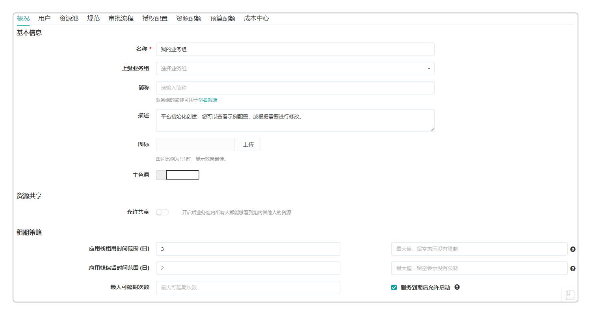

**快速入门**

# 快速入门简介

平台提供自动化、自助式的云服务，覆盖资源Day0到DayN全生命周期，业务部门用户可方便的按需获取多云环境资源，自助扩容、监控、回收资源。同时平台集成DevOps工具链，实现自动构建、打包、部署与测试的流程，帮助用户加快软件交付速度。

根据本章节的教程，您可以了解如何使用云持续交付产品的自动化和云编排能力统一管理公有云、私有云和混合云，并通过高度自动化的可视化流水线让软件开发简单高效。

# 设立组织架构

在使用持续交付功能前，可以设置业务组和项目并关联用户，项目内的成员可以申请执行流水线。

## 添加业务组

在云持续交付产品【组织架构】-【业务组】，

+  点击「添加」，填写业务组的概况信息，如名称、描述、图标、资源共享与租期策略等，请参考[添加业务组](https://cloudchef.github.io/doc/AdminDoc/04组织架构管理/业务组.html#添加业务组)。
+  点击「用户」标签页，管理业务组关联的用户与角色。
+  点击「授权配置」标签页，配置授权配置模板，指定用户对应用栈和云资源可以进行的操作。您可以在[授权配置](https://cloudchef.github.io/doc/AdminDoc/04组织架构管理/授权配置.html)菜单中查看模板配置的详细授权信息。

 
## 添加项目

在云持续交付产品【组织架构】-【项目】，

+  点击「添加」，填写项目的概况信息，如名称、描述、所属业务组、资源共享等，请参考[添加项目](https://cloudchef.github.io/doc/AdminDoc/04组织架构管理/项目.html#添加项目)。
+  点击「用户」标签页，管理项目关联的用户与角色。

## 添加用户

在云持续交付产品【组织架构】-【用户】，

+  点击「添加」，选择登录类型“根据系统配置”。
+  概况标签页：输入用户名、邮箱、密码和手机号码等必填项，企业微信号、钉钉号、联系人姓名邮箱、到期时间（指定到期时间自动禁用）等选填，并上传图标。
+  角色标签页：默认用户为普通成员。系统默认有软件架构师、基础设施管理员、平台管理员等角色，您也可自定义角色，为该角色分配相应的权限，具体参照角色章节。勾选某角色后，会显示该角色所对应的实体对象（组件库、蓝图设计）和权限范围（访问、读取、创建、编辑或删除）。
+  关联业务组标签页：勾选业务组，将该业务组与用户关联。

 
# 定义应用服务

管理员可以完成云平台的对接，逻辑资源池的创建，并将要管理的虚拟机资源添加到云持续交付产品中。

## 对接云平台

在云持续交付产品【基础设施】-【云平台管理】，

+  点击「添加」，提供云平台的相关信息，请参考[添加云平台](https://cloudchef.github.io/doc/AdminDoc/03基础设施管理/云平台管理.html#添加云平台)。
+  点击「验证」，验证成功则已成功连通，保存该云平台；若未成功，请检查云平台的相关信息是否正确。

## 创建资源池

通过创建资源池，抽象池化云平台的资源，更细颗粒度的管理不同集群、不同存储和不同网络区域的资源。

+  在云持续交付产品【基础设施】-【资源池管理】-「添加」
+  填写相关的资源池信息，请参考[添加资源池](https://cloudchef.github.io/doc/AdminDoc/03基础设施管理/资源池管理.html#创建资源池)。
+  点击「保存」，资源池创建成功。

## 存量资源导入

### 通过资源池导入

在云监控告警平台【基础设施】-【资源池管理】- 选择要导入资源的资源池，

1. 点击资源池名称进入详情，点击「云资源」标签页，点击「导入」，选择要导入的资源，提交请求。
2. 或者点击「同步策略」标签页，设置同步策略，选择同步对象的分组与类型、指定导入资源所属的业务组与所有者、设置同步策略的重复周期以定时同步云平台中新增的资源。

 
### 通过云主机菜单导入

在云监控告警平台【我的部署】-【云主机】，

+  点击「导入」，选择要导入的资源，提交请求。

# 定义应用软件

云持续交付产品支持接入主流制品库对制品进行存放管理和版本控制，Jenkins持续集成系统用于持续、自动的构建/测试软件项目，并支持通过脚本库统一创建和管理一些共享脚本，供被授权成员在任意场景下直接引用。

## 软件制品管理

云管平台通过接入主流的制品仓库对制品进行存放管理和版本控制。

在云持续交付产品【服务设计】-【制品库】，

+  点击「添加」，选择docker、HARBOR或Nexus制品库，填写制品库信息完成对接。
+  在【服务设计】-【组件库】，选择自定义组件，在该组件的「概况」标签页，勾选“制品”，进入「制品」标签页选择二进制软件制品仓库，进行软件版本的配置。
+  在服务申请时，用户可以使用管理员配置的制品（如Harbor镜像部署容器）生成应用环境。
+  云持续交付产品的自助运维功能支持从制品仓库更新最新的制品。

## 持续集成系统对接

在云持续交付产品【作业管理】-【入口】，

+  点击「添加」，选择「Jenkins」
+  输入所需参数并点击「验证」。验证成功后点击「保存」，Jenkins连接成功。
+  在流水线作业添加串行任务时选择Jenkins任务，在输入参数关联上述已配置的Jenkins入口。

## 脚本库管理

在云持续交付产品【作业管理】-【脚本库】，

+  点击「添加」，在「概况」标签页输入脚本基本信息，选择是否允许共享脚本和共享授权对象。未共享的脚本将不允许其他用户查看或使用。
+  在「脚本」标签页，在脚本内容输入框中填写相关参数。
+  保存并发布脚本，发布成功后就能在资源列表或流水线作业中执行。

# 定义应用服务

云持续交付产品提供丰富的开箱即用的组件，以可视化的形式编排蓝图，灵活地为各项服务配置资源满足用户多样的需求。

通过云持续交付产品，用户不仅能够完成用户自服务申请云资源，云资源自动化部署交付，也可以自助地进行运维操作、查看性能监控信息，以及设置告警。

## 云组件

云持续交付产品内置大量常用的组件资源，包括IaaS（不同云平台的云主机、网络、存储等等）、PaaS（服务器、数据库、RDS等等）、容器（Kubernetes、Docker）、软件(MySQL、Oracle、Nginx等等)、代理（监控代理），不同类型资源在统一的界面进行创建和管理，采用树形结构的分组目录，支持二次编辑、快速复制、导入、导出组件。

平台支持通过二进制软件制品仓库对组件进行版本管理：

在云持续交付产品【服务设计】-【组件库】，

+  选择已添加或导入的组件（系统内置组件不支持修改），进入组件编辑页面。
+  勾选“制品”，在「制品」标签页，选择入口、已对接的制品仓库（Jfrog Artifactory、Nexus）、组、名称、版本（默认选择latest代表最新版本）。
+  点击「保存」，将组件与制品管理平台关联，进行组件版本控制。

## 蓝图编排

以自定义Kubernetes蓝图为例介绍云持续交付产品的蓝图编排能力：

在云持续交付产品【服务设计】-【蓝图设计】，

+  点击「添加」，输入蓝图名称及描述，点击「确定」，进入可视化蓝图编辑页面。
+  从左边的组件列表中选择组件（如Service, Deployment, MySQL等），分别将他们拖拽到右边的画布区域中
+  建立组件的连接关系，如：点击Service右边的Deployment|DaemonSet|StatefulSet节点拖拽到Deployment的Service节点上，建立Service和Deployment的网络连接
+  点击左上角「验证」，验证蓝图的合法性；验证成功后点击左上角「保存并发布」，蓝图发布成功，用户能够使用已发布的蓝图申请标准化的服务。

## 服务配置

管理员可以创建和管理服务，包括云资源蓝图服务和手工工单服务。可以将一个服务发布到某个特定的业务组，或共享给所有业务组。用户将通过服务目录进行各项服务的申请。

在云持续交付产品【服务设计】-【服务配置】，点击「添加」，

+  输入服务名称、描述，选择业务组和服务类型。
    +  在服务类型可以选择云应用部署服务，关联一个或多个已编排的蓝图进行云应用申请；
    +  或者选择任务执行，关联流水线启动任务，方便用户申请流水线执行。
+  在「概况」标签页，填入服务名称、描述、图标，选择业务组、授权、服务等级协议、服务目录分组、顺序和状态等。
+  在「组件」标签页（云应用部署服务），定义蓝图中各个组件参数的相关配置
    +  以Instance为例，点击Instance名称，为该节点配置概况信息，填写云资源配置信息，存储信息，文件系统信息和执行条件。详细操作请查看服务配置。
+  在「任务配置」标签页（任务执行服务），点击「添加」，选择“流水线任务”，关联允许用户申请启动的流水线。
+  其他标签页字段配置请参考：[服务配置](https://cloudchef.github.io/doc/AdminDoc/05服务建模/服务配置.html#添加服务配置)。
+  点击「发布」按钮，成功发布服务卡片。用户可以在【服务目录】中查看已发布的卡片并自服务申请服务。

## 云资源自服务申请

在云持续交付产品【服务目录】，

+  点击任意已发布的服务卡片
+  填写组织信息：业务组、项目、所有者。如下拉框为空可以点击创建，详细参数填写请参考[组织架构](https://cloudchef.github.io/doc/AdminDoc/04组织架构管理/业务组.html)。
+  填写部署信息：描述、数量，选择执行时间、付费方式和租用到期日期。
+  设置标签：创建或设置键值标签，也可以设置管理员提供的云资源标签。
    
+  填写相关申请参数：资源环境、实例类型、镜像、存储、凭证等信息。
    +  创建云平台规格请参考：[计算规格](https://cloudchef.github.io/doc/AdminDoc/03基础设施管理/计算规格.html)。
    +  创建操作系统请参考：[虚拟机模板](https://cloudchef.github.io/doc/AdminDoc/03基础设施管理/虚拟机模板.html)。
    
+  确认无误后点击「申请」，在【我的资源】-【云资源】可以查看已部署云资源资源。

## 云资源运维

用户申请服务之后，云自动化管理平台将根据策略自动化部署用户申请服务包含的所有云资源，例如一台虚拟机，一个数据库，或是一个多层次架构的应用环境。用户可在配置的服务租期内，使用该服务部署的所有资源，在云管理平台的统一界面查看和管理所有云上资源，选中一个或者多个应用栈或者云资源快速进行已被授权的运维操作。同时平台优化了资源回收流程，支持手动回收和回收站功能防止误删除。

在云持续交付产品【我的资源】-【云资源】，选择任一已部署云主机，可在云主机详情页面进行启动、停止、刷新状态、执行脚本、关联凭证和安装软件操作，具体操作请参考[云主机运维操作](https://cloudchef.github.io/doc/AdminDoc/14我的资源/云主机.html#云主机运维操作)。

+  「启动」：实时启动（关机状态的）云主机。
+  「停止」：实时关机（开机状态的）云主机。
+  「刷新状态」：手工刷新状态云主机状态。刷新后更新：规格配置的修改，磁盘的增加，IP地址的修改等。
+  「安装软件」：选择需要安装的软件。该软件列表来源于 服务设计 - 组件库，可对软件的属性键值进行更改。
+  「执行脚本」：选择任一已部署云主机，可在云主机详情页面为云主机执行脚本
    +  点击「执行脚本」，选择脚本来源（脚本库或直接执行）
    +  输入凭证或者自定义用户密码。
    +  点击「确定」，完成脚本执行任务。
    

+  更改配置：在【我的资源】-【云资源】，选择任一已部署云主机，点击「更多操作」，可以更改云主机配置，包括调整虚机配置，添加网卡，删除网卡，更新云主机名称，设置云资源标签，具体操作请参考[更改配置](https://cloudchef.github.io/doc/AdminDoc/14我的资源/云主机.html#更改配置)。
+  管理磁盘：在【我的资源】-【云资源】，选择任一已部署云主机，点击「更多操作」，可以管理云主机磁盘，包括添加新磁盘，扩展磁盘，添加文件系统，扩展文件系统等，具体操作请参考[管理磁盘](https://cloudchef.github.io/doc/AdminDoc/14我的资源/云主机.html#管理磁盘)。

    
 
+  监控和代理：在【我的资源】-【云资源】，选择任一已部署云主机，点击「更多操作」，可以为云主机启用或切换监控，
    +  「启用/切换监控」：云平台监控是指通过云平台的API，获取监控信息，无需安装代理。
    +  选择对应监控指标集并点击「确定」。
    

+  删除：在【我的资源】-【云资源】，选择任一已部署云主机，点击「更多操作」，可以对云主机进行删除操作，详细操作请参考[删除云资源](https://cloudchef.github.io/doc/AdminDoc/14我的资源/云主机.html#删除)。
    +  「删除管理信息」：删除该云主机在云自动化管理平台上的管理信息，在相关云平台中仍然保留，不进行删除。
    >「Note」在云自动化管理平台【系统管理】-【系统配置】-「系统参数」标签页，可以启用或关闭回收站功能，开启后执行卸除操作将把云资源放入回收站，放入回收站的时候系统不会删除云上的资源。

## 云资源监控告警

云持续交付产品支持通过统一界面（资源状态图）可视化展示云主机和云资源的健康状态。用户可以为已部署纳管资源创建自定义告警策略，定义触发警报的条件，定义所选告警策略应用到的范围以及触发的通知，配置触发告警后的自愈操作，为云资源告警配置修复资源的操作建议，在触发告警时支持根据操作建议修复资源实现自愈。

### 资源状态图

在云持续交付产品【监控告警】-【资源状态图】，

+  鼠标移至某一蜂窝模块上，将显示该云主机或容器名称
+  点击后显示详情：基本信息、组织信息、已装软件、键值标签、性能监控指标
+  可根据您的需求对展示内容进行筛选，如全部或已安装监控或未安装监控、按云平台筛选、业务组筛选、项目筛选、资源类型、标签等筛选。

### 告警策略定义

告警策略定义了所选的对象类型（如云主机/应用/容器等）触发警报的条件。用户可以为已部署纳管资源创建自定义告警策略，定义触发警报的条件。平台支持多种告警规则，如：宕机告警、阈值告警和预测告警。

在云持续交付产品【监控告警】-【告警策略】，

+  点击「添加」，进入添加告警策略界面。
+  在添加告警策略界面，定义告警策略的基本信息。依次输入告警策略的名字，选择告警类别和告警类型。
    +  告警类别支持对云主机、应用和容器的告警。
    +  告警类型支持对任意监控对象的任意指标，进行包括宕机告警、阈值告警和预测告警在内的告警。可根据选择的不同告警类型定义告警策略的触发条件。
+  点击「保存」，提示告警策略添加成功，返回告警策略列表界面。

### 告警通知和处理

定义所选告警策略应用到的范围以及触发的通知，配置触发告警后的自愈操作。

在云持续交付产品【监控告警】-【告警】，

+  点击「添加」，进入添加告警界面，定义告警的基本信息。
+  输入告警的名字，选择步骤四已配置的告警策略、告警范围、告警对象以及警报级别；设定触发xx次后，自动升级为更高级别。
+  定义触发告警后，通知到的用户、角色、排班或特定的邮件地址。平台将根据所选用户或角色已配置的消息通知平台发送通知。
+  点击「保存」，返回告警列表界面。

在云持续交付产品【监控告警】-【已触发警报】，查看已触发的云资源警报（来自云监控告警平台或第三方告警平台），追溯警报的详细情况，并对警报进行恢复、暂停、解除操作，或者通过工单进行处理。

+  查看所有已触发警报的警报级别、告警名称、触发告警对象、告警类型、第一次触发时间、最后一次触发时间、已触发次数以及告警状态。
+  任意选择一条已触发的警报，在工具栏中可选择「暂停」或「解除」警报。
+  点击列表中的告警名称，可查看该警报的详细信息以及历史数据。该页显示了告警触发的对象、警报的级别，触发的条件、业务组、所有者、IP地址、警报图表（可调控时间范围灵活查看各个时间段的警报数据）、以及该告警的后续操作历史。
    +  如果您需要为触发的告警新建一个工单任务，点击「提单」按钮
>「Note」管理员可以预先设置服务团队处理工单任务，当用户提交工单任务时根据预先配置的服务流程和服务团队排班，相应的服务团队将接到工单进行处理。
+  点击告警触发的对象可跳转至该对象的监控页面，如服务部署链接至服务部署监控页面、云主机链接至云主机监控页面等。

 
### 告警自愈

在告警配置和告警集成配置时允许为云资源告警配置修复资源的操作建议，支持配置工单审批。在触发告警时支持根据操作建议修复资源实现自愈。

以告警配置为例，在云持续交付产品【监控告警】-【告警】，

+  选择任意一条已创建告警，点击「编辑」，进入编辑告警界面。
+  在【操作配置】模块定义警报触发后的自愈操作：
    +  点击「添加」，选择包括云资源运维任务、告警任务在内的任务类型，设置相应输入参数与作用到的云资源。
    +  执行设置：填写超时时间、执行选项和执行方式。
+  点击「保存」并返回告警集成列表页。
+  当告警产生时，已定义的自愈操作将被触发以修复资源。
>「Note」如果自愈操作涉及修改云资源配置（除脚本执行），则需要将云平台设置为非只读模式。
 

# 应用发布流水线

流水线由一系列阶段构成，每个阶段由软件在发布到生产之前必须完成的多个任务和环境组成。用户通过流水线可以建设自动化的、可重复利用、安全合规的应用持续交付和部署，实现应用的测试、部署、更新、运维、回收的全生命周期管理。

## 创建流水线阶段

在云持续交付产品【作业管理】-【流水线作业】，

+  点击「添加」，在概况标签页输入名称、描述、选择业务组和项目；
+  添加全局参数，在后期任务中进行调用。
+  在「任务」标签页，点击添加按钮，输入阶段名称创建阶段。

## 流水线任务类型

在云持续交付产品【作业管理】-【流水线作业】-「任务」标签页，
+  在已创建的阶段下，点击「添加串行任务」，输入任务的基本信息、输入参数、操作详情、输出参数与执行设置。
+  云持续交付产品支持以下任务类型：
    +  Jenkins任务：执行Jenkins仓库已有的Job。
    +  制品库解析任务：解析二进制制品库中的软件制品包版本。
    +  蓝图部署任务：在作业执行时部署新的云资源。
    +  等待任务：定义间隔的时间，在执行时进行等待。
    +  人工确认任务：对流水线进行人工干预。
    +  云资源运维任务：对指定的云资源执行运维操作。
    +  流水线任务：定义一个可以启动流水线的任务，任务执行后将立即启动指定的流水线。
    +  HTTP(s) API任务：可以调用任意HTTP(s) API请求的任务。
    +  第三方系统集成任务：定义第三方的集成任务，实现高效灵活地对接第三方系统。
+  配置流水线任务详细参数请参考：[配置流水线任务](https://cloudchef.github.io/doc/AdminDoc/11作业管理/流水线作业.html#配置任务)。

## 流水线触发条件

在云持续交付产品【作业管理】-【流水线作业】-「触发器」标签页，
+  点击「添加」，输入触发器的名称，选择触发器类型填写相应参数：
    +  CRON：定时触发任务。
    +  Jenkins：Jenkins触发任务。
    +  Webhook：支持Git、Gitlab等代码仓库改变触发。
+  通过设定策略由触发器自动触发流水线任务。

云持续交付产品还支持将流水线启动任务发布为服务卡片供用户申请。通过服务配置添加“任务执行”服务，添加流水线任务并关联已创建的流水线。用户可以通过服务目录申请执行该流水线。

## 流水线执行

流水线支持人工手动执行和自动触发执行。

在云持续交付产品【作业管理】-【流水线作业】，选择已有流水线，点击「执行」，手动触发流水线。或者通过设置的触发器自动触发流水线执行。
在云持续交付产品【作业管理】-【执行历史】，选择已执行流水线记录，可了解流水线执行的基本信息，通过作业执行历史可以查看任务的编排情况，通过颜色快速了解当前任务的执行状态。

## 流水线应用场景（应用版本发布）

应用版本发布，Gitlab代码提交通过Webhook触发流水线启动，Jenkins自动化构建进行应用打包，上传最新的War包到制品仓库存储最新的镜像包，通过制品库解析任务获取最新应用包的仓库地址，在云主机执行脚本上传镜像并更新应用，完成应用发布的流程。
 
1.	在云持续交付产品【作业管理】-【流水线作业】，点击「添加」，创建“应用发布”流水线，填写描述和全局参数。
2.	在「任务」标签页，添加阶段“Jenkins打包任务”、“等待打包任务”、“更新Harbor仓库镜像”和“更新应用”。
3.	点击「添加串行任务」，
    1. 在“Jenkins打包任务”阶段添加应用打包任务：选择“Jenkins任务”，选择已对接的Jenkins仓库和Job，执行应用打包。
    2. 在“等待打包任务”阶段添加等待任务和人工确认任务：等待应用打包完成，并通知管理员人工确认。
    3. 在“更新Harbor仓库镜像”阶段添加制品库地址解析任务：选择“制品库解析任务”，选择已对接的制品库入口和制品名称与版本，获取制品的下载地址。
    4. 在“更新Harbor仓库镜像”阶段添加云资源运维任务：选择执行脚本的云主机，执行“更新上传镜像”脚本。
    5. 在“更新应用”阶段添加云资源运维任务：选择执行脚本的云主机，执行“更新应用”脚本。
4.	在「触发器」标签页，添加触发器选择类型为Webhook，在来源中定义字段生成URL，设置过滤条件（设置密码）。在Gitlab – Settings – Integrations中输入前文生成的URL，具体请参考[添加Webhook触发器](https://cloudchef.github.io/doc/AdminDoc/11作业管理/流水线作业.html#添加webhook触发器)。
5.	保存流水线。当用户进行Gitlab代码提交操作，通过Webhook触发流水线完成自动部署升级。

