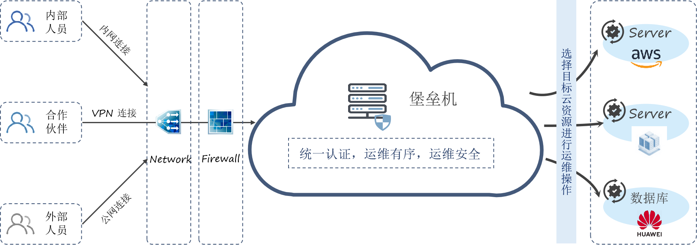

**产品介绍**

# 产品简介

## 背景简介

骞云云堡垒机可集中管控多云环境下的云资源访问，通过脚本库，软件组件标准化企业的运维能力；全程记录操作数据，还原运维场景。云堡垒机采用分布式架构，支持多数据中心海量并发，可以为用户提供高速稳定的服务，助力企业用户构建云上统一、安全、高效的运维通道。

## 产品架构

# 产品优势

## 支持云资源自动同步策略
骞云堡垒机支持云资源同步策略，则用户可定时同步各类云平台中新增的资源，无需再进行手工操作，提升了运维管理云资源的效率和质量。

## 支持多种运维管理协议
骞云堡垒机支持SSH、RDP、VNC等多种远程访问协议，并支持通过不同云平台协议或者Agent的形式使用VNC登录虚拟机。

## 统一认证管理
支持云资源访问凭证的统一管理，单个凭证可关联多个云主机，修改该凭证，支持同步更新到关联的云主机中，实现批量改密，实现通过凭证一键登录到设备。

## 实现最小权限运维
在对资源进行授权管理时，仅依靠操作系统或应用系统本身的授权体系来实现管理，过于粗放。骞云云堡垒机提供基于最小权限分配原则管理用户权限，支持资源层面的授权策略。

## 满足安全管理需求，实现高效运维
骞云云堡垒机为IT管理者提供更高、更全面而细致的安全管理视角，在为IT运维工程师授予合适粒度权限的同时，更为运维工程师带来了丰富便捷的运维手段和极致的操作体验，既满足了安全管理需求，也实现了高效运维，在安全与效率之间取得了平衡。

## 符合安全合规，完整运维闭环
从安全合规上来说， 骞云云堡垒机提供事前授权、事中监察、事后审计等完整的运维闭环，所有远程运维操作，均可进行审计录像，方便事后追踪溯源，满足合规建设要求。
