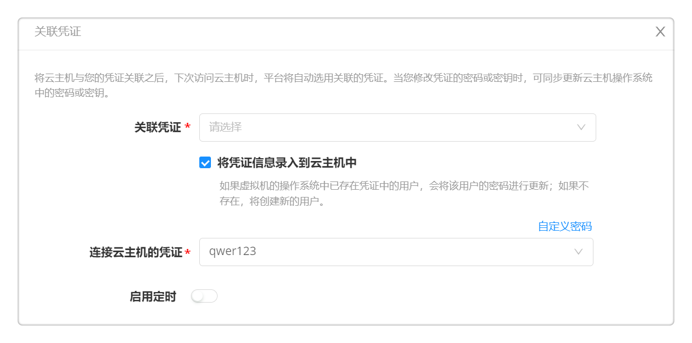
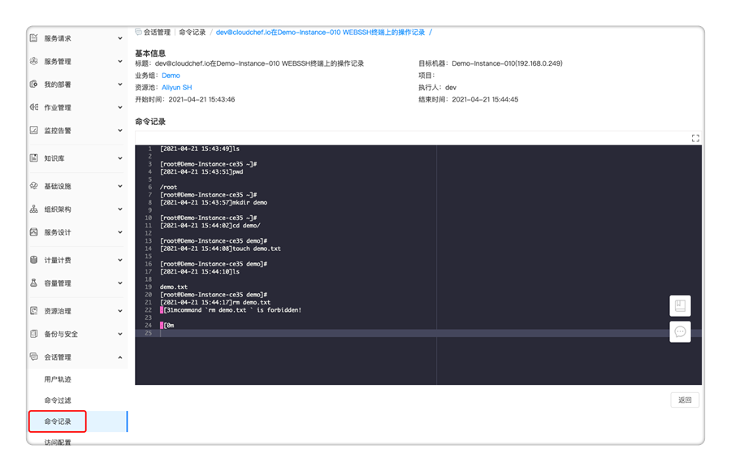

**快速入门**

根据快速入门的教程，您可以了解如何使用骞云堡垒机来管理IT资产，全面审计运维操作，运维记录有源可溯；通过命令过滤规则控制执行命令，实现安全预防。

# 组织架构和权限
业务组是一个逻辑概念，有需要把用户、服务、资源使用以及流程、规范等联系在一起的实体都可以用业务组来对应。
在使用云堡垒机功能前，可以设置业务组与项目，将云资源按组织架构进行有效管理，让业务部门的用户可以管理IT资源。
## 添加业务组
在云堡垒机【组织架构】-【业务组】，
 - 点击「添加」，填写业务组的概况信息，如名称、描述、图标、资源共享与租期策略等，请参考[添加业务组](https://cloudchef.github.io/doc/AdminDoc/04组织架构管理/业务组.html#添加业务组)。
 - 点击「用户」标签页，管理业务组关联的用户与角色。
 - 点击「授权配置」标签页，配置授权配置模板，指定用户对应用栈和云资源可以进行的操作。您可以在[授权配置](https://cloudchef.github.io/doc/AdminDoc/04组织架构管理/授权配置.html#添加授权配置)菜单中查看模板配置的详细授权信息。

## 添加项目
在云堡垒机【组织架构】-【项目】，
 - 点击「添加」，填写项目的概况信息，如名称、描述、所属业务组、资源共享等，请参考添加项目。
 - 点击「用户」标签页，管理项目关联的用户与角色。
 - 点击「云资源」标签页，展示了该项目中所有的云主机、存储、网络、软件等资源。
 

# 基础设施对接
## 对接云平台
在【基础设施】-【云平台管理】-【阿里云】，
 - 点击「添加」，提供阿里云平台的相关信息，请参考[添加阿里云平台](https://cloudchef.github.io/doc/AdminDoc/03基础设施管理/云平台管理.html#添加阿里云平台)。
 - 点击「验证」，验证成功则已成功连通，保存该云平台；若未保存成功，请检查阿里云平台的相关信息是否正确；
该步骤完成后，云平台对接已经完成，可以通过平台访问和管理阿里云的资源。

## 创建资源池
资源池，抽象池化云平台的资源，方便管理资源的导入、同步和访问策略。一个云平台可以对应多个资源池。以阿里云为例：可一个VPC对应一个资源池。以vSphere为例，一个集群对应一个资源池。
 - 在骞云自动化管理平台【基础设施】-【资源池管理】-「添加」-「阿里云」
 - 填写相关的资源池信息，请参考添加[添加阿里云资源池](https://cloudchef.github.io/doc/AdminDoc/03基础设施管理/资源池管理.html#添加阿里云资源池)。
 - 点击「保存」，资源池创建成功。
 
  

## 导入存量资源
### 通过资源池导入
在云自动化管理平台【基础设施】-【资源池管理】- 选择要导入资源的资源池，
 - 点击资源池名称进入详情，点击【云资源】Tab页面，点击「导入」，选择要导入的资源，提交请求。

 
 
 

### 通过云主机导入
在云自动化管理平台【我的部署】-【云主机】，
 - 点击「导入」，选择要导入的资源，提交请求。     
 

 

# 安装和关联云网关
云网关，为平台及其所管理的各个云或网络隔离环境提供数据传递和通信功能。
公有云的VPC内部署云网关后，用户就可以通过云网关直接管理VPC内的所有资源。通过在不同的云，不同的区域配置不同的云网关，我们可以通过一套平台访问多云多中心上的各种云资源。

## 添加云网关
 - 准备一台安装云网关的主机，该主机需要的条件为：
     - 操作系统为CentOS或RHEL 7.x版本，至少2C4G；
     - 主机和其它需要管理的阿里云虚拟机在同一个网络内，能够互相连接（同一VPC内）;
     - 主机需要能够访问公网（开通公网IP或绑定弹性IP）;
 - 获取云网关运行脚本
     - 【基础设施】-【云网关管理】-「添加」，设置云网关名称，「下一步」；
     - 点击「复制」，下载云网关安装脚本，「下一步」，「确定」；
     - 在准备好的云网关主机中运行该脚本，脚本运行成功后，刷新云网关管理列表页面，可查看该云网关主机的名称、IP地址，云网关状态更新为“在线”；
  

  

  

## 关联云网关
云网关将转发资源池中处于同一网络下云主机的操作请求，并提供安全访问控制；对阿里云资源来说，云网关将转发资源池中同一VPC内虚拟机的运维请求，提供会话访问控制和操作审计。
【基础设施】-【资源池管理】- 点击阿里云资源池进入详情，在【概况】Tab页下，【网络连接与安全】中，关联云网关，「保存」资源池；
  

# 运维和会话审计管理
骞云堡垒机支持访问命令过滤。
运维操作，在【我的部署】中可以针对服务部署、云主机或云资源做相关的运维操作；
会话审计管理，在【会话管理】中进行相关规则的配置和会话命令审计，普通用户无法查看该菜单。

### 命令过滤规则
骞云堡垒机支持命令过滤，支持的命令包括Shell，PowerShell，SQL等。配置过程如下。
 - 管理员账户登录，在【会话管理】-【命令过滤】中，添加允许或拒绝的命令规则，用户在对主机做命令执行时，将不允许用户做拒绝的操作命令，用户可以执行允许的命令；
 - 可以通过多种维度对命令规则生效的云资源做过滤，符合条件的云资源在做运维操作时，才受到规则的限制；
  

## 关联凭证
管理员可为云主机关联用户凭证。将云主机与您的凭证关联之后，下次访问云主机时，平台将自动选用关联的凭证。当您修改凭证的密码或密钥时，可同步更新云主机操作系统中的密码或密钥。
 - 在【我的部署】-【云主机】中，选择要运维的云主机（普通用户登录时，只能看到所有者是自己的资源，可以对这些资源做运维操作；业务组管理员可以查看当前业务组下的所有资源；平台管理员可以查看平台纳管的所有资源）
 - 点击 关联凭证 按钮，进入关联界面
     - 从下拉框内选择已有凭证，与云主机关联
     - 勾选 将凭证信息录入到云主机中 ，如果虚拟机的操作系统中已存在凭证中的用户，会将该用户的密码进行更新；如果不存在，则将创建新的用户。
     - 输入连接云主机的密码。可以通过下拉框选择已有凭证，或者点击自定义密码并输入用户名与密码。
      

      
 
 - 如果您需要创建凭证，请在【个人中心】-【我的凭证】中添加
  
 
## 云资源操作运维
骞云堡垒机支持对各种云资源进行运维操作，包括云主机，数据库，Kubernetes等。
 - 普通用户（资源的所有者）登录，在【我的部署】-【云主机】中，选择要运维的云主机（普通用户登录时，只能看到所有者是自己的资源，可以对这些资源做运维操作；业务组管理员可以查看当前业务组下的所有资源；平台管理员可以查看平台纳管的所有资源）
     - 执行「Web SSH」，输入登录凭证连接云主机；
     - 执行「远程终端」，基于VNC或RDP的远程协议类型登录云主机（基于云平台的远程协议类型将不通过云网关进行转发）；
     - 「执行脚本」，可通过脚本库，选择已有的脚本；或直接输入脚本内容直接执行；
 - 对数据库的SQL执行一样可以进行命令过滤和记录。

## 会话审计管理
 - 用户轨迹：管理员登录，在【会话管理】-【用户轨迹】中，可查看当前用户正在进行的活动会话和已结束的历史会话；
     - 活动会话：可以终止正在进行的活动会话；
     - 历史会话：查看已结束的历史会话，可以查看访问用户，主机相关的信息等；可下载记录文件查看命令；可录屏回放还原运维现场；
      

      
 - 命令记录：管理员登录，在【会话管理】-【命令记录】中，可查看所有的用户操作记录，包括用户信息、主机信息和命令详情等；
  

 - 访问配置：管理员登录，在【会话管理】-【访问配置】中，可配置会话录屏的启用状态和录像保留时间。
  
 
# 申请工单服务
当您在使用云堡垒机时出现问题并需要管理员进行处理，可申请工单服务。
 - 点击【服务目录】- 工单服务卡片，选择申请工单服务；
 - 填写工单申请信息。详细操作请参考[工单服务](https://cloudchef.github.io/doc/AdminDoc/06云服务管理/服务目录.html#工单服务)；
 - 确认无误后点击 申请 按钮，申请通过后，您可以在 服务请求 - 我的申请 中查看进度、处理人和处理时间。
