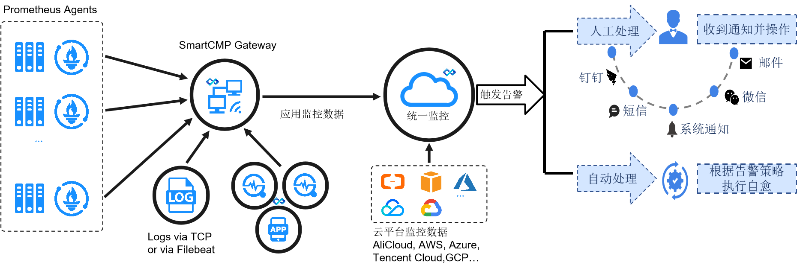

**产品介绍**

# 产品简介

## 背景介绍

骞云云监控告警产品是资源与服务一体化的监控告警产品，面向多云服务、现代应用，以ITIL流程为基础，以AIOps为驱动，集监控、告警、自动化运维、故障自愈的一体化监控告警产品。平台支提供面向多云和云原生服务的统一监控、提供端到端的应用监控体系并可扩展监控任意云对象、支持多平台统一告警收集、支持自动生成工单并拥有基于AI的故障自愈能力。

## 产品架构

# 产品优势

## 面向多云和云原生服务

提供中立的单一控制台，一站式管理私有云、公有云、容器平台、x86裸金属服务器、SDN、SDS等在内的多云环境。通过统一的管理平台和资源入口，帮助企业构建标准化的IT服务管理体系。

## 跨云，跨网络的统一监控，破解信息孤岛

骞云云监控告警产品支持物理设备、公有云、私有云、容器、数据库中间件等应用的全栈资源监控。通过云网关实现跨云、跨网络的统一监控，打破监控孤岛。

## 可扩展监控任意云对象

整合Prometheus生态体系，实现对云资源（云主机、RDS、Redis、Nginx等）快速监控，也支持添加自定义Exporter扩展任意云资源的监控。

## 基于AI的故障自愈能力

基于ITIL流程，支持多种自动化的故障自愈（故障工单、云资源自动化变更、Jenkins任务、外部系统集成等），从而降低故障处理时长，提升企业 IT 服务的可用性。

## 完整的监控可视化能力

支持多种告警策略，故障告警、阈值告警或预测告警。告警触发后，支持自动生成工单，通知到指定用户，确保第一时间进行问题处理。支持告警级别的设置和告警自动升级。

通过统一界面（监控仪表盘、资源状态图）查看目标云资源的运行状态和云资源的健康指数，直观判断部署的健康程度，辨别潜在热点，快速查找相关信息，通过趋势和异常值分析指标。通过告警概览菜单展示当前用户下的所有监控数据，监控的云资源类型包括云主机，OSS，RDS, 软件等。

## 推动用户部门的自服务

支持云主机和应用告警的自服务，普通用户可对自己的云主机、云资源、应用或容器设置所需的监控告警。支持将不同的告警策略应用到不同的层级结构，比如将告警应用到组织和部门中的所有云主机或应用。
