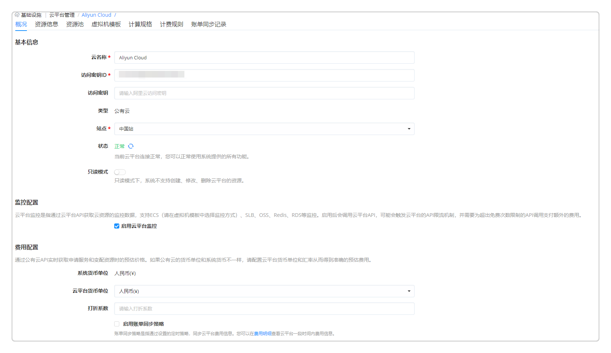
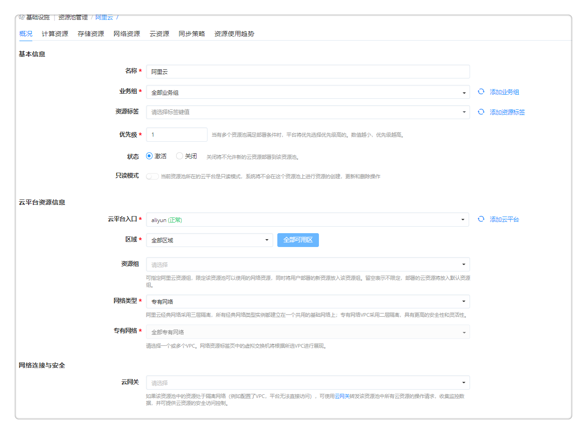
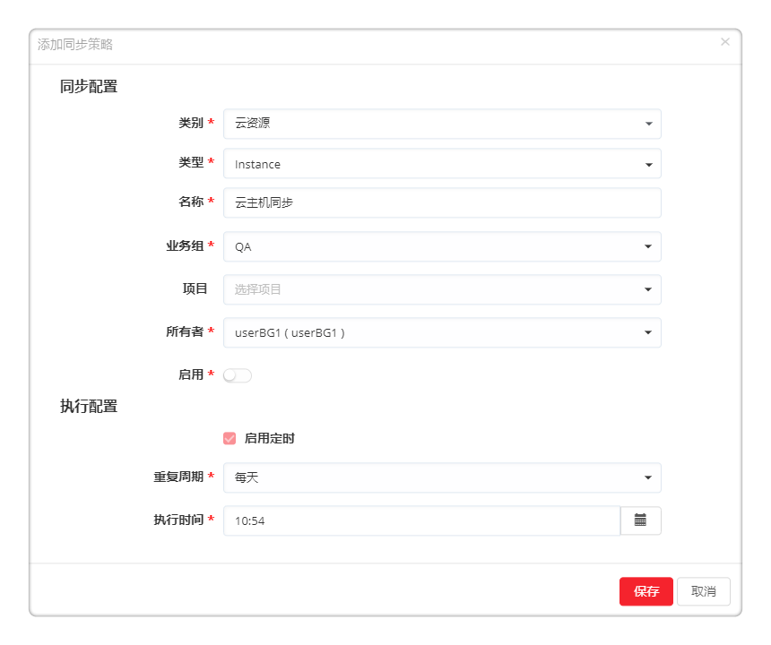
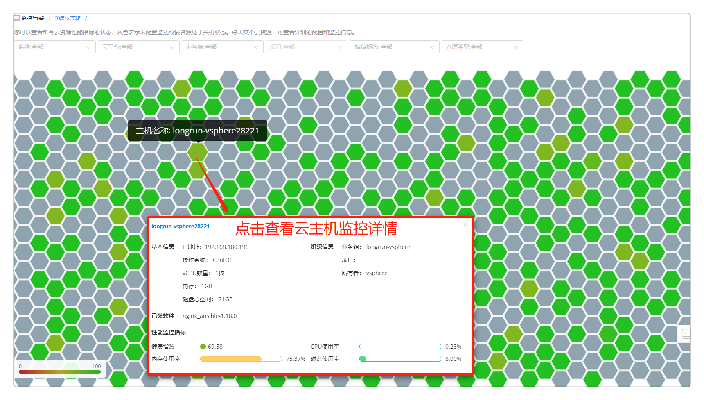
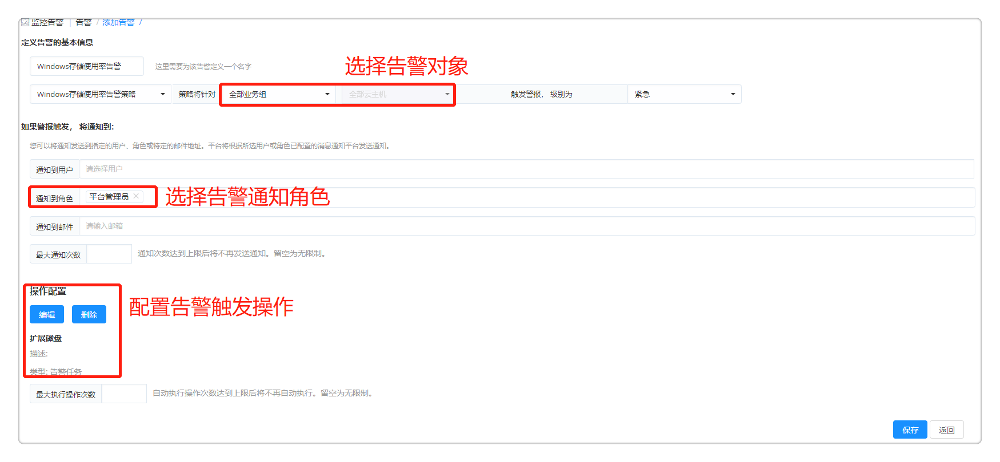
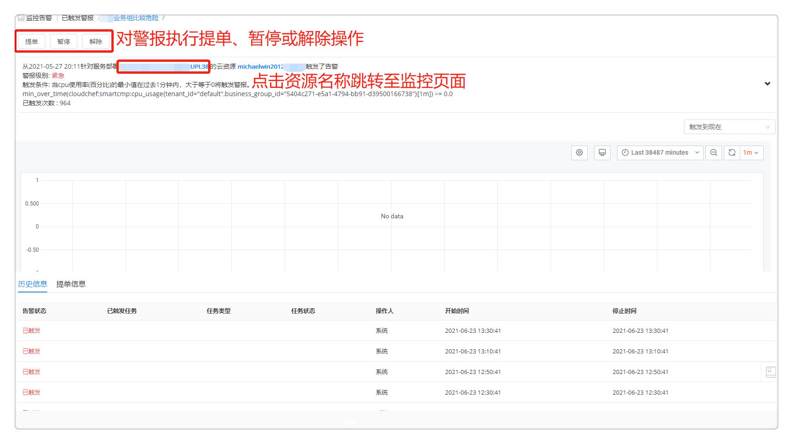

**快速入门**

# 快速入门简介

平台提供云资源的性能监控，助用户了解云环境的整体使用情况。用户可以通过资源状态图和监控仪表盘等总览资源性能与健康状态。同时支持丰富的告警类型、策略的设置，针对云主机、应用、容器等资源进行在线状态、性能指标的检测和趋势判断并通过多种方式通知到干系人，及时掌握云平台的运行情况。

根据快速入门的教程，您可以了解如何通过云监控告警产品，纳管需要监控的资源、对资源和应用添加监控、查看所拥有的云资源的监控信息并自服务设置告警与触发告警后的自愈。

# 组织架构和权限

业务组是一个逻辑概念，有需要把用户、服务、资源使用以及流程、规范等联系在一起的实体都可以用业务组来对应。

在使用监控告警功能前，可以设置业务组与项目，将监控对象按组织架构进行有效管理，让业务部门的用户可以自服务了解资源的运行情况。

## 添加业务组

在云监控告警产品【组织架构】-【业务组】，

+  点击「添加」，填写业务组的概况信息，如名称、描述、图标、资源共享与租期策略等，请参考[添加业务组](https://cloudchef.github.io/doc/AdminDoc/04组织架构管理/业务组.html#添加业务组)。
+  点击「用户」标签页，管理业务组关联的用户与角色。
+  点击「授权配置」标签页，配置授权配置模板，指定用户对应用栈和云资源可以进行的操作。您可以在[授权配置](https://cloudchef.github.io/doc/AdminDoc/04组织架构管理/授权配置.html)菜单中查看模板配置的详细授权信息。

 
## 添加项目

在云监控告警产品【组织架构】-【项目】，

+  点击「添加」，填写项目的概况信息，如名称、描述、所属业务组、资源共享等，请参考[添加项目](https://cloudchef.github.io/doc/AdminDoc/04组织架构管理/项目.html#添加项目)。
+  点击「用户」标签页，管理项目关联的用户与角色。
+  点击「云资源」标签页，展示了该项目中所有的云主机、存储、网络、软件等资源。

 
# 监控对象接入

在使用监控告警功能前，管理员需要先完成云平台的对接，逻辑资源池的创建，并将要管理的虚拟机资源添加到云监控告警产品中。

## 对接云平台

在云监控告警产品【基础设施】-【云平台管理】，

+  点击「添加」，提供云平台的相关信息，请参考[添加云平台](https://cloudchef.github.io/doc/AdminDoc/03基础设施管理/云平台管理.html#添加云平台)。
+  在「监控配置」模块，启用云平台监控。云平台监控是指通过云平台API获取云资源的监控数据，支持云主机、弹性负载均衡、对象存储等监控。
+  点击「验证」，验证成功则已成功连通，保存该云平台；若未成功，请检查云平台的相关信息是否正确。

+  支持云平台只读模式，当用户只需要监控告警功能时，可以开启云平台只读模式，限制资源的创建与修改，提升安全性。在只读模式下，系统将对当前云平台做出如下限制：无法创建资源、无法修改资源：包括调整配置、创建磁盘、开机、关机等、无法删除资源。

## 创建资源池

通过创建资源池，抽象池化云平台的资源，更细颗粒度的管理不同集群、不同存储和不同网络区域的资源。

+  在云监控告警产品【基础设施】-【资源池管理】-「添加」
+  填写相关的资源池信息，请参考[添加资源池](https://cloudchef.github.io/doc/AdminDoc/03基础设施管理/资源池管理.html#创建资源池)。
+  点击「保存」，资源池创建成功。

## 接入监控对象

### 通过资源池导入

在云监控告警产品【基础设施】-【资源池管理】- 选择要导入资源的资源池，

1. 点击资源池名称进入详情，点击「云资源」标签页，点击「导入」，选择要导入的资源，提交请求。
2. 或者点击「同步策略」标签页，设置同步策略，选择同步对象的分组与类型、指定导入资源所属的业务组与所有者、设置同步策略的重复周期以定时同步云平台中新增的资源。

 
### 通过云主机菜单导入

在云监控告警产品【我的部署】-【云主机】，

+  点击「导入」，选择要导入的资源，提交请求。

### 通过组件监控菜单导入

在云监控告警产品【监控告警】-【组件监控】，

+  选择一个监控组件，点击「添加」。
+  点击「导入」，将未在平台管理的云资源导入到云监控告警产品上再添加监控。

 
## 通过云网关访问隔离的资源

当对接的云平台处于隔离网络（例如配置了VPC，平台无法直接访问），可以使用云网关转发云平台的请求，无需暴露对外访问端口，更安全易用。

+  准备一台安装云网关的主机，操作系统为CentOS或RHEL 7.x版本，至少2C4G，并满足以下的网络权限
    +  主机和其它您需要管理的内网主机在同一个网络内，能够互相连接;
    +  主机不需要配置公网IP，但需要能够访问公网;
+  在云监控告警产品【基础设施】-【云网关管理】-「添加」，获得云网关安装脚本

+  在云网关主机中运行该脚本，等待连接结果，运行成功后，【云网关管理】列表页面将显示该云网关主机的信息，系统将主动刷新为“在线”状态。
+  使用该云网关，连接处在隔离网络内的云平台和资源。

# 监控数据采集

云监控告警产品支持通过云平台监控或者监控代理组件采集监控数据。可以为监控代理组件配置默认的指标维度信息，供用户在添加组件监控时配置使用。为组件配置监控时，支持配置健康指数的JavaScript计算脚本，健康指数将在资源状态图上展示。监控数据收集后，平台不仅能在部署或云资源的详情界面进行监控信息的展示，还能在全新的页面，统一展示监控信息。下面为您介绍云资源监控安装的方法：

## 存量云主机安装监控

在云监控告警产品【我的部署】-【云资源】

+  单击某一个云资源进入其详情界面，选择「更多操作」-「监控和代理」-「启用/切换监控」。
+  选择监控方式：云平台监控或者Prometheus代理监控，配置相应监控指标集。
+  点击「确定」，提交安装监控申请。添加成功后，可在云资源详情页的监控标签页查看监控详情。

## 存量应用安装监控

在云监控告警产品【监控告警】-【组件监控】

+  点击「MySQL Exporter」, 您可以在基本信息页面查看平台对MySQL的基本监控信息，包括监控目标，监控状态，监控代理所安装的云主机，更新时间等。
+  点击「添加」，选择需要监控的云资源类型和对应类型的具体云资源，您可以选择单个或者多个需要监控的云资源，点击「下一步」。
+  请选择安装监控代理的云主机，您需要为每一个被监控的资源指定安装监控代理的云主机，并配置监控代理服务的参数。
+  点击「下一步」，确认每个资源的监控代理的安装情况。点击「确认」，安装监控代理。

 
# 监控数据展示

云监控告警产品支持通过统一界面（监控仪表盘、监控大盘、告警概览、资源状态图）可视化展示云主机和云资源的健康状态与告警情况。

## 通过监控仪表盘查看

仪表盘能够直观展示各类云组件的监控数据，方便快速查找相关信息，协助用户通过趋势和异常值分析指标。

在云监控告警产品【监控告警】-【仪表盘】，

+  左侧展现仪表盘的分类，右侧显示相关分类的仪表盘基本信息，包括名称，描述，授权，创建者和创建时间。
+  目前平台展现四种类型的仪表盘：
    +  我关注的：展现所有您感兴趣的仪表盘。点亮仪表盘的星号标识，仪表盘会自动移动至此分类；取消星标，仪表盘会相应地移动至最初的分类。
    +  我创建的：展现所有您创建的仪表盘。
    +  系统的：展现系统内置的仪表盘，类型包括云主机，Web Server, App Server，关系型数据库等。系统内置的系统仪表盘不能被删除和编辑，但是能够被归类至 我关注的 。
    +  共享的：展现平台管理员分享给您使用的仪表盘。
+  选择仪表盘(如Nginx监控仪表盘），下拉选择需要查看监控的云资源，查看该资源的监控仪表盘。

除了使用系统内置的仪表盘，用户也可以自建新的仪表盘来展现您关注的监控数据。

在云监控告警产品【监控告警】-【仪表盘】，

+  点击「添加」，进入创建仪表盘的界面。
+  填写仪表盘的基本信息：
    +  基本信息: 自定义新建仪表盘的名称和相关描述
        +  资源类型：请选择想要查看监 控信息的资源类型，可选类型包括IaaS、PaaS、CaaS、软件和代理。
    +  共享：平台管理员可以将仪表盘共享给指定业务组中授权角色的用户使用
        +  允许共享：选择允许共享该仪表盘
        +  业务组：请选择一个业务组，业务组中的用户都能使用该共享的仪表盘
        +  角色：请选择一个或多个授权的角色，则在指定业务组中，拥有授权角色的用户才能使用该共享的仪表盘。如不选择任何角色，则指定业务组中所有用户都能使用共享的仪表盘
+  点击「保存」按钮，进入仪表盘信息展示部分配置页面
    +  新增或编辑仪表盘，在右上角选择：新建、保存、设置、查询模式、时间段、缩小（针对时间段进行放宽）、刷新等。

## 通过监控大盘查看

在云监控告警产品【监控告警】-【云资源监控大盘】，平台提供统一入口查看各类云资源的监控信息，您只需选择资源类型，就能快速查看该类型下的纳管资源的监控数据。

 
## 通过云资源详情查看

在云监控告警产品【我的部署】-【云资源】，

+  单击某一个云资源进入其详情界面，选择「监控」标签页查看云资源监控详情。
+  监控标签页：展示了该云资源CPU、内存、磁盘、网络等的监控数据（可以按照需要调整时间跨度或者平均时间来查看历史监控数据）。

## 通过资源状态图查看

在云监控告警产品【监控告警】-【资源状态图】，

+  鼠标移至某一蜂窝模块上，将显示该云主机或容器名称
+  点击后显示详情：基本信息、组织信息、已装软件、键值标签、性能监控指标
+  可根据您的需求对展示内容进行筛选，如全部或已安装监控或未安装监控、按云平台筛选、业务组筛选、项目筛选、资源类型、标签等筛选。

# 告警策略定义

告警策略定义了所选的对象类型（如云主机/应用/容器等）触发警报的条件。用户可以为已部署纳管资源创建自定义告警策略，定义触发警报的条件。平台支持多种告警规则，如：宕机告警、阈值告警和预测告警。

在云监控告警产品【监控告警】-【告警策略】，

+  点击「添加」，进入添加告警策略界面。
+  在添加告警策略界面，定义告警策略的基本信息。依次输入告警策略的名字，选择告警类别和告警类型。
    +  告警类别支持对云主机、应用和容器的告警。
    +  告警类型支持对任意监控对象的任意指标，进行包括宕机告警、阈值告警和预测告警在内的告警。可根据选择的不同告警类型定义告警策略的触发条件。
+  点击「保存」，提示告警策略添加成功，返回告警策略列表界面。

# 第三方告警集成

告警集成通过提供统一的WebHook的API，可以将第三方平台系统所发送的告警接入到系统中，实现告警的统一通知，统一分析和告警自愈。目前支持主流公有云平台，和业界常用的监控平台, 如Prometheus, Zabbix, SNMP等。

在云监控告警产品【监控告警】-【告警集成】-点击「添加」，

+  配置基本信息：输入策略名称，选择策略启用状态（默认启用），选择云平台入口（若下拉为空请首先添加云平台）。
+  点击「获取AppKey」。AppKey是告警回调唯一标识，点击后将自动生成接口回调地址Webhook URL。
+  配置告警：选择警报级别（警告、紧急）并输入触发多少次后自动升级为更高级别。
+  配置通知：您可以将通知发送到指定的用户、角色或特定的邮件地址。平台将根据所选用户或角色已配置的消息通知平台发送通知。设置最大通知次数，在通知次数达到上限后将不再发送通知。
+  配置操作：您可以添加操作建议。当告警触发时，后续人员可以直接通过您预定义的操作建议修复资源。
+  点击「保存」并返回告警集成列表页。
+  在第三方监控控制台配置报警回调以将云监控发送的报警通知集成到平台。

 
# 告警通知和处理

定义所选告警策略应用到的范围以及触发的通知，配置触发告警后的自愈操作。

在云监控告警产品【监控告警】-【告警】，

+  点击「添加」，进入添加告警界面，定义告警的基本信息。
+  输入告警的名字，选择步骤四已配置的告警策略、告警范围、告警对象以及警报级别；设定触发xx次后，自动升级为更高级别。
+  定义触发告警后，通知到的用户、角色、排班或特定的邮件地址。平台将根据所选用户或角色已配置的消息通知平台发送通知。
+  点击「保存」，返回告警列表界面。

在云监控告警产品【监控告警】-【已触发警报】，查看已触发的云资源警报（来自云监控告警产品或第三方告警平台），追溯警报的详细情况，并对警报进行恢复、暂停、解除操作，或者通过工单进行处理。

+  查看所有已触发警报的警报级别、告警名称、触发告警对象、告警类型、第一次触发时间、最后一次触发时间、已触发次数以及告警状态。
+  任意选择一条已触发的警报，在工具栏中可选择「暂停」或「解除」警报。
+  点击列表中的告警名称，可查看该警报的详细信息以及历史数据。该页显示了告警触发的对象、警报的级别，触发的条件、业务组、所有者、IP地址、警报图表（可调控时间范围灵活查看各个时间段的警报数据）、以及该告警的后续操作历史。
    +  如果您需要为触发的告警新建一个工单任务，点击「提单」按钮
        >「Note」管理员可以预先设置服务团队处理工单任务，当用户提交工单任务时根据预先配置的服务流程和服务团队排班，相应的服务团队将接到工单进行处理。
+  点击告警触发的对象可跳转至该对象的监控页面，如服务部署链接至服务部署监控页面、云主机链接至云主机监控页面等。

 
# 告警自愈

在告警配置和告警集成配置时允许为云资源告警配置修复资源的操作建议，支持配置工单审批。在触发告警时支持根据操作建议修复资源实现自愈。

以告警配置为例，在云监控告警产品【监控告警】-【告警】，

+  选择任意一条已创建告警，点击「编辑」，进入编辑告警界面。
+  在【操作配置】模块定义警报触发后的自愈操作：
    +  点击「添加」，选择包括云资源运维任务、告警任务在内的任务类型，设置相应输入参数与作用到的云资源。
    +  执行设置：填写超时时间、执行选项和执行方式。
+  点击「保存」并返回告警集成列表页。
+  当告警产生时，已定义的自愈操作将被触发以修复资源。
>「Note」如果自愈操作涉及修改云资源配置（除脚本执行），则需要将云平台设置为非只读模式。

