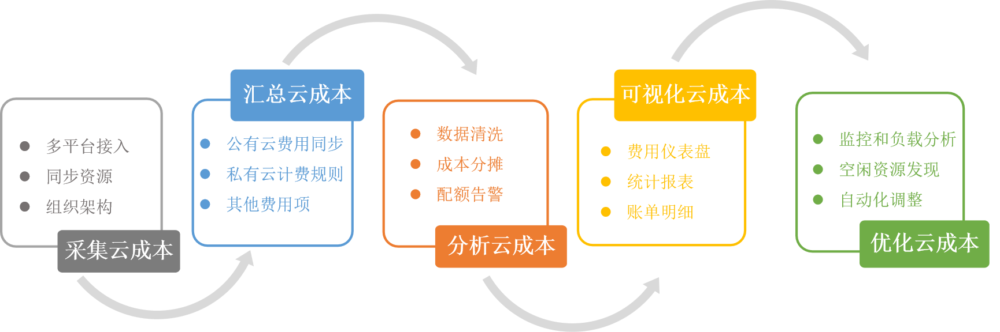

**产品介绍**

# 产品简介

## 背景介绍

随着数字化转型的趋势，企业上云进程的加速，企业数据中心底层架构也越来越复杂，公有云、私有云、混合云、多云等资源共存成为常态。此时企业面临的首要调挑战，就是云成本管理和优化。公有云厂商只提供流水账单，而不会告诉企业是否有成本浪费，又如何去有效控制成本。The Forrester Wave在2018年第二季度的云成本优化报告提出了“强大的多云支持和成本优化能力将是混合云平台的有效竞争力体现。”的观点，在2020年第四季度的报告提到企业对成本优化的需求已经从虚拟机扩展到容器甚至存储和数据库服务，渴求的是能够涵盖所需的多云服务、提供强大的成本优化建议和支持费用追踪与费用预测的云费用分析产品。

骞云云费用分析产品是面向混合云场景的多云费用分析产品，统一采集或生成公有云、私有云和混合云的与云资产相关的所有成本，通过多种成本分析手段，根据费用类型、成本中心、业务组等不同维度来分析成本分布和使用趋势，评估各项成本支出，实施多种监管策略和自动化手段，减少资源浪费，提升企业云资源的使用效率，释放企业发展资本，帮助企业识别机会、节省资金和优化运营。
平台支持按组织架构分解并分析成本，并通过多种维度分析发现资源配置问题，并提供一键优化。平台提供灵活可配置的优化策略、支持完善成本治理来减少浪费，从而实现云费用可追踪，可分析，可优化。平台内置丰富的仪表盘组件综合展现各部门费用占比，通过图表让用户了解费用成本分摊状况及费用趋势，提供所有云环境的详细费用报告，管理者可精确跟踪每一笔成本。

## 产品架构

# 产品优势

## 面向多云和云原生服务，建设统一的云费用管理体系

提供中立的单一控制台，一站式管理私有云、公有云、容器平台、x86裸金属服务器、SDN、SDS等在内的多云环境。通过统一的管理平台和资源入口，帮助企业构建标准化的IT服务管理体系。

提供统一的组织架构流程，建设统一的云费用管理体系，让用户的每一笔费用都可以追溯，从而推动费用管理的组织责任制；实现控制各部门操作权限、费用配额、审批流程等。

## 多种费用规则计算任意IT成本

支持灵活的计费规则，用户可自定义计费体系。对私有云按照资源基础属性、某个时间单位进行计费；对公有云提供二次计价、统一折扣，费用定期同步；同时支持通过脚本定义计费模式。

## 可视化多云成本分析

丰富的仪表盘组件：云费用分析产品内置丰富的仪表盘组件，综合展现各部门费用，月度各部门费用占比、部门月度费用构成、部门月度费用趋势、月度各云资源费用占比、每日个人费用排行等，仪表盘支持自定义。

多维度计费分析：所有费用可追踪追溯；通过占比的饼图和趋势曲线图，让管理层了解各个公有云的费用成本分摊状况，及花费用趋势，提供不同维度的筛选和分组，从不同角度查看和对比；费用Top排行分析。

多种类型明细报表：提供所有云环境的详细费用报告，管理者可精确跟踪每一笔成本。

## 立体化监控，及时发现浪费

平台支持从云平台到应用系统的多服务、多指标的立体化监控，通过主动监视性能数据，及时发现存在浪费的资源，以便及时采取优化措施。

## 灵活可配置的优化策略，自动执行优化

提供灵活可配置的优化策略，定期清理闲置云资源、非工作时间对资源进行关闭等，及时减少不必要的浪费，实现成本节约。

+ 定期清理闲置的云服器、没有连接的RDS、未挂载的云硬盘等
+ 对于开发、测试所用资源，执行非工作/工作时间的自动关闭，减少不必要的浪费；
+ 配置自动缩放，动态分配和取消分配资源来满足性能需求，实现成本节约；
+ 实时检测资源性能，自动化调整规模，确保企业正确使用需要的资源。

## 利用大数据技术，智能优化成本

云费用平台采用大数据分析技术，依据历史经验，计算每天费用浮动值，当数据超过安全区间时，系统自动告警，及时发现异常波动，防止发生意外支出；根据历史账单数据、企业应用架构、未来规划，预测企业费用趋势，提前进行预留实例成本规划；结合费用账单、各平台政策，计算平均成本，在保证效率不变的情况下，为用户推荐最佳云平台。
