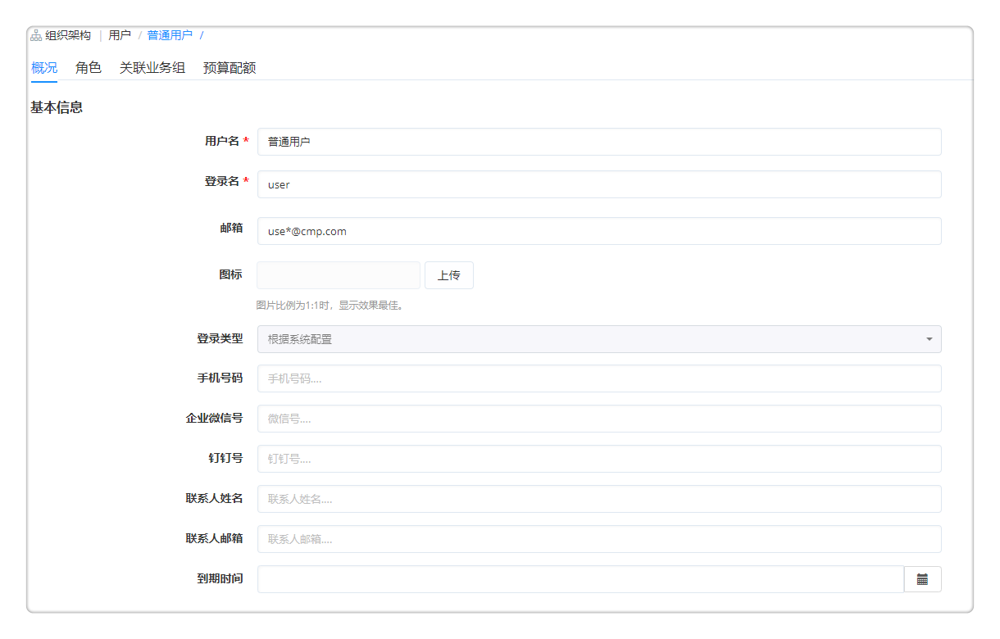

**快速入门**

# 快速入门简介

平台统一采集、生成公有云、私有云和混合云的各种费用成本，按组织架构分摊并分析成本，并通过多种维度分析发现资源配置问题，提供一键优化，从而实现成本治理减少浪费，使云费用可追踪、可分析、可优化。

根据本章节的教程，您可以了解如何通过云费用分析产品采集、汇总、分析、可视化和优化云成本。

# 设立组织架构和成本中心

业务组是一个逻辑概念，有需要把用户、服务、资源使用以及流程、规范等联系在一起的实体都可以用业务组来对应。

在使用费用分析功能前，可以设置业务组和项目并关联用户，让业务部门的用户可以自服务了解资源的费用情况。设置成本中心并为每个组织部门关联和设置分摊规则，实现以基于成本中心的费用控制。

## 添加业务组

在云费用分析产品【组织架构】-【业务组】，

+  点击「添加」，填写业务组的概况信息，如名称、描述、图标、资源共享与租期策略等，请参考[添加业务组](https://cloudchef.github.io/doc/AdminDoc/04组织架构管理/业务组.html#添加业务组)。
+  点击「用户」标签页，管理业务组关联的用户与角色。
+  点击「授权配置」标签页，配置授权配置模板，指定用户对应用栈和云资源可以进行的操作。您可以在[授权配置](https://cloudchef.github.io/doc/AdminDoc/04组织架构管理/授权配置.html)菜单中查看模板配置的详细授权信息。

 
## 添加项目

在云费用分析产品【组织架构】-【项目】，

+  点击「添加」，填写项目的概况信息，如名称、描述、所属业务组、资源共享等，请参考[添加项目](https://cloudchef.github.io/doc/AdminDoc/04组织架构管理/项目.html#添加项目)。
+  点击「用户」标签页，管理项目关联的用户与角色。

## 添加用户

在云费用分析产品【组织架构】-【用户】，

+  点击「添加」，选择登录类型“根据系统配置”。
+  概况标签页：输入用户名、邮箱、密码和手机号码等必填项，企业微信号、钉钉号、联系人姓名邮箱、到期时间（指定到期时间自动禁用）等选填，并上传图标。
+  角色标签页：默认用户为普通成员。系统默认有软件架构师、基础设施管理员、平台管理员等角色，您也可自定义角色，为该角色分配相应的权限，具体参照角色章节。勾选某角色后，会显示该角色所对应的实体对象（组件库、蓝图设计）和权限范围（访问、读取、创建、编辑或删除）。
+  关联业务组标签页：勾选业务组，将该业务组与用户关联。

 
## 添加成本中心

在云费用分析产品【计量计费】-【成本中心】，

+  点击「添加」，输入成本中心名称及代码。
+  在基本信息页面，填写成本中心描述并为成本中心关联业务组。支持关联多个业务组和设置默认业务组。
+  在【组织架构】-【业务组】中可以查看该业务组关联的成本中心及默认成本中心。

 
# 接入云资源费用信息

在对纳管资源实现费用管理与分析前，用户需要先完成云平台的对接、逻辑资源池和业务组的创建，并设置定时策略将要管理的云资源添加到云费用分析产品中。

通过设置费用类型计费项和账单同步，接入云资源费用信息以进行费用分析与优化。

## 对接云平台

在云费用分析产品【基础设施】-【云平台管理】，

+  点击「添加」，提供云平台的相关信息，请参考[添加云平台](https://cloudchef.github.io/doc/AdminDoc/03基础设施管理/云平台管理.html#添加云平台)。
+  点击「验证」，验证成功则已成功连通，保存该云平台；若未成功，请检查云平台的相关信息是否正确。

## 创建资源池

通过创建资源池，抽象池化云平台的资源，更细颗粒度的管理不同集群、不同存储和不同网络区域的资源。

+  在云费用分析产品【基础设施】-【资源池管理】-「添加」
+  填写相关的资源池信息，请参考[添加资源池](https://cloudchef.github.io/doc/AdminDoc/03基础设施管理/资源池管理.html#创建资源池)。
+  点击「保存」，资源池创建成功。

## 导入云资源

### 通过资源池导入

在云费用分析产品【基础设施】-【资源池管理】- 选择要导入资源的资源池，

1. 点击资源池名称进入详情，点击「云资源」标签页，点击「导入」，选择要导入的资源，提交请求。
2. 或者点击「同步策略」标签页，设置同步策略，选择同步对象的分组与类型、指定导入资源所属的业务组与所有者、设置同步策略的重复周期以定时同步云平台中新增的资源。

 
### 通过云主机菜单导入

在云费用分析产品【我的部署】-【云主机】，

+  点击「导入」，选择要导入的资源，提交请求。

## 获取费用信息

在云费用分析产品【基础设施】-【云平台管理】，选择已对接的公有云云平台，

+  在「费用管理」勾选「启用账单同步策略」，设置账单同步的重复周期与执行时间，建议设置的账单同步执行时间略晚于云资源同步策略执行时间。
+  点击「保存」，账单同步策略已保存，公有云账单将根据策略定时同步至平台。

# 费用分析

完成费用接入后，在费用明细页面，可以查看已导入的费用明细和自定义新增明细信息，同时可以在费用明细详情中进行费用校准和更改费用归属。可以定义资源费用分摊到不同成本中心的分摊规则，实现基于成本中心的费用控制。

通过费用分析仪表盘和费用报表，可以可视化了解各个业务组、项目、云平台等在过去一段时间内的花费情况。

## 费用校准和分摊

### 查看和校准费用明细

在云费用分析产品【计量计费】-【费用明细】，

+  在费用明细页面，用户可以查看聚合分摊的费用明细信息，支持根据业务组、项目、所有者、时间、云平台、资源标签、键值标签、费用类型、成本中心等不同维度进行筛选查看。
+  点击费用明细页面的一条费用类型，可以编辑该费用的归属（业务组、项目及所有者）和配置（费用类型及计费项）并校准账单费用。

### 创建分摊规则

在云费用分析产品【计量计费】-【分摊规则】，

+  点击「添加」，输入分摊规则的名称、描述，选择业务组、优先级与启用状态。
+  指定分摊规则的过滤方式，通过选择匹配条件（如云资源、所有者、云平台、标签等）来指定规则对哪些资源生效（匹配条件取交集）。
+  配置分摊设置：平台支持通过标准模式或专家模式进行分摊设置
    +  标准模式：在下拉框中选择分摊规则关联的成本中心并设置各成本中心分摊比例，分摊比例总和需为100%。
    +  专家模式：通过Javascript分摊脚本来满足更多的分摊规则要求。
+  点击「保存」完成分摊规则创建，系统将把聚合后的资源费用分摊至各成本中心。

 
## 费用分析仪表盘

在云费用分析产品【计量计费】-【费用分析】，

+  展示了总体费用分析概览和分组费用分析概览，包含“总费用趋势”、“预测今天（本月）费用”、“费用占比”、“费用趋势”及“费用排行”模块。鼠标悬浮于图表上时，将显示悬浮区域的数据明细。
+  点击“总费用趋势”和“费用趋势”中的某一项将跳转至费用明细页面，时间跨度根据费用分析页面时间粒度设置展示。可根据时间、云平台、资源类型、费用类型、业务组、项目和所有者等不同维度进行筛选查看。
+  点击“费用占比”和“费用排行”的某一项资源类型，将跳转至该类型的费用概览页面，支持根据时间粒度、分组、业务组、所有者等维度筛选展示，以及图表形式切换。
+  云费用分析产品支持费用下钻，请参考[费用分析](https://cloudchef.github.io/doc/AdminDoc/07云资源分析/费用管理.html#费用分析)。

 
## 费用报表

在云费用分析产品【计量计费】-【费用报表】，可查看基于成本中心、业务组、项目和云资源的费用报表。

+  点击任意报表名称进入报表生成页面。点击「生成」，可生成用户所属业务组所有费用明细报表。
+  可根据云平台类型、业务组、云平台类型、费用类型及起始时间进行筛选。可点击「合并左边相同维度行」，并可选择需要展示的报表表头，如：云平台名称、费用。
+  点击「导出」可以导出筛选后的报表，导出格式为Excel文件。

 
# 成本优化

平台内置提供云资源费用优化策略，针对云主机、存储、RDS等进行规格、利用率、付费模式等检查，对需优化云资源提出优化建议，用户可根据建议进行配置调整。

## 成本优化规则

在云费用分析产品【资源治理】-【合规性策略】，对内置策略进行启用/禁用，编辑策略的作用范围、通知设置与操作建议：

+  点击成本优化策略名称，进入策略详情页。
+  在「概况标签页」，可以编辑策略作用范围、通知配置、添加建议修复操作。
    +  作用范围：您可以选择匹配条件来指定策略对哪些资源进行合规性检查，不满足任意一个条件的资源将不会在检查范围中。
    +  通知配置：您可以将通知发送到指定的用户、角色或特定的邮件地址。平台将根据所选用户或角色已配置的消息通知平台发送通知。
    +  建议修复操作：您可以添加建议修复操作，后续人员可以直接通过您预定义的修复操作优化资源费用。

## 成本优化仪表盘

在云费用分析产品【资源治理】-【合规检查概览】，供用户查看成本优化检查执行的总体情况。当前页面展示了合规策略概览、合规率、合规率趋势图、违规影响程度占比、违规影响程度趋势图等模块。详细请参考[合规检查概览](https://cloudchef.github.io/doc/AdminDoc/07云资源分析/资源治理.html#合规检查概览)。

 
## 一键优化成本

在云费用分析产品【计量计费】-【优化建议】，可以根据修复建议与建议修复操作一键对需要费用优化的资源进行修复。

+  点击建议修复操作中已配置的操作名称（如“启动云主机”操作），对资源进行费用优化。您也可以点击“更多操作”，选择刷新状态、启动、停止、更改配置等该云资源支持的Day 2运维操作。
+  同时平台支持根据修复建议手动对资源进行修复，修复后可以在优化建议详情页手动将该条优化建议的状态修改为已修复。

# 扩展

除平台内置的费用类型、计费规则和优化规则，平台支持自定义添加更多费用类型、计费规则和优化规则，以满足用户业务场景需要。

## 可扩展费用类型

在云费用分析产品【计量计费】-【费用类型】，

+  点击「添加费用类型」，输入费用类型的主键、名称和描述并点击「保存」。
+  在新建的费用类型下点击「添加」，新增计费项。在费用明细映射页面，输入名称、描述及代码。
+  添加计费项属性，选择属性类型及备选项。可以添加一个或多个计费项属性。
+  若此计费项是公有云计费项，勾选「公有云计费项」并在映射标签页下公有云映射关系。映射表示每一个计费项与各个公有云平台中相关产品和实际计费项的关联关系。
+  平台支持为不同的云资源类型关联计费项，从而将费用账单中的费用明细按照费用类型进行匹配。

## 可扩展计费规则

平台允许自定义计费规则，对纳管的私有云、公有云等多种不同类型资源进行计费。

在云费用分析产品【计量计费】-【计费规则】，

+  点击「添加」，填写计费规则名称，选择云平台、资源池。
+  选择计费模式（经典模式、专家模式，请参考：[计费规则](https://cloudchef.github.io/doc/AdminDoc/07云资源分析/费用管理.html#计费规则)、组件类别，设置价格和周期，支持设置折扣系数。
+  选择费用类型和计费项，设置结单周期频率。点击「保存」。

## 可扩展优化规则

在云费用分析产品【资源治理】-【合规性策略】，为了满足用户业务场景需求，平台支持用户添加自定义成本优化策略。

+  点击「添加」，填写策略基本信息：名称、描述、资源类型（如IaaS、PaaS、软件等）、分组。
+  配置策略作用范围：您可以选择匹配条件来指定策略对哪些资源进行成本优化检查，不满足任意一个条件的资源将不会在检查范围中。
+  配置策略通知设置：您可以将通知发送到指定的用户、角色或特定的邮件地址。平台将根据所选用户或角色已配置的消息通知平台发送通知。
+  添加修复建议与修复操作，后续人员可以通过该建议手动优化成本或者根据预定义的修复操作一键优化成本。
+  点击「保存」，策略已添加。可以在合规性策略界面执行该成本优化检查。
