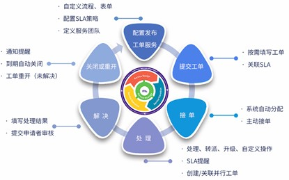

**产品介绍**

# 产品简介

## 背景简介

骞云云ITSM产品是面向多云的轻量的ITSM系统，通过低代码，机器学习，将云资源管理的最佳实践流程化，标准化。平台支持云资源故障处理、云资源变更、云资源请求等各种场景，帮助企业根据自身特点定制各种业务流程，从而彻底改变错综无序的IT管理现状，提高IT团队的生产效率，大大提高终端用户的满意度。

## 通用IT服务流程

# 核心价值

## 统一IT 部门与业务部门的服务接口
云ITSM产品为业务部门提供集中和统一的技术支持入口，保障服务。管理员可配置相应的自动化工作流及SLA，并发布标准化的服务至服务目录，业务部门用户则可通过服务目录申请服务支持。

## 规范和固化IT服务管理流程
云ITSM产品规范IT服务的管理流程，实现了高效的日常运行维护机制、迅捷的事件定位和恢复、清晰的责权划分。

## 降低管理成本和技术门槛
云ITSM产品支持知识库功能，帮助企业将分散的知识资产分门别类地进行统一存储及管理，方便共享与利用，并且可编辑、发布、取消发布、归档文章、支持Markdown编辑格式。知识库中包含企业IT服务部门希望保留和共享的信息，避免信息孤岛和知识流失。业务用户可以自助查询知识、提交请求并在线跟踪进展。基于知识库实现智能问答和快捷操作推送，减轻服务台负荷，提高IT效率让IT更透明。

## 量化考核IT管理相关工作
云ITSM产品量化了管理人员的工作情况和工作效果，并明确了IT管理的投入和产出。平台支持的服务等级协议功能约定了服务完成的时间和其他条件，并可以将服务等级协议与平台提供的服务进行关联，以确保及时地追踪服务的处理情况。

