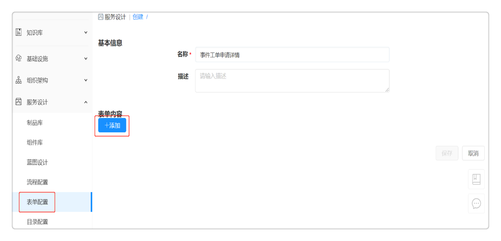

**快速入门**

欢迎阅读云ITSM产品的快速上手文档，它能帮助您了解如何快速设计并管理ITSM流程。ITSM流程包括事件管理、问题管理、变更管理和请求管理。首先管理员需要完成一系列的服务配置包括配置组织架构，表单，审批流程，SLA, 服务团队和排班管理等，并发布服务至服务目录。业务部门用户可根据不同需求选择申请不同类型的工单服务，并能够实时查看服务进度。
以设计事件管理流程为例，请参考以下步骤。

# 设立组织架构
## 创建用户
平台管理员可以创建用户并为不同的用户配置合适的权限，例如：申请事件工单的用户只需配置普通成员的角色权限，而处理事件工单的用户还需分配事件管理员的角色。
在【组织架构】-【用户】-「添加用户」，填写用户的相关信息，详细操作请参考[添加用户](https://cloudchef.github.io/doc/AdminDoc/04组织架构管理/用户.html#添加用户)。 
 

该步骤完成后，成功创建普通用户和处理人的相关账号。

## 添加业务组
业务组是平台内的逻辑组织结构，有需要把用户、服务、资源使用以及流程、规范等联系在一起的实体都可以用业务组来对应，比如子公司，不同层级的部门等。业务组的成员可以申请发布在该业务组中的服务。
添加业务组：在【组织架构】-【业务组】添加业务组，详细步骤请参考[添加业务组](https://cloudchef.github.io/doc/AdminDoc/04组织架构管理/业务组.html#添加业务组)。
关联用户：点击关联用户，勾选列表中的用户，点击确定，关联该用户到业务组。关联成功后，将在用户页面显示已关联用户。
 

## 添加项目
在云自动化管理平台【组织架构】-【项目】，
 - 点击「添加」，填写项目的概况信息，如名称、描述、所属业务组、资源共享等，请参考添加项目。
 - 点击「用户」标签页，管理项目关联的用户与角色。
 - 点击「云资源」标签页，展示了该项目中所有的云主机、存储、网络、软件等资源。
 

## 添加服务团队
服务团队是工单服务管理过程中处理工单任务的服务人员集合，支持您指定一个或多个用户成为服务团队的成员。当用户通过服务目录申请需要人工介入的手工工单服务之后，根据预先配置的服务流程，相应的服务团队将接到工单进行处理。
在云ITSM产品【服务设计】-【服务团队】-「添加服务团队」，填写服务团队「服务台」的相关信息
 - 填写团队名称和描述，填写完成点击保存，进入概况标签页；
 - 概况：可修改团队名称及团队描述；
 - 用户：可关联服务团队用户或移除服务团队用户。关联的用户作为服务团队成员可处理工单；
 - 点击保存，成功添加服务团队。
  

  

# 接入云资源
本步骤需由平台管理员操作，您可以在【组织架构】-【角色】中查看角色所拥有的权限，也可以在【组织架构】-【用户】中为指定用户配置该角色权限。通过本操作您可以将云资源纳管至云ITSM产品。

## 对接云平台
在【基础设施】-【云平台管理】-【阿里云】，
 - 点击「添加」，提供阿里云平台的相关信息，请参考[添加阿里云平台](https://cloudchef.github.io/doc/AdminDoc/03基础设施管理/云平台管理.html#添加阿里云平台)。
 - 点击「验证」，验证成功则已成功连通，保存该云平台；若未保存成功，请检查阿里云平台的相关信息是否正确；
该步骤完成后，云平台对接已经完成，可以通过平台访问和管理阿里云的资源。

## 创建资源池
资源池，抽象池化云平台的资源，方便管理资源的导入、同步和访问策略。一个云平台可以对应多个资源池。以阿里云为例：可一个VPC对应一个资源池。以vSphere为例，一个集群对应一个资源池。
 - 在骞云自动化管理平台【基础设施】-【资源池管理】-「添加」-「阿里云」
 - 填写相关的资源池信息，请参考添加[添加阿里云资源池](https://cloudchef.github.io/doc/AdminDoc/03基础设施管理/资源池管理.html#添加阿里云资源池)。
 - 点击「保存」，资源池创建成功。
 
 

## 导入存量资源
### 通过资源池导入
在云自动化管理平台【基础设施】-【资源池管理】- 选择要导入资源的资源池，
 - 点击资源池名称进入详情，点击【云资源】Tab页面，点击「导入」，选择要导入的资源，提交请求。
 
 
 

### 通过云主机导入
在云自动化管理平台【我的部署】-【云主机】，
 - 点击「导入」，选择要导入的资源，提交请求。     
 

 

# 设置排班管理
本步骤需由平台管理员或排班管理员操作，您可以在【组织架构】-【角色】中查看角色所拥有的权限，也可以在【组织架构】-【用户】中为指定用户配置该角色权限。
在排班管理中，平台管理员或排班管理员添加并管理服务团队排班的详细信息，并可选择值班人员处理工单等任务，提高了处理任务的整体效率，使工单处理更规范、更高效、更可靠。
在【服务管理】-【排班管理】，
 - 进入排班概况界面，此界面展示排班的简要信息，包括名称，描述，服务团队，是否启用，班次时间，班次人员等；
 - 点击添加按钮，自定义排班表的名称和描述，选择该排班表的所属服务团队，并启用该排班表；
 - 点击 排班管理 按钮 ，选择添加排班，在此界面，您可以自定义班次名和描述，并设定字体显示颜色；
 - 点击 排班管理 按钮 ，选择添加排班，在此界面，您可以自定义班次名和描述，并设定字体显示颜色；详细情况请参考排班管理；
  

 - 点击返回按钮，您可以看到该排班表的排班情况。
  

# 配置服务目录
服务目录的主要作用是为用户提供统一的服务入口。将工单的申请服务化，并配套提供企业级的流程、权限和配额管控，普通用户能够在服务目录直接申请工单。
本步骤需由平台管理员操作，您可以在【组织架构】-【角色】中查看角色所拥有的权限，也可以在【组织架构】-【用户】中为指定用户配置该角色权限。

## 配置表单
在创建或配置服务时，如果您需要修改或添加额外的字段信息供用户在申请时填写，可以通过表单设计器，自定义配置表单。
在【服务设计】-【表单配置】-「添加表单配置」，编辑表单「事件工单申请详情」。
 >「Note」视图模式一旦切换至专家模式后，不支持由专家模式切换回视图模式，请谨慎操作，做好备份。

 

 
## 设置服务等级协议
平台管理员可以创建一个或多个服务等级协议，定义服务响应时间（、服务协议名称、描述、优先级（可选四种，特高、高、中、低），以及发送通知的用户和角色。
服务等级协议一次创建，可重复、多次地应用于不同的服务，但是一个服务配置只能关联一个服务等级协议。
在【服务设计】-【服务等级协议】-「添加服务等级协议」，编辑SLA详细信息。详细操作请参考[添加服务等级协议](https://cloudchef.github.io/doc/AdminDoc/05服务建模/服务等级协议.html#添加服务等级协议)。

## 配置审批流程
在IT服务的审批处理过程中,流程定义了这些任务处理过程的方法和策略。平台默认提供多种审批流程，同时支持管理员通过流程设计器定义灵活的各项服务所需的流程，对自服务的申请进行实时的管控。
平台默认内置多种审批流程，包括基础设施管理员审批，平台管理员审批，业务组管理员审批等。
您也可以根据业务需求自定义审批流程：
 - 在【服务设计】-【流程配置】-「添加」，填写名称、描述、类别（审批流程）等信息；
 - 自定义审批流程，并配置审批者，审批规则，审批更改和高级配置。详细操作请参考[配置审批流程](https://cloudchef.github.io/doc/AdminDoc/05服务建模/流程配置.html#配置审批流程)。

## 配置并发布服务卡片
 - 在【服务设计】-【服务配置】-「添加」，添加服务配置，根据不同的业务需求选择服务类型和服务类型；
 - 配置基本信息
 - 配置SLA选择策略：SLA定义了本次服务需要完成的时间和其他条件
 - 流程配置：您可以指定工单流转的流程，并指定每个流程步骤的处理人和工单分派方式，处理人配置包括以下几种类型：
     - 服务团队：由服务团队承担该工单的处理，服务团队的分配方式有以下两种；
         - 成员认领：由服务团队成员手动接单处理；
         - 随机分配：由系统随机分配工单给服务团队成员进行处理；
     - 角色：由某种角色的成员承担该工单的处理，该角色成员可能是1个，也可能是多个；分配方式包含成员认领和随机分配；
     - 用户：指定具体用户处理工单；
     - 申请人：指定工单申请人响应工单；
 - 配置审批流程：选择该服务需要执行的审批流程，选择“业务组管理员审批”。系统默认配置和启用了多个审批类型的流程，若需自定义，请至【服务设计】-【流程配置】中设计。
     - 若服务中未配置审批流程，则默认使用业务组中配置的审批；【组织架构】-【业务组】-【审批流程】
     - 若服务中配置了审批流程，则会覆盖业务组中的审批；
 - 服务条款配置：如有业务需要，您可以配置用户在申请服务时首先确认的服务条款、隐私政策等；
 - 申请字段配置：您可以根据该服务的业务需求，定义用户在申请工单时需要填写的字段（该字段为系统默认字段）；详细情况参考[配置服务卡片](https://cloudchef.github.io/doc/AdminDoc/05服务建模/服务配置.html#配置手工工单服务)。
 - 点击「发布」按钮，生成新的服务配置并将该服务发布至服务目录，业务组内的用户都能申请该工单服务。

 

 
 
 

# 事件管理服务流程
服务配置发布成功之后，普通用户将会在服务目录界面看到发布的服务卡片，并可以根据业务需求快速申请不同类型的工单服务，本章节以事件管理服务流程为例。

## 服务申请
事故是指服务的意外停运或中断。事故管理将定义事故的响应流程，事件工单服务用于恢复服务并将用户和企业受到的影响最小化。例如，业务部门员工发现有1台阿里云云服务器无法登陆访问，就可以申请事件工单服务。业务部门员工也可以在【知识库】- 【知识检索】查看是否有该事件的解决方案，详细操作请参考下文知识库。
本步骤由普通用户操作，您可以在【组织架构】-【角色】中查看角色所拥有的权限，也可以在【组织架构】-【用户】中为指定用户配置该角色权限。
 - 在【服务目录】-【事件工单服务】，选择申请事件工单服务，
 - 填写申请者信息，工单信息，请求工单详情，并在配置项中选择无法登陆访问的阿里云服务器，详细操作请参考[申请事件工单服务](https://cloudchef.github.io/doc/AdminDoc/06云服务管理/服务目录.html#工单服务)；
 - 确认无误后点击 申请 按钮，申请通过后，您可以在 服务请求 - 我的申请 中查看进度、处理人和处理时间。
 

## 服务审批
按照事件管理工单配置的审批人，对应的审批人可以查看待审批的服务请求的详细信息，并进行审批操作，
在【服务请求】-【我的审批】，选择一条待审批的服务请求；
 - 点击请求链接，审批人有权限查看该请求的基本信息，部署信息，组件参数信息，服务审批信息等；
 - 请求内容修改：您可以查看该服务的所有请求参数并进行修改（若审批流程的高级配置中控制了部分参数不可改，则审批者只能查看，不能修改）
 - 审批处理：您需要审批该服务请求；
     - 批准：批准此次申请，服务的申请状态变更为已审批；
     - 拒绝：此次服务的申请被驳回；
     - 退回：填写审批意见点击退回，申请则退回申请人处修改申请详情；
 - 若审批通过后即开始应用部署，无需任何人工操作。可至【我的资源】-【应用栈】中查看该服务部署的详情动态；
 - 若审批拒绝或者退回：
     - 审批拒绝：申请者可至【我的申请】中查看被拒绝请求以及拒绝原因；
     - 审批退回上一级：上一级审批者可在【我的审批】中查看被退回的请求及退回原因，按照退回原因修改后可再次审批提交到下一级；
     - 审批退回申请者：申请者可至【我的申请】中查看被退回的请求以及退回原因，按照退回原因修改后可再次提交审批。
     
       

 管理员也可以通过APP进行审批操作，目前App Store, 小米，百度，腾讯等应用商店都已支持下载手机App, 帮助您实时管控服务的申请全流程。
 
   
 
## 服务接单
按照事件管理工单配置的处理人，对应符合条件的处理人可以查看待处理的IT申请服务，并进行接单处理。例如，处理人选择服务团队，由服务团队承担该工单的处理，则服务团队中的任何成员都有权限接单并处理该事件工单。
处理人在【服务管理】-【我的待办】，
 - 点击工单编号，处理人有权限查看该请求的申请者信息，工单信息，服务处理信息等；
 - 点击「接单」按钮，确认将这个请求分配给自己进行处理。如果申请人指定您处理该工单，您可直接进行服务处理；
 

## 服务处理
不同类型的工单服务已内置不同的工单处理流程，处理人可根据工单流程进行服务处理。在事件工单处理流程中，一线处理支持人员使用知识库、初步诊断、分析相关信息等方式解决事件，为事件提供初步支持，把事件的影响降低到最小。如果无法解决该事件，需转派事件工单给其他一线支持人员或者升级事件工单转至二线处理。

### 一线处理支持人员处理工单
在【服务管理】-【我的待办】，选择一条待处理的服务请求；
 - 点击工单编号，处理人有权限查看该请求的申请者信息，工单信息，服务处理信息等；
 - 服务处理：您需要解决该事件或者指派合适的人去完成这项任务；
     - 选择直接处理方式：点击解决按钮，填上处理结果描述，即可点击提交处理，平台会通知服务申请者，申请者可进行工单关闭操作，则服务请求状态变更为已处理；
     - 选择转派给其他人处理：
         - 转派服务团队：选择某服务团队的成员处理该工单，并填写转派说明；
         - 转派用户：选择某个具体的用户处理该工单，并填写转派说明；
         - 转派角色：选择具有某角色的成员处理该工单，并填写转派说明；
         - 转派申请者：工单转派给申请人，并填写转派说明；
     - 选择升级处理：点击升级按钮，事件升级，需要二线支持人员处理解决该事件。
 

### 二线处理支持人员处理工单
二线处理支持人员接收和处理升级事件，根据经验和专业技能，及时提供有效解决方案并实施有效的行动。
在【服务管理】-【我的待办】，选择一条待处理的服务请求；
服务处理：您需要解决该事件或者指派合适的人去完成这项任务；
 - 选择直接处理方式：点击解决按钮，填上处理结果描述，即可点击提交处理，平台会通知服务申请者，申请者可进行工单关闭操作，则服务请求状态变更为已处理；
 - 选择转派给其他人处理：同一线支持人员处理流程；
 

## 服务关闭
这个步骤确保用户对事件的处理感到满意，事件工单的信息是正确的、完整的。该步骤由申请工单的用户进行操作。
 - 在云ITSM产品【服务请求】-【我的申请】，选择已被处理的服务请求；
 - 选择事件工单名称，查看处理人填写的处理信息，确认该问题是否已经得到解决；
 - 工单处理：您需要确认该事件是否已经解决或者需要重新处理；
     - 事件已解决：点击关闭按钮，填写处理描述，工单成功关闭；
     - 事件未解决：点击重新处理按钮，填写处理描述，工单转派至处理人处重新处理。
 

# 知识管理
管理员可把处理工单服务的经验操作等添加至知识库。
ITIL处理员、变更管理员、事件管理员、问题管理员、请求管理员或知识库管理员有权限操作此步骤。您可以在【组织架构】-【角色】中查看各个角色所拥有的权限，也可以在【组织架构】-【用户】中为指定用户分配角色。
 - 点击【知识库】- 【知识库】，管理员可以添加，编辑，发布并取消发布知识库的文章。详细操作请参考[知识库](https://cloudchef.github.io/doc/AdminDoc/07云资源分析/知识库.html#知识管理)。
 

 
 

 
