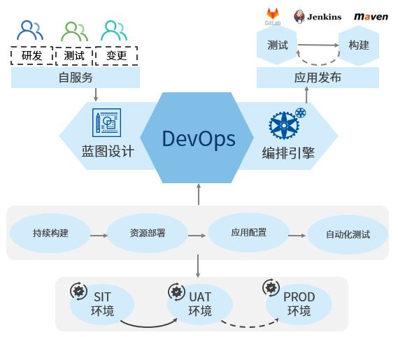

**集成与发布**

通过页面上简单信息的填写，配置出适合开发团队特点的持续集成、持续部署的流水线，SmartCMP应用发布流水线能够与 Jenkins, Git, JFrog Artifactory等持续集成工具无缝协作，实现整个应用部署,变更流水线的自动化。
SmartCMP DevOps的核心使用场景：
+	满足异构和存量云环境对应用架构的DevOps需求；
+	以自服务为导向、通过服务目录全自动化的申请方式；
+	开发人员提交代码，发布版本，高效代码构建和编译；
+	测试人员进行单元测试，提高测试自动化程度；
+	运维人员通过平台确保跨云部署和变更的一致性，降低部署和运维风险；
+	自动化应用发布，灰度发布、回滚、金丝雀分析。

支持普通用户添加流水线和查看流水线执行历史。

# 流水线

流水线由一系列阶段构成，每个阶段由软件在发布到生产之前必须完成的多个任务和环境组成。目前支持多种阶段和任务的自定义和组装，能够在阶段中添加任意数量的执行任务，通过它们已经可以设计出各种场景适用的开发、部署、运维流水线，下面为您介绍配置流水线的步骤：
1.  在左侧导航栏点击「集成与发布」-「流水线」，点击创建，在基本信息页面输入名称、描述、项目、通知到用户
2. 设置自定义属性，点击添加按钮，输入名称、值、描述，点击创建即可
当您创建流水线完成之后， 在左侧导航栏点击「集成与发布」-「流水线」，可二次编辑、删除、执行、禁用、锁定流水线。

## 配置触发器

触发器定义何时自动运行流水线，可以手动触发流水线任务，也可以设定策略由触发器自动触发流水线任务。
具体步骤：
1.  在左侧导航栏点击「集成与发布」-「流水线」，点击创建，在触发器页面点击创建，
2. 输入触发器名称、类型、描述
3. 点击创建即可配置完成触发器

## 配置阶段和任务{#配置阶段和任务} 

设计流水的阶段和每个人阶段的具体任务。操作部署：
1. 在左侧导航栏点击「集成与发布」-「流水线」，点击创建，在流程页面点击添加按钮，输入阶段名称，点击添加
2. 点击添加串行任务，在任务的详情页填写：任务类型、名称、描述、通知到用户，填写输入参数，自定义输出参数（任务类型不同，输入输出参数相应变化）；
    + 选择等待任务，在输入参数处填写等待时间（s）
    + 选择蓝图部署任务，在输入参数处填写服务（服务目录中发布的服务）和模板（发布服务保存的参数模板）
    + Jenkins任务，在输入参数处填写EndPoint(仓库入口)，Job(任务类型)，选择是否等待结果，如果不稳定时，标记为成功继续继续还是标记为失败，结束执行
    + 选择云资源任务，在输入参数处选择已有云资源，云资源类型、操作（云资源的day2运维操作包括挂载，调整磁盘配置等等）

3. 执行设置内填写超时时间、执行选项（选择失败后继续执行或失败后结束流程）、执行方式（选择默认执行或条件执行）

# 执行历史
通过执行历史可以查看执行状态、执行人、执行时间、每个阶段任务执行的详细信息。
1. 在左侧导航栏点击「集成与发布」-「执行历史」，可根据筛选条件（项目、状态、起止时间）快速定位流水线。
2. 点击流水线，可查看流水执行状态（进行中、成功、失败）、执行人信息、开始时间、结束时间、耗时、流水线完整的可视化的流程图。

