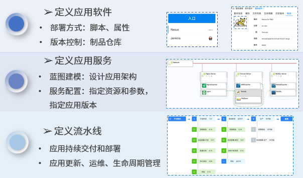
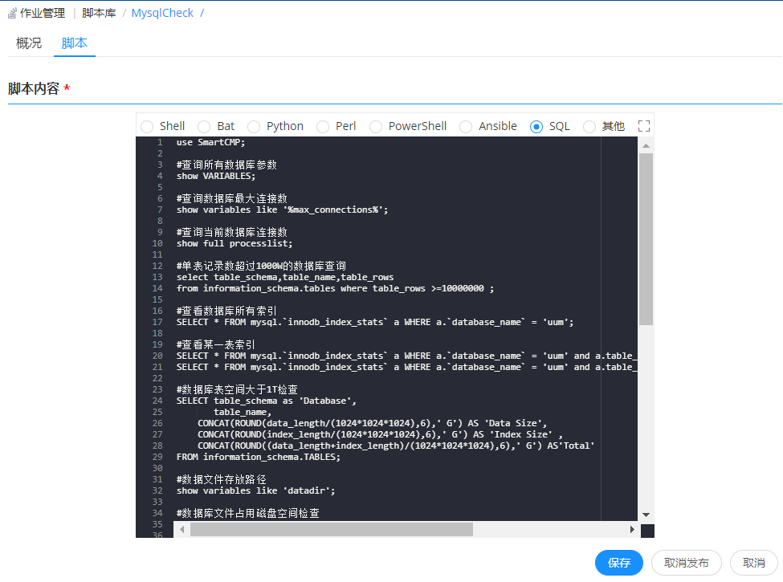

**持续发布与部署**

SmartCMP的应用持续发布和部署，通过脚本库、软件组件、蓝图和流水线作业来构建：

+   定义脚本库：管理员将海量的脚本进行统一的创建和管理，支持根据业务需要创建一些共享脚本，供授权的成员在任意业务下直接引用，平台支持包括 Shell、Perl、Bat、PowerShell、Python、SQL 等类型脚本。
+	定义应用软件：接入主流的制品仓库对软件组件进行存放管理和版本控制，软件组件关联制品仓库并自定义应用的部署方式和相关参数。
+	定义应用服务：通过蓝图建模，编排应用架构；通过服务配置，指定资源参数和相关应用的版本。
+	定义流水线：配置流水线的阶段和多种类型的任务，实现应用的测试、部署、更新、运维、回收的的全生命周期管理。

SmartCMP支持对持续集成与发布功能进行权限管理，管理员在配置流水线时，会为流水线绑定一个项目，并添加全局参数，在后期任务中进行调用。
该项目下的项目组成员，拥有添加、编辑、删除、执行、禁用、锁定自动化流水线、查看流水线执行历史的权限。

> Note 请您使用项目管理员账号登录SmartCMP，项目管理员有创建流水线、查看执行历史的权限。如果当前用户是业务组下的普通用户，需要为当前用户叠加项目管理员的角色。

# 脚本库

支持在平台上直接新建、编辑和删除脚本。还支持快速查找新建好的脚本，规范管理适用于多种环境的脚本。

## 创建脚本

以创建MySQLCheck脚本为例，该脚本适用于检查数据库参数。
+ 在左边导航选择「作业管理」-「脚本库」，点击「添加」按钮，出现创建脚本页面。
+ 输入脚本名称MysqlCheck，选择云资源类型为 Software下的 RDS和 PaaS类型下的RDS。

+ 在脚本内容输入框中填写相关参数。例如，下图中MysqlCheck脚本定义详细参数，如错误日志存放路径、数据库存放路径、数据库大小等。

## 脚本执行

### 运维操作中快速执行脚本

以针对数据库资源，快速执行更参数检查地脚本为例，具体步骤：
1. 在左边导航选择「我的部署」-「云资源」，选择部署成功的数据库，点击执行脚本。
2. 在执行脚本配置页面，选择创建成功地MysqlCheck脚本，自动且快速地完成数据库地参数检查。

  

# 流水线作业

云平台的流水线作业功能，能够帮助用户建设自动化的、可重复利用、安全合规的应用持续交付和部署。流水线由一系列阶段构成，每个阶段由软件在发布到生产之前必须完成的多个任务和环境组成。目前支持多种阶段和任务的自定义和组装，能够在阶段中添加任意数量的执行任务，通过它们已经可以设计出各种场景适用的开发、部署、运维流水线。

## 新增流水线作业

+	新增流水线作业，绑定一个项目，并可添加全局参数，在后期任务中进行调用。

具体步骤：

1. 在左侧导航栏点击「作业管理」-「流水线作业」，点击创建，在基本信息页面输入名称、描述、项目、通知到用户
2. 设置自定义属性，点击添加按钮，输入名称、值、描述，点击创建即可
3. 当您创建流水线完成之后， 在左侧导航栏点击「作业管理」-「流水线作业」，可二次编辑、删除、执行、禁用、锁定流水线。

## 配置触发器

自定义流水线的触发条件，触发器定义何时自动运行流水线，可以手动触发流水线任务，也可以设定策略由触发器自动触发流水线任务。SmartCMP触发器类型包括：Webhook集成(支持Git，Gitlab等代码仓库改变触发)、Jenkins触发、定时触发、手工触发等等。
具体步骤：

1.  在左侧导航栏点击「集成与发布」-「流水线」，点击创建，在触发器页面点击创建，
2. 输入触发器名称、类型、描述
3. 点击创建即可配置完成触发器

## 配置阶段和任务{#配置阶段和任务} 

可根据业务的需要，定义不同的阶段，在每个阶段中定义需要完成的任务。

+ 例如，可定义软件打包、部署测试环境等不同的阶段。每个阶段的任务类型包括：Jenkins Job 任务、部署新应用任务、云资源变更任务、脚本执行任务等等。流水线的发布者可以定义每个任务的参数，在后续的任务中进行调用。

任务指具体执行的活动。支持自定义任务类型、输入输出参数，其中输入输出参数指SmartCMP支持流水线各个任务之间的参数传递，例如将上一个任务新部署虚拟机的IP地址传给下一个任务进行调用。

+ 例如，通过一个蓝图部署任务，即可以自动化触发一个已发布的云资源服务，进行云资源的部署；而云资源任务则可以自动化进行云资源变更、运维操作，进行应用软件的升级、更新。

设计流水的阶段和任务的具体步骤：

1. 在左侧导航栏点击「集成与发布」-「流水线」，点击创建，在流程页面点击添加按钮，输入阶段名称，点击添加
2. 点击添加串行任务，在任务的详情页填写：任务类型、名称、描述、通知到用户，填写输入参数，自定义输出参数（任务类型不同，输入输出参数相应变化）
    + 选择等待任务，在输入参数处填写等待时间（s）
    + 选择蓝图部署任务，在输入参数处填写服务（服务目录中发布的服务）和模板
    + Jenkins任务，在输入参数处填写仓库入口，任务类型，选择是否等待结果，如果不稳定时，标记为成功继续继续还是标记为失败，结束执行
    + 选择云资源任务，在输入参数处选择已有云资源，云资源类型、操作（云资源的day2运维操作包括挂载，调整磁盘配置等等）

3. 执行设置内填写超时时间、执行选项（选择失败后继续执行或失败后结束流程）、执行方式（选择默认执行或条件执行）

# 查看流水线的执行历史
通过执行历史可以查看执行状态、执行人、执行时间、每个阶段任务执行的详细信息。
1. 在左侧导航栏点击「集成与发布」-「执行历史」，可根据筛选条件（项目、状态、起止时间）快速定位流水线作业。
2. 点击流水线，可查看流水线作业执行状态（进行中、成功、失败）、执行人信息、开始时间、结束时间、耗时、流水线完整的可视化的流程图。

