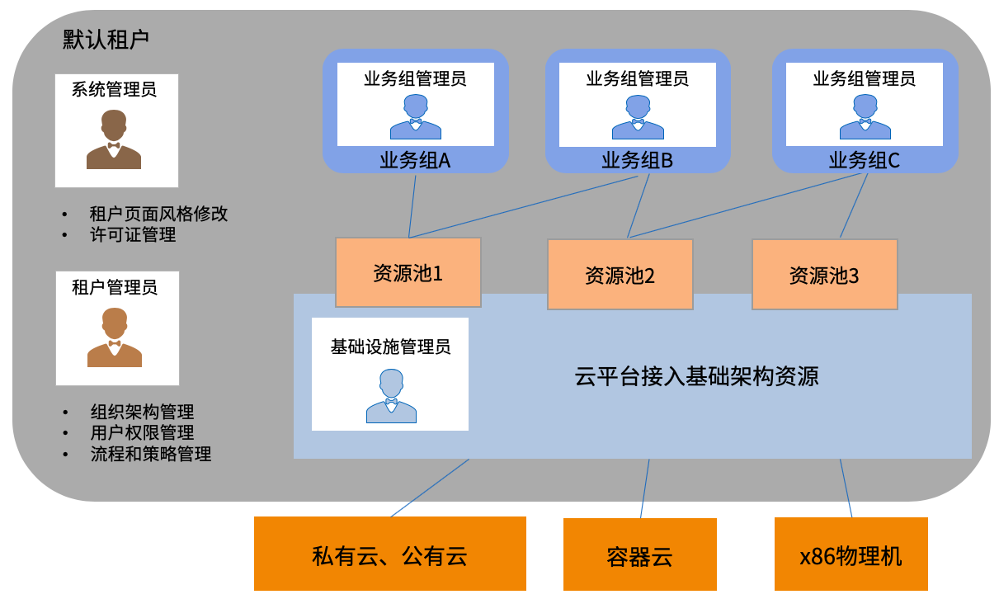
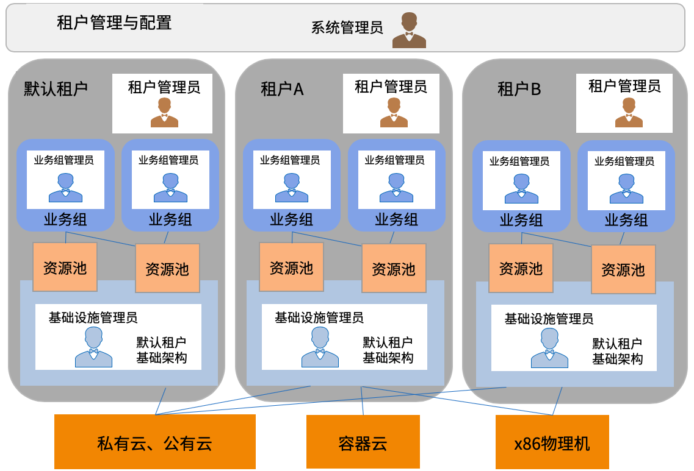
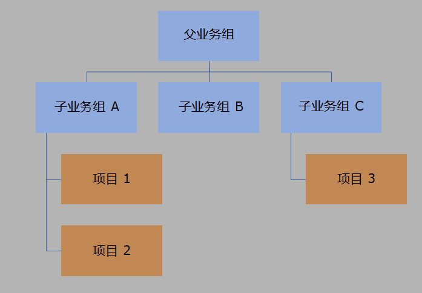

 **组织架构**
 
组织架构可为每个租户配置独立的组织架构，包括业务组，项目，等等。
租户是SmartCMP中的架构单位，在一个SmartCMP的部署中，可以配置多个租户。租户提供了资源使用和管理配置的隔离边界。以下列出了每个租户中的专用配置：

+ Logo和主题配色方案：可为每个租户定制不同的Logo和主题配色方案，在管理控制界面进行配置。
+ 用户：每个租户有独立的用户管理。可以创建本地用户，租户A的用户只能访问租户A，不能访问其他租户。也可以为每个租户配置一个验证用户身份的目录服务进行身份验证，如Microsoft Active Directory（活动目录）或其他LDAP服务器。多个租户可以使用同一个目录服务，但是相同的用户只能属于某一个租户，不能在不同租户中配置相同ID的用户。
+ 权限：每个租户有独立的权限配置。在租户A中配置的权限，仅限于在租户A的范围中，对其他租户不起作用。
+ 业务流程：每个租户的管理员可以配置业务流程，例如审批流程，服务流程等等，应用在这个租户的范围之内。
+ 云平台管理和资源池配置：每个租户的管理员或基础设施管理员可以为该租户接入和纳管所需的云平台入口，例如VMware vCenter，AWS/Azure/阿里公有云等等。可在不同租户中配置和管理不同的云平台入口，也可以共享相同的云平台入口，通过配置不同的资源池来接入不同的计算资源（例如vCenter中不同的集群）供不同租户中的用户进行使用。
+ 服务目录：每个租户的架构师可以为该租户设计服务蓝图，由管理员根据不同的部门、环境等需求，发布为用户可以自助申请的服务目录。服务目录中的类别和服务项，在不同租户中保持独立。

# 租户

## 单租户和多租户示例

### 单租户

在单租户部署中，所有配置均在默认租户中出现。管理员可管理租户内的云资源和组织架构，配置租户内特定的服务目录。

### 多租户

在多租户环境中，每个租户拥有独立的配置，由该租户的管理员进行管理。系统管理员可以配置可以查看和管理多个租户中的配置。

#  业务组与项目

在每个租户内，可以创建不同的组织架构，包括业务组和项目。

##  业务组 

业务组是租户内的逻辑组织结构，可为企业的部门、机构或者事业部创建对应的业务组。支持租户管理员创建多级业务组，关联到业务组的用户可以使用该业务组中的资源和服务。

可以为每个业务组配置独立的规则，流程和资源：

+ 可为每个业务组关联一个或多个资源池。
+ 可为每个业务组关联用户。
+ 可为每个业务组设置不同的审批流程，操作许可，云资源使用租期，云资源命名规范等。

##  项目

在SmartCMP中，一个项目内的云资源对本项目中的所有成员可见，对其它项目的所有成员不可见。

一个项目从属于某个业务组，可以包含多个用户。一个用户可以加入多个项目。

# 角色
角色由一组可与用户关联的权限组成，用于确定该用户在SmartCMP中可以管理、配置和使用的功能。基于个人的职责，每个用户可关联一个或多个角色，所具备的权限将是这些角色的叠加。

在SmartCMP部署完成之后，默认提供以下角色：

##  租户角色概览

租户范围上的角色具有该特定租户的相应职责，不会影响系统中的其他租户。可根据需要创建自定义的角色，关联到所需的用户。

###  租户管理员 

通常为负责租户整体架构的管理员。租户管理员会根据其租户内部组织需求来配置SmartCMP，负责租户内流程和策略配置、组织架构配置，用户和权限配置等等。

主要职责：

+ 创建和管理用户、租户角色，为用户分配角色和权限，创建服务团队
+ 创建和管理业务组，为各业务组指定业务组管理员。
+ 创建和管理服务流程和审批流程。
+ 进行租户的系统配置，包括目录服务信息、邮件系统信息、仪表盘和报表的访问权限，等等。

### 软件架构师 

通常负责设计企业和组织中用户需要申请和使用的服务。服务包含多种样式，可以是单台虚拟机，也可以是包括网络负载均衡、Web应用和数据库在内的复杂应用。

主要职责：
+ 创建和管理软件组件。
+ 创建和修改蓝图，根据业务需要，进行建模，定义蓝图中包含的组件，包括基础架构组件、软件组件。 
+ 发布蓝图。
+ 对需要下架的蓝图进行取消发布和删除。

###  基础设施管理员

基础设施管理员是在每个租户内接入一个或多个云平台，管理云平台中的虚拟机模板（即操作系统镜像），计算规格（即实例类型）。创建资源池，将各个云平台的基础架构资源进行指定，分配给业务组使用。同时可以根据软件架构师设计的蓝图，针对不同业务组或者环境要求进行配置，发布到服务目录。

主要职责：

+ 接入云平台
+ 资源池创建与分配，纳管云平台存量云资源
+ 配置和管理云平台的虚拟机模板（即操作系统镜像），计算规格（即实例类型）
+ 管理IP地址池
+ 根据软件架构师发布的蓝图，配置和发布服务。
+ 管理目录服务。
+ 分析资源使用，回收到期资源。

##  业务组角色概览

业务组范围上的角色具有该特定业务组的相应职责，不会影响其他业务组。

### 业务组管理员

管理一个或多个业务组，通常是部门经理。

主要职责：

+ 为业务组添加用户并关联角色。
+ 配置云资源的使用租期，命名规范等策略。
+ 配置业务组云资源操作许可和服务部署操作许可，指定用户可以进行的操作（例如开关机，添加磁盘，调整配置等等）以及需要的审批流程。
+ 创建项目，指定项目管理员。
+ 监控业务组中的资源使用情况。如果资源紧缺，可申请资源扩容。

### 业务组成员

业务组中的所有用户均可以请求发布到该业务组的服务（包括共享给所有业务组的服务）。用户可以从服务目录中请求服务并管理其拥有的资源。

主要职责：
+ 自助申请所需的服务。
+ 查看所拥有云资源的配置、监控信息等，进行自助运维操作（所能够进行的操作权限由业务组关联配置）。
+ 自助设置对所拥有的云资源的告警。

##  项目角色概览

项目范围上的角色具有该特定项目的相应职责，不会影响其他项目。

### 项目管理员

管理一个或多个项目，通常是项目经理。

主要职责：
+ 为项目添加用户并关联角色。
+ 查看项目所拥有的云资源。

### 项目成员

项目成员同时也是该项目所属业务组的成员，因此可以申请发布到该业务组的服务，并能够查看资源，进行操作。同时，同一个项目的所有成员均可以查看该项目中的资源。

# 服务团队

服务团队是工单服务管理过程中处理工单任务的服务人员集合。租户管理员可以创建一个或多个服务团队，并向每个服务团队指派成员。

主要职责：
+ 当用户通过服务目录申请需要人工介入的手工工单服务之后，根据预先配置的服务流程，相应的服务团队将接到工单进行处理。
+ 服务团队中的人员接到工单之后，可以进行转派，也可以进行线下处理，在完成任务之后更新工单状态，将工单返回给申请用户进行确认和关闭。

