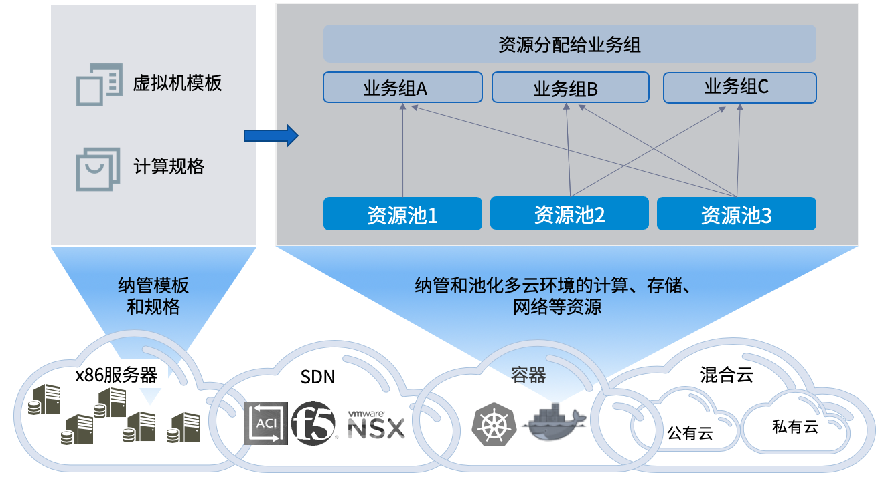

**基础架构**

通过基础架构，您可以统一管理多云异构环境的所有资源，包括私有云、公有云、x86裸金属服务器、网络虚拟化（SDN）、存储虚拟化（SDS）等不同类型。接入云平台之后，您可以通过资源池将计算、存储、网络等资源进行分配，指定给不同业务组使用。同时，您可以在SmartCMP中创建虚拟机模板和计算规格（即实例类型），将各个云平台的虚拟机模板（或操作系统镜像）以及计算规格（即实例类型）进行封装和抽象，实现统一管理和自动化调用。

# 云平台

您可以在SmartCMP中输入各云平台的访问信息，进行连接和纳管。例如，虚拟化管理控制器地址、用户名和密码，或者公有云访问密钥。下表列出了各个云平台入口需要输入的信息：

 云平台类型|接入方式
 :------: |:------: 
vSphere|vCenter Server
OpenStack|OpenStack管理控制器
PowerVC |PowerVC管理控制器
Hyper-V|Microsoft System Center Virtual Machine Manager(SCVMM)服务器
物理服务器 |SmartCMP的物理服务器管理节点信息
阿里云  |阿里云云服务账号AccessKey
AWS  |AWS云服务账号AccessKey
微软Azure|  Azure API访问凭证
腾讯云|腾讯云云服务账号AccessKey
青云|   青云云服务账号AccessKey
VMware NSX  |NSX管理控制器 
Cisco ACI  |ACI管理控制器 
F5  |F5管理控制器 

# 资源池
    
在资源池中，您可以指定云平台中的一组资源对象做为资源入口，用于部署云主机或其他云资源。该资源对象可以是虚拟化平台中的计算机群集，或是公有云的区域。

通过资源池将计算、存储、网络等资源进行分类和指定，分配到不同的业务组，提供给业务组中的成员进行消费和使用。例如，您可以将vSphere群集中的不同数据存储（Datastore）和虚拟交换机分配到不同资源池，使得不同部门部署的资源使用不同的存储和网络；或指定公有云特定的区域、可用区和专有网络（VPC），使得通过该资源池部署的公有云服务都统一使用该可用区的资源，并通过该VPC与其他服务进行网络隔离。

下表列出了各个云平台资源池的资源入口配置：

 云平台类型|     资源池资源入口
 :------: |:------: 
vSphere |vSphere群集
OpenStack |OpenStack可用区
PowerVC |PowerVC可用区
Hyper-V |Hyper-V群集
阿里云   |阿里云区域，可用区以及VPC
AWS  |AWS区域，可用区以及VPC
微软Azure  |Azure订阅ID，区域以及资源组 
青云   |青云云区域，可用区以及VPC

可为每个业务组关联一个或多个资源池（包括多个来自同一云平台的资源池）。同时，每个资源池可以分配给一个业务组使用，也可以分配给多个或全部业务组进行共享。

您可以在资源池中：

+ 指定虚拟化平台的计算资源，或公有云的区域、可用区等信息；
+ 设定可用使用的资源配额，包括CPU数量，内存数量，可以部署的云主机数量等等；
+ 指定特定的存储资源、网络资源
+ 手工导入云平台中的存量资源，或设置定时策略，自动同步云平台中的存量资源。

例如，您可以创建vSphere资源池：

+ 指定纳管的vCenter中某个vSphere群集来提供计算资源；
+ 设定该资源池的资源配额：CPU数量，内存数量，可以部署的云主机数量，允许的快照数量等等；
+ 指定可使用的数据存储，并设定每个数据存储可使用的存储空间；
+ 指定可使用的虚拟交换机，并设定IP地址分配方式。

#  虚拟机模板

您可以在SmartCMP中定义一个或多个的操作系统（例如CentOS）。操作系统是个逻辑概念，可为每个操作系统关联不同云平台中的模板或镜像（例如vCenter中的CentOS虚拟机模板，或阿里公有云中的CentOS镜像等）。操作系统和虚拟机模板将在服务配置的时候使用。

# 计算规格

计算规格定义了计算机CPU和内存的配置规范。在SmartCMP平台上，与操作系统类似，计算规格是个逻辑概念，您可以为每个计算规格关联不同云平台中的规格或实例类型（例如OpenStack平台中的规格，或AWS公有云中的实例类型等）。计算规格和云平台规格将在服务配置的时候使用。

通过操作系统和计算规格的抽象，您可以根据需要创建不同的操作系统，关联符合企业安全规范的虚拟机模板；同时创建不同的计算规格，指定特定的实例类型（例如已经购买的预留实例类型）。您可以在服务配置的时候指定操作系统和虚拟机模板，发布标准化的服务供用户进行申请。

# IP地址管理  

您可以创建和管理IP池，从而在部署云资源的时候自动化分配IP地址。IP池能够支持多云的异构环境，例如创建一个IP池，同时分配给vSphere和OpenStack平台使用。

通过IP地址管理，您可以查看IP地址的使用情况、历史日志，并且能够手动占用、释放IP地址。

# 密钥对

密钥对是用户访问不同云平台的云主机所需要的登录凭证。基础设施管理员和租户管理员可以对密钥对进行管理，包括创建、导入、下载和删除。

