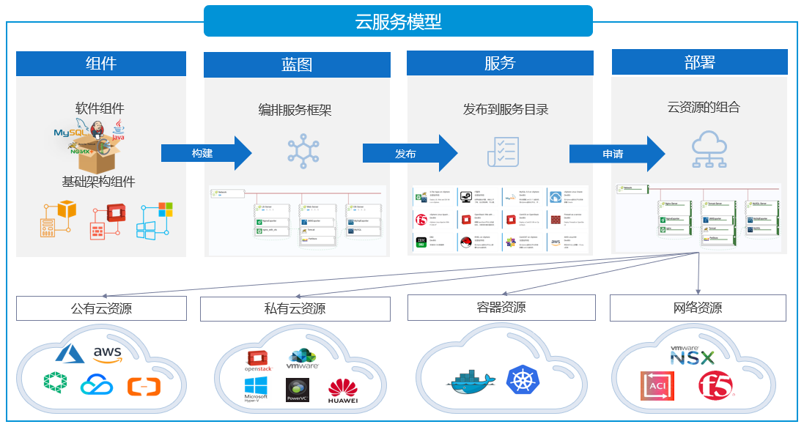
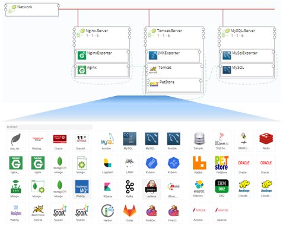

**服务模型**

　　在SmartCMP中，服务分为两种类型：

+ 云资源蓝图服务：是指各云平台资源的申请和自动化部署。这些服务可以是基础设施服务（例如虚拟机，防火墙，DNS等等），应用服务（例如数据库，或是包含网络负载均衡、Web组件和数据库在内的整体应用等等）。
+ 手工工单服务：即非标准化、需要人工进行介入和支持的服务，包括服务请求，事件处理等等。例如，用户忘记密码需要进行重置，或是提交一个开通邮箱或账户的请求，或是遇到IT服务的问题需要解决（服务器、打印机或网络不能访问等等）。用户可通过服务目录发起工单请求服务，服务团队收到请求，进行工单处理。

　　下图描述了组件、蓝图、服务和部署之间的逻辑联系。组件包括软件组件和基础架构组件，软件架构师构建应用的拓扑结构图并为服务配置资源和参数，将服务卡片发布到服务目录。业务组成员在服务目录中根据实际需求进行自助申请，服务按照策略和规范自动组合，完成自动化部署交付。

# 组件

　　任意资源都是组件对象，无论是软件、基础设施还是容器资源，不同类型的云资源都是组件对象，都可以组件化。组件的定义采用面向对象的设计方法，使用统一的数据结构进行建模，并将配置属性标准化。不仅内置丰富的组件资源和常用的操作，还拥有高度可扩展的能力，根据用户需求灵活自定义添加组件资源和配置运维操作。

　　丰富的组件库:开箱即用的组件资源。SmartCMP云管平台内置大量常用的组件资源，包括IaaS（不同云平台的云主机、网络、存储等等）、PaaS（RDS）、容器（Kubernetes、Docker）、软件(MySQL、Oracle、Nginx等等)、代理（监控代理、自动化代理），不同类型资源在统一的界面进行创建和管理，采用树形结构的分组目录，支持自定义组件分组，支持二次编辑、快速复制、导入、导出组件。

> 「Note」详细的创建和管理步骤请参考：[组件库](https://cloudchef.github.io/doc/AdminDoc/05服务建模/组件库.html#组件库)

　　　自定义组件:用户根据需求创建可重用的组件，将任意资源组件化以及将配置组件的过程标准化，包括定义资源类型，定义版本，定义属性，定义组件的操作等等，并且所有的配置界面都开放给用户自定义。例如：DBA在创建数据库集群时，需要部署Oracle数据库，DBA可根据需求在组件库添加Oracle组件，配置组件，包括配置组件概况、使用说明、属性、脚本、操作（指定数据库的创建、启动、停止、重启、删除等等操作）

> 「Note」自定义组件的详细步骤请参考：[创建组件](https://cloudchef.github.io/doc/AdminDoc/05服务建模/组件库.html#创建组件)

## 组件构建蓝图

　　组件是构成蓝图的基本单元。SmartCMP中构成蓝图的组件主要包含两种类型：

+ 基础设施组件：包括计算组件（例如，虚拟机、容器等），网络组件（例如，负载均衡、安全组、防火墙等），存储组件（例如，磁盘、对象存储等）。这些组件是SmartCMP内置的，在蓝图设计时候可以进行选择。

+ 软件组件：用于应用软件的安装，包括中间件、关系型数据库、非关系型数据库等等。您可以将配置属性标准化，并使用脚本来指定在软件部署的过程中如何安装、配置、卸载或更新组件（您也可以自定义您所需要的其他操作）。软件架构师可以通过软件组件管理界面创建自定义的组件，更新已有组件，或者删除已经下架的组件。在蓝图设计时，软件组件可与基础设施组件一起使用。

> 「Note」SmartCMP内置大量常用的组件，当自定义添加的基础设施组件或软件组件，添加组件时选择实例化，在蓝图设计时也可进行选择。

## 面向对象的设计

　　组件的设计，采用面向对象思想设计的结构，面向对象具有封装、继承和多态三大特性。继承可以使得子类别具有父类别的各种属性和方法，而不需要再次编写相同的代码。在令子类别继承父类别的同时，可以重新定义某些属性，并重写某些方法，即覆盖父类别的原有属性和方法，使其获得与父类别不同的功能。

+	操作和属性可继承。系统内置组件的启动、停止、重启、删除、刷新操作。（以刷新操作为例，系统提前配置完成，组件刷新操作所使用的实现方式、脚本、任务和刷新必须的参数。）内置的操作可应用于平台上的任意资源。因此，在创建组件Oracle时，将自动继承内置的“启动、停止、重启、删除、刷新”操作。当选择组件类型Software，则创建的Oracle组件具有父类软件组件的各种属性，也可以通过自定义属性，使其获得与父类不同的功能。需要注意的是自定义添加的属性键值和父组件中的属性键值不能相同，否则将覆盖父组件中的属性定义。也可以通过创建新文件添加脚本文件，脚本文件将用于对组件进行扩展。例如：自定义组件Oracle的install.sh脚本将与“创建操作”进行关联。

+	封装指隐藏复杂操作的实现细节，仅对外提供公共的访问方式。平台将复杂的操作内置，开箱即用，降低差异性和理解难度。例如：“调整虚机配置”操作(调整虚拟机的计算规格和云平台规格)，同一个“调整虚机配置”操作当云平台类型不同时，SmartCMP云管平台隐藏资源操作的流转细节，只暴露公共的访问接口。例如：“调整虚机配置”操作应用在Hyper -V平台的虚拟机和OpenStack平台的虚拟机上，具体的技术实现方式不同，但是用户配置界面，显示相同内容。

+	多态指同一个操作，由于传入的参数不同产生差异化效果。例如：当创建组件Oracle时，不同应用系统对Oracle的部署需求和参数控制都会有特定的需求和自定义要求。“属性”可以按照不同系统的部署要求，通过设置自定义属性，将应用组件需要填写的配置参数暴露在界面配置上，传递自定义参数。当自动化部署Oracle时，SmartCMP云管理平台会自动化调用相关参数执行应用的安装配置，达到不同数据集群对Oracle部署的不同要求。

# 蓝图

　　蓝图是包含计算、存储、网络、软件等资源在内的整体应用的完整规范，用于确定各种资源的的属性与依赖关系、工作流和执行策略。您可以通过可视化画布进行蓝图设计，将一个或多个组件进行组合，从而创建标准化的服务框架。蓝图发布之后，可用于创建服务。

　　蓝图可以是多种形式，例如，一个蓝图可以包含：

+ 一个网络组件和一个虚拟机组件
+ 一个防火墙组件，或是一个公有云关系型数据库组件
+ 多层次的应用架构，例如：网络负载均衡，Web应用，和数据库
+ 多个云平台组件的混合编排，例如Web应用部署在阿里云，数据库在vSphere私有云；或是Web应用在Kubernetes容器，数据库在OpenStack私有云。

# 流程

　　流程定义了自动化过程当中每一步的活动或任务执行的顺序与策略。

　　SmartCMP中的流程分为以下三种类型。每种类型都包含内置的流程，可以直接使用。这些内置的流程不能修改或删除。您也可以通过可视化的流程设计器，自定义需要的流程。

+ 云资源蓝图流程：定义云资源自动化部署的流程，包括标准云服务部署内置流程。
+ 手工工单流程：定义工单服务每一步的任务和流转方式，包括标准手工工单，标准事件管理等内置流程。
+ 审批流程：用于控制用户申请服务、或针对云资源进行运维操作时，是否需要获得组织中某人或者某些人的批准才能进行。

# 表单

　　当用户请求服务目录中的服务时，您创建和发布的每个服务都会显示一个表单。在创建或配置每个服务时，您可以使用默认表单；如果您需要修改或添加额外的字段信息供用户在申请时候填写，您可以通过表单设计器，自定义表单。

# 服务分组

　　服务分组用于将不同的服务组织到相关类型中，使用户可以更方便地浏览所需的服务。例如：基础设施服务，数据库服务，工单服务等等。您可以根据需要创建新的分组，将需要发布的服务进行归类展示。

# 服务发布

　　平台管理员可将已经发布的蓝图和流程，根据不同的组织或部门需求进行配置，发布成为服务目录中的服务。一个服务可以发布到某个业务组，这样只有该业务组的成员才能进行申请；也可以发布到所有业务组，共享给所有成员进行申请。

　　在服务配置的过程中：

+ 针对云资源部署服务，您可以指定部署的完整规范，例如虚拟机配置（所需的虚拟机模板，计算规格大小，磁盘配置等等），租期，操作许可，审批流程，服务流程，自定义表单等等；
+ 针对工单服务，您可以指定每一步任务处理的服务团队，审批流程，服务流程，自定义表单等等。

## 服务的租期

　　租期包括租用时间，保留时间以及回收站回收时间：

+ 当租用时间到期之后，服务部署中的所有计算资源将会被关机；
+ 当保留时间到期之后，该服务部署将会被放置到回收站；
+ 在回收站中，您可以还原，或进行手动删除（将从云平台中彻底释放这些资源）。如不进行任何操作，资源将在回收时间到期后，自动删除（将从云平台中彻底释放这些资源）。

## 服务的审批流程

　　审批流程可在业务组和服务配置处分别进行设置：

  + 业务组配置的审批流程将对该业务组所有的服务生效；
  + 如果某个服务单独配置了审批流程，该流程将生效，不再使用业务组配置的审批流程；如果服务没有配置，则使用业务组配置的审批流程。

# 服务部署

　　用户申请云资源服务之后，经过审批（如果配置了审批流程），SmartCMP将根据服务配置的策略与规范自动化进行部署，完成之后，交付给用户进行使用。

　　服务部署是指用户所申请服务包含的的所有云资源，例如一台虚拟机，一个数据库，或是一个多层次架构的应用环境。用户可在配置的服务租期内，使用该服务部署的所有资源，并能够根据管理员配置的操作许可，自助进行运维或变更操作。

## 命名规范模板

　　通过规范模板定义服务部署和云资源的命名规则，在全局进行一次配置，所有业务组默认使用，不同的业务组还可以按需单独选择配置，覆盖全局设置。

　　命名规则模板规范了服务部署及其所包含云资源的名称，包括服务部署名称、云主机显示名称、以及Windows或Linux操作系统主机名（Hostname）。为了保证命名的唯一性，您可以在规则中加入命名后缀。

　　命名后缀可以是自定义长度的数字序列或者自定义长度的随机字符串。您可以为数字序列指定初始化序列号，例如，您可以创建一个长度为3、初始化序列号为1的命名后缀，如果指定业务组名加上此后缀为云主机名称的命名规则，则针对Dev业务组部署出来的云主机名称将依次为Dev001、Dev002等。

## 授权配置模板 

　　通过授权配置模板定义用户对服务部署和云资源的可以进行的操作，同时操作可以配置审批流程，可以将一套授权配置模板应用于所有的业务组，也可以允许不同的业务组单独关联授权配置模板。

　　其中，操作许可指授权给用户可以针对服务部署或是云资源执行的变更或运维操作。您可以禁用或启用某些操作，以及针对启用的操作设置审批流程。操作许可分为两种类型：

+ 服务部署操作针是指针对服务部署级别的操作，包括延长服务部署的租期，更改服务部署所属的业务组、项目、所有者等等；
+ 云资源操作许针对云主机或其他云资源，包括开关机，远程连接，添加磁盘，迁移等等。

　　可在统一的授权配置界面，创建多套符合使用场景的操作许可模板：

+ 在系统配置界面，为所有的业务组配置一个授权配置模板，所有的业务组将默认使用； 
+ 每个业务组单独配置的操作许可，将对该业务组所有的服务部署和云资源生效；
  

