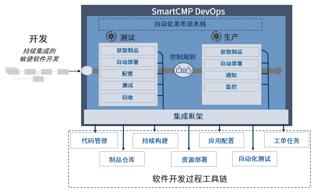
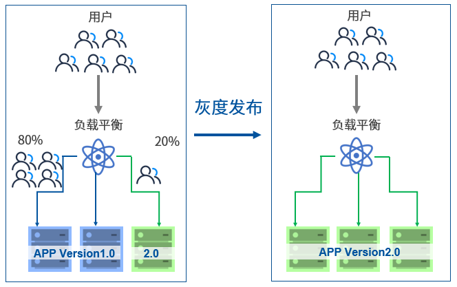

**集成与发布（CI/CD）**

SmartCMP的集成与发布功能为企业软件开发项目提供持续集成的敏捷软件开发。

+ 通过页面上简单信息的填写，配置出适合开发团队特点的持续集成、持续部署的流水线，SmartCMP应用发布流水线能够与 Jenkins, Git, JFrog Artifactory等持续集成工具无缝协作，实现整个应用部署,变更流水线的自动化。

+ 部署自动化通过以应用程序为中心的角度集成整个工具链（自动化完成软件开发项目过程中包括代码管理、编译构建、单元测试、制品归档、镜像构建、自动部署等各个环节）、管理并可视化整个流水线的候选版本部署，从而构建了Dev和Ops之间的桥梁。

+ 研发和测试人员通过SmartCMP服务目录自助申请云资源或服务，减少开发和运维之间协作的时间损耗，使团队整体更加高效地协同工作、迭代功能、发布产品。

+ 基于蓝图，实现每一个应用拓扑蓝图的灰度发布过程，并让平台自动化执行发布，测试和回滚。支持部署任意应用到任意云，打通开发，测试，生产各个环境.

典型使用场景：

+ 开发人员：提交代码，CI/CD工具链调度SmartCMP创建基于容器或虚拟机环境后，自动发布版本
+ 测试人员：通过SmartCMP一键生成全新应用环境或更新已有应用环境，进行相应版本的测试
+ 变更人员：使用经过验证的架构、程序和部署工具，在生产环境自动上线或更新应用

# 流水线（Pipeline）

流水线由一系列阶段构成，每个阶段由软件在发布到生产之前必须完成的多个任务和环境组成。
+ 这些阶段可以包括开发，功能测试，用户验收测试（UAT），负载测试（LT），系统集成测试（SIT），和生产（PROD）。

阶段 ：流水线中的每个阶段都包含一组活动，一个阶段是一组将并行或串行的作业。这些活动可以部署软件，运行测试，创建手动任务或运行自定义工作流或脚本等等。当前阶段任务满足规则并执行完成时，被提升到流水线中的下一个阶段。

+ 目前支持多种阶段和任务的自定义和组装，能够在阶段中添加任意数量的执行任务，通过它们已经可以设计出各种场景适用的开发、部署、运维流水线，同时基于SmartCMP的二次开发能力，可以扩展更多个性化的场景需求；

+ 无论是流水线的定义，还是流水线的执行，都提供了友好的交互界面，通过简单实践即可掌握流水线的配置，流水线运行过程中也可直观感受流水线的处理过程。

#入口（Endpoints）

入口可以添加需要连接的软件制品仓库，为将要使用的软件组件提供部署时的制品来源，定义了软件包或任务调度的对接。流水线中执行归档或镜像推送操作的程序包，会统一存放一份在制品仓库中，支持在入口处接入Nexus、Jfrog Artifactory等等制品仓库管理平台。

# 触发器
+ 触发器定义何时自动运行流水线，可以手动触发流水线任务，也可以设定策略由触发器自动触发流水线任务。

+ 触发器类型：触发Jenkins完成工作、触发发布/订阅消息、触发webhooks、触发从GCS接收产品、触发从GitHub接收产品等等

# 执行历史
通过执行历史可以查看执行状态、执行人、执行时间、每个阶段任务执行的详细信息。

# 部署
CI和CD的桥梁是构件仓库，CI输出程序包到构件仓库，CD从构件仓库获取程序包。
SmartCMP流水线的部署支持将任意程序包部署到windows、linux、docker容器等各种丰富的运行环境，而且支持混搭使用。依托SmartCMP平台的标准运维模块以及底层能力，可以设计各种复杂的运维场景，满足大集群部署及海量运维等需求。

# 灰度发布
灰度发布是按照一定策略选取部分用户，让他们先行体验新版本的应用，通过收集这部分用户对新版本应用的反馈以及对新版本功能、性能、稳定性等指标进行评论，进而决定继续放大新版本投放范围直至全量升级或回滚至老版本。
SmartCMP基于蓝图，软件架构师可以实现每一个应用拓扑蓝图的灰度发布过程，并让平台自动化执行发布，测试和回滚。

