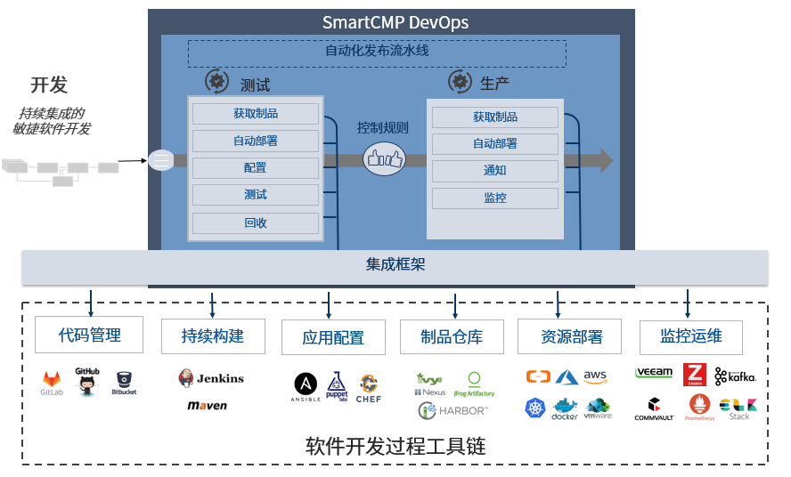
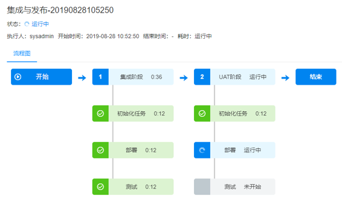

**集成与发布（CI/CD）**

SmartCMP的集成与发布功能为企业提供持续集成的敏捷软件开发，让团队能迅速、可靠并高质量的交付产品，同时减少人力支出和运维风险。

+ 通过页面上简单信息的填写，配置出适合开发团队特点的持续集成、持续部署的流水线，SmartCMP应用发布流水线能够与 Jenkins, Git, JFrog Artifactory等持续集成工具无缝协作，实现整个应用部署,变更流水线的自动化。

+ 部署自动化通过以应用程序为中心的角度集成整个工具链（自动化完成软件开发项目过程中包括代码管理、持续构建、应用配置、制品归档、资源部署、监控运维等各个环节）、管理并可视化整个流水线的候选版本部署，从而构建了Dev和Ops之间的桥梁。

+ 基于蓝图，实现每一个应用拓扑蓝图的灰度发布过程，并让平台自动化执行发布，测试和回滚。支持部署任意应用到任意云，打通开发，测试，生产各个环境。

+ 研发和测试人员通过SmartCMP服务目录自助申请云资源或服务，减少开发和运维之间协作的时间损耗，使团队整体更加高效地协同工作、迭代功能、发布产品。

核心应用场景：
+ 满足异构和存量云环境，应用架构的DevOps需求。
+ 开发人员：提交代码，CI/CD工具链调度SmartCMP创建基于容器或虚拟机环境后，自动发布版本。
+ 测试人员：通过SmartCMP一键生成全新应用环境或更新已有应用环境，进行相应版本的测试。
+ 变更人员：使用经过验证的架构、程序和部署工具，在生产环境自动上线或更新应用，确保跨云部署和变更的一致性。

# 流水线（Pipeline）

SmartCMP自动化流水线创建自动的、可重复利用、安全合规的应用交付流程，自定义配置构建、部署、测试端到端的流程治理和控制。
流水线由一系列阶段构成，每个阶段由软件在发布到生产之前必须完成的多个任务和环境组成，描述了为了获得预期结果需要执行的操作。
流水线在包含一个或多个并行或串行任务的连续阶段中构建。

## 阶段
阶段是一组将并行或串行的任务组成，当前阶段任务满足规则并执行完成时，被提升到流水线中的下一个阶段。
阶段分为多种类型，包括
+ 代码编译阶段：构建二进制文件。
+ 单元测试阶段：运行所有单元测试并分析代码质量，例如：开发，功能测试，用户验收测试（UAT），负载测试（LT），系统集成测试（SIT）。
+ 打包阶段：构建最终的程序包，虚拟机镜像或Docker镜像。
+ 可以在阶段任务的执行过程中定义触发条件、输入输出的参数、执行时间，实现在指定条件下启用该阶段。

如上图所示，
+ 支持多种阶段和任务的自定义和组装，能够在阶段中添加任意数量的执行任务，通过它们已经可以设计出各种场景适用的开发、部署、运维流水线，同时基于SmartCMP的二次开发能力，可以扩展更多个性化的场景需求。
+ 流水线实现了自动化发布、跨不同环境和阶段部署、全生命周期部署和发布管理。
+ 无论是流水线的定义，还是流水线的执行，都提供了友好的交互界面，通过简单实践即可掌握流水线的配置，流水线运行过程中也可直观感受流水线的处理过程。

## 任务
每个阶段的任务即软件开发过程中的活动或作业，这些活动可以是获取制品、自动部署，运行单元测试，创建任务、运行自定义工作流或脚本等等。
SmartCMP流水线的任务定义包括：
+ 自定义任务类型：Jenkins Job 任务、部署新应用任务、云资源变更任务、应用更新任务、脚本执行任务、其他定制任务……
+ 输入参数
+ 输出参数
+ 执行设置

### 部署新应用任务

SmartCMP的部署任务支持将任意新应用部署到windows、linux、docker容器等各种丰富的运行环境，而且支持混搭使用。
依托SmartCMP平台的标准运维模块以及底层能力，可以设计各种复杂的运维场景，满足大集群部署及海量运维等需求。 

### 应用更新任务
变更人员使用经过验证的架构、程序和部署工具，在生产环境自动上线或更新应用。
+ SmartCMP基于蓝图，可以实现每一个应用拓扑蓝图的灰度发布过程，并让平台自动化执行发布，测试和回滚。
+ 其中灰度发布是指按照一定策略选取部分用户，让他们先行体验新版本的应用，通过收集这部分用户对新版本应用的反馈以及对新版本功能、性能、稳定性等指标进行评论，进而决定继续放大新版本投放范围直至全量升级或回滚至老版本。

## 触发器
触发器定义何时自动运行流水线，可以手动触发流水线任务，也可以设定策略由触发器自动触发流水线任务，实现灵活的流水线触发条件。
触发器类型包括：
+ Jenkins触发
+ Webhook集成，支持Git，Gitlab等代码仓库改变触发
+ 手工触发
+ 定时触发
+ Jenkins触发

# 入口（Endpoints）

入口可以添加需要连接的软件制品仓库，为将要使用的软件组件提供部署时的制品来源，定义了软件包或任务调度的对接。流水线中执行归档或镜像推送操作的程序包，会统一存放一份在制品仓库中，支持在入口处接入Nexus、Jfrog Artifactory、VMware Harbor等等制品仓库管理平台。

## 软件制品管理

+ 制品即构建过程的输出物，包括软件包，测试报告，应用配置文件等可在服务器上直接运行或可查看二进制形式的文件，通常称之为二进制软件制品。
+ 制品管理是对软件研发过程中生成的产物的管理， 一般作为最终交付物完成发布和交付。所有的制品包，依赖组件均能够纳入制品库中统一管理。制品库应作为测试及生产部署的唯一可信制品来源。
+ 不同开发语言 所产生的制品的获取、使用、共享方式不同，不同的制品仓库能够管理各自开发语言类型的二进制制品。

如图所示，

 开发团队通常会为每个项目建立软件制品管理系统，以实现在网络上传输大型二进制文件的良好性能。因此，团队通常拥有各种不同的制品仓库，包括Nexus，Harbor或Artifactory。例如： Artifactory作为流水线中统一存放管理制品的仓库，Artifactory正在不断获取最新、正确的制品，将制品用于应用部署、资源配置或环境更新，降低创建和自动化发布管道的复杂度。

# 执行历史
通过执行历史可以查看执行状态、执行人、执行时间、每个阶段任务执行的详细信息。

