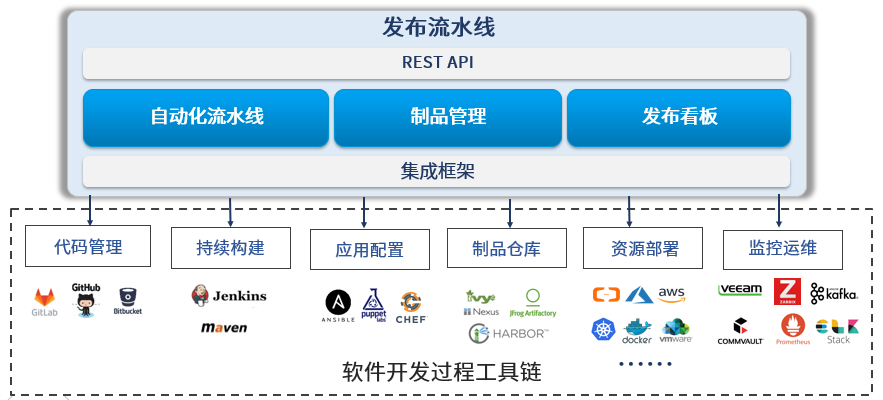

**应用持续发布与部署**

SmartCMP的集成与发布功能为企业提供持续集成的敏捷软件开发，以 IT 自动化以及持续集成（CI）、持续部署（CD）为基础，来优化产品开发(DEV)、测试(QA)、系统运维(OPS)等所有环节。软件行业日益清晰地认识到，为了持续、高效、可靠地交付软件产品和服务，开发部门和运维部门必须紧密合作，通过自动化的工具协作和沟通来完成软件的生命周期管理。核心的使用场景包括：

+ 通过设置各阶段和任务来自动化应用软件的打包、环境部署、自动化测试等，配置出适合开发团队特点的持续发布、持续部署的自动化流水线。SmartCMP应用发布流水线能够与 Jenkins, Git, Nexus等持续集成工具无缝协作，实现整个应用部署,应用升级的自动化，完成从开发、测试到生产的持续交付与部署。

+ 基于蓝图，实现每一个应用拓扑蓝图的自动化部署，并让平台根据策略自动化触发流水线、执行发布，测试、制品管理和自动化部署。支持部署任意应用到任意云，打通开发，测试，生产各个环境。 使用经过验证的架构、程序和部署工具，在生产环境自动上线或更新应用，确保跨云部署和变更的一致性，降低部署和运维风险。

+ 部署自动化通过以应用程序为中心的角度集成整个工具链（自动化完成软件开发项目过程中包括持续构建、应用配置、制品归档、资源部署、监控运维等各个环节）、管理并可视化整个流水线的候选版本部署，快速获取正确的制品部署到相应的环境，从而构建了Dev和Ops之间的桥梁。

+ 研发和测试人员通过SmartCMP服务目录自助申请云资源或服务，减少开发和运维之间协作的时间损耗，使团队整体更加高效地协同工作、迭代功能、发布产品。

# CI/CD工具链

SmartCMP能够集成丰富的CI/CD工具链，为应用软件提供代码管理、持续构建、制品管理、部署、监控运维等等多种功能，并提供开放的API。所有功能基于全面的集成框架，囊括主流的软件工具：GitLab、GitHub、Jenkins、Maven、Ansible、Puppet、Chef、Nexus、Kafka等等
，实现开发人员更高效的代码管理，运维人员更低风险的变更应用程序，提升应用程序质量降低部署功能的风险。

# 流水线

SmartCMP自动化流水线创建自动的、可重复利用、安全合规的应用交付流程，自定义配置构建、部署、测试端到端的流程治理和控制。 
流水线实现了自动化发布、跨不同环境和阶段部署、全生命周期部署和发布管理。
无论是流水线的定义，还是流水线的执行，都提供了友好的交互界面，通过简单实践即可掌握流水线的配置，流水线运行过程中也可直观感受流水线的处理过程。
流水线由一系列阶段构成，每个阶段由软件在发布到生产之前必须完成的多个任务和环境组成，描述了为了获得预期结果需要执行的操作。
流水线在包含一个或多个并行或串行任务的连续阶段中构建。
整个流水线的定义方式如下：
+ 新增流水线，绑定一个项目，并可添加全局参数，在后期任务中进行调用

+ 自定义流水线的触发条件，触发器定义何时自动运行流水线，可以手动触发流水线任务，也可以设定策略由触发器自动触发流水线任务，实现灵活的流水线触发条件。触发器类型包括： Jenkins触发；Webhook集成（支持Git，Gitlab等代码仓库改变触发）；手工触发；定时触发

+ 根据业务需要定义阶段和任务。

## 阶段
阶段是一组将并行或串行的任务组成，当前阶段任务满足规则并执行完成时，被提升到流水线中的下一个阶段。 SmartCMP流水线支持多种阶段和任务的自定义和组装，能够在阶段中添加任意数量的执行任务，通过它们已经可以设计出各种场景适用的开发、部署、运维流水线，同时基于SmartCMP的二次开发能力，可以扩展更多个性化的场景需求。
阶段分为多种类型，包括
+ 代码编译阶段：构建二进制文件。
+ 单元测试阶段：运行所有单元测试并分析代码质量，例如：开发，功能测试，用户验收测试（UAT），负载测试（LT），系统集成测试（SIT）。
+ 打包阶段：构建最终的程序包，虚拟机镜像或Docker镜像。
+ 可以在阶段任务的执行过程中定义输入输出的参数、执行时间，实现在指定条件下启用该阶段。

例如，可定义软件打包、部署测试环境等不同的阶段。每个阶段的任务类型包括：Jenkins Job 任务、部署新应用任务、云资源变更任务、脚本执行任务等等。
流水线执行之后，用户可以查看每个阶段和任务的执行状态，以及输出信息。

## 任务

每个阶段的任务即软件开发过程中的活动或作业，这些活动可以是获取制品、自动部署，运行单元测试，创建任务、运行自定义工作流或脚本等等。
SmartCMP流水线的任务定义包括：
+ 自定义任务类型：Jenkins Job 任务、部署新应用任务、云资源变更任务、应用更新任务、脚本执行任务、其他定制任务；
+ 流水线的发布者可以定义每个任务的输入、输出参数，在后续的任务中进行调用。

例如，通过一个蓝图部署任务，支持将任意新应用部署到windows、linux、k8s容器等各种丰富的运行环境，即可以自动化触发一个已发布的云资源服务，进行云资源的部署；而云资源任务则可以自动化进行云资源变更、运维操作，进行应用软件的升级、更新。
依托SmartCMP平台的标准运维模块以及底层能力，可以设计各种复杂的运维场景，满足大集群部署及海量运维等需求。 

## 执行历史
通过执行历史可以查看执行状态、执行人、执行时间、每个阶段任务执行的详细信息。下图展现了一个复杂的流水线的执行过程：

# 制品管理

+ 制品即构建过程的输出物，包括软件包，测试报告，应用配置文件等可在服务器上直接运行或可查看二进制形式的文件，通常称之为二进制软件制品。
+ 制品管理是对软件研发过程中生成的产物的管理， 一般作为最终交付物完成发布和交付。所有的制品包，依赖组件均能够纳入制品库中统一管理。制品库应作为测试及生产部署的唯一可信制品来源。
+ 不同开发语言 所产生的制品的获取、使用、共享方式不同，不同的制品仓库能够管理各自开发语言类型的二进制制品。

SmartCMP将领先的二进制制品管理仓库Nexus嵌入到代码流中。 开发组织通常会为每个项目建立制品管理系统，以实现更加简单、方便地获取制品，并实现在网络上传输大型制品的良好性能。
尽管开发人员使用不同类型的代码开发构建工具、测试人员使用不同类型的测试工具，但是软件制品管理系统指定了仓库类型和制品位置，并处理获取最新和正确制品的所有复杂性，降低创建自动化发布流水线的复杂性，快速地获得正确的制品提高部署效率。

+ 入口:可以添加需要连接的软件制品仓库，为将要使用的软件组件提供部署时的制品来源，定义了软件包或任务调度的对接。流水线中执行归档或镜像推送操作的程序包，会统一存放一份在制品仓库中，支持在入口处接入Nexus、Jenkins等等管理平台。

